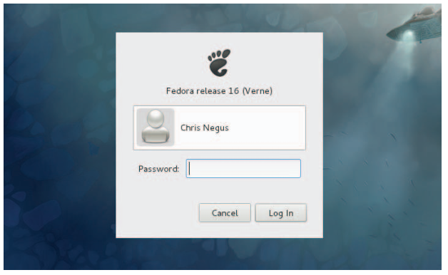
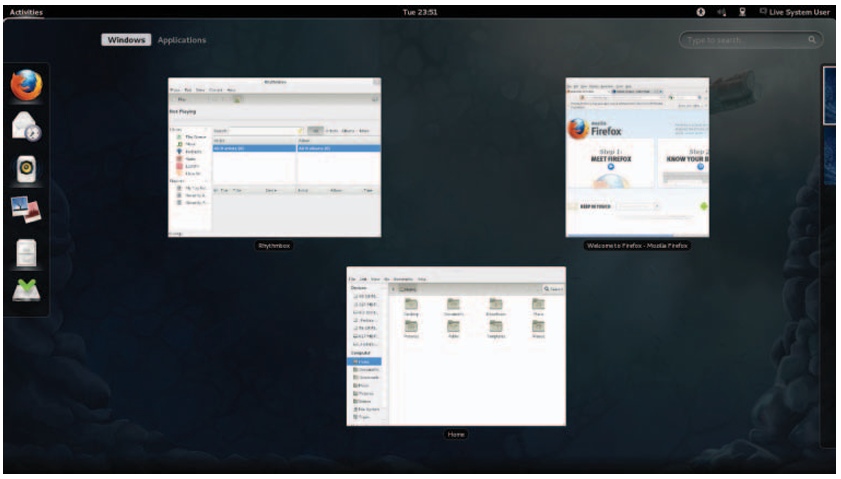
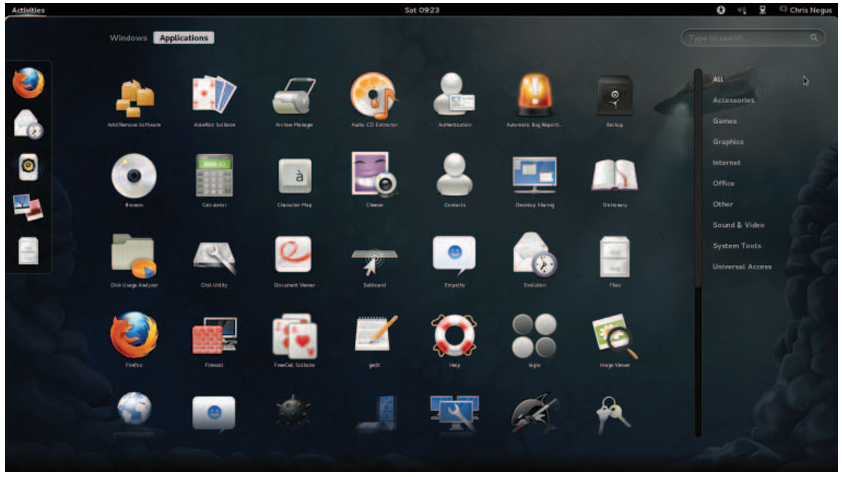
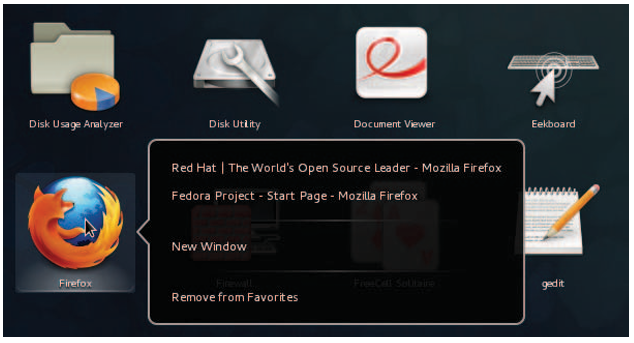
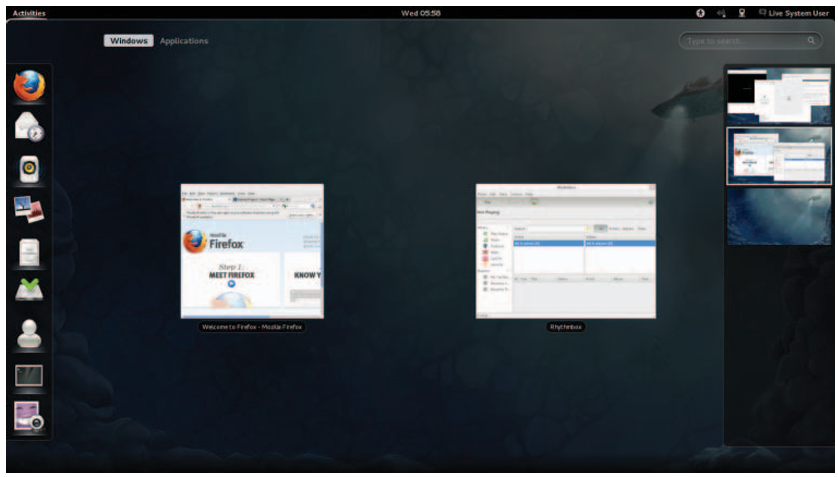
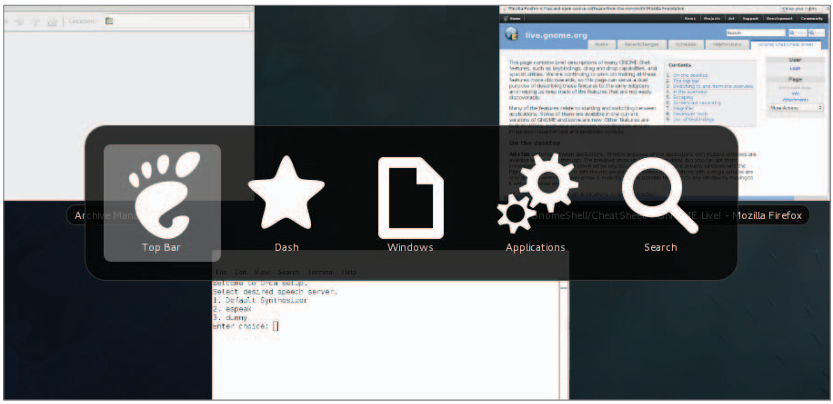
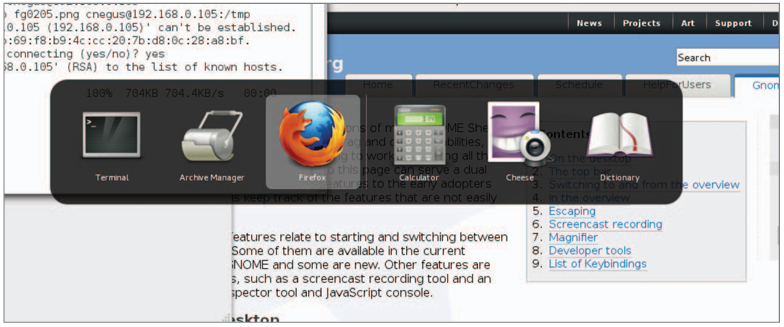
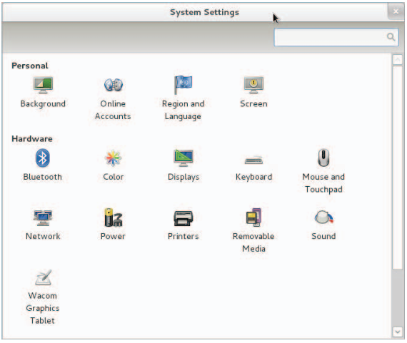

# Creating the Perfect Linux Desktop

 IN THIS CHAPTER
 Understanding the X Window System and desktop environments
 Running Linux from a Live CD
 Navigating the GNOME 3 desktop
 Adding extensions to GNOME 3
 Using Nautilus to manage fi les in GNOME 3
 Working with the GNOME 2 desktop
 Enabling 3D effects in GNOME 2

Using Linux as your everyday desktop system is becoming easier to do all the time. As with everything in Linux, you have choices. There are full-featured GNOME or KDE desktop environments or lightweight desktops such as LXDE or Xfce. There are even simpler stand alone window managers.

Once you have chosen a desktop, you will fi nd that almost every major type of desktop application you have on a Windows or Mac system will have equivalent applications in Linux. For applications that are not available in Linux, you can often run a Windows application in Linux using Windows compatibility software.

The goal of this chapter is to familiarize you with the concepts related to Linux desktop systems, and then give you tips for working with a Linux desktop. You will: -

 ■ Step through the desktop features and technologies that are available in Linux
 ■ Tour the major features of the GNOME desktop environment
 ■ Learn tips and tricks for getting the most out of your GNOME desktop experience

To use the descriptions in this chapter, I recommend you have a Fedora system running in front of you. You can get Fedora in lots of ways, including: -

■ Running Fedora from a live CD—Refer to Appendix A for information on downloading and burning a Fedora Live CD so you can boot it live to use with this chapter.
■ Installing Fedora permanently—Install Fedora to your hard disk and boot it from there (as described in Chapter 9, “Installing Linux”).

Because the current release of Fedora uses the GNOME 3 interface, most of the procedures described here will work with other Linux distributions that have GNOME 3
available. If you are using Red Hat Enterprise Linux (which, as of RHEL 6, uses GNOME2), I have added descriptions of GNOME 2 that you can try as well.

## Understanding Linux Desktop Technology

Modern computer desktop systems offer graphical windows, icons, and menus that are operated from a mouse and keyboard. If you are under 30 years old, you might think
there’s nothing special about that. But the fi rst Linux systems did not have graphical interfaces available. Also, today, many Linux servers tuned for special tasks (for example, serving as a web server or fi le server) don’t have desktop software installed.

Nearly every major Linux distribution that offers desktop interfaces is based on the X Window System (http://www.x.org). The X Window System provides a framework on
which different types of desktop environments or simple window managers can be built.

The X Window System (sometimes simply called X) was created before Linux existed and even predates Microsoft Windows. It was built to be a lightweight, networked desk
top framework.

X works in a sort of backward client/server model. The X server runs on the local system, providing an interface to your screen, mouse, and keyboard. X clients (such
as word  processors, music players, or image viewers) can be launched from the local system or from any system on your network that the X server gives permission to do so.

X was created in a time when graphical terminals (thin clients) simply managed the keyboard, mouse, and display. Applications, disk storage, and processing power were all on larger centralized computers. So, applications ran on larger machines but were displayed and managed over the network on the thin client. Later, thin clients were replaced by desktop personal computers. Most client applications ran locally, using local processing power, disk space, memory, and other hardware features, while not allowing applications that didn’t start from the local system.

X itself provides a plain gray background and a simple “X” mouse cursor. There are no menus, panels, or icons on a plain X screen. If you were to launch an X client (such as a terminal window or word processor), it would appear on the X display with no border around it to move, minimize, or close the window. Those features are added by a window manager.

A window manager adds the capability to manage the windows on your desktop and  often provides menus for launching applications and otherwise working with the desk
top. A  full-blown desktop environment includes a window manager, but also adds menus, panels, and usually an application programming interface that is used to create applications that play well together.

So, how does an understanding of how desktop interfaces work in Linux help you when it comes to using Linux? Here are some ways: -

■ Because Linux desktop environments are not required to run a Linux system, a Linux system may have been installed without a desktop. It might offer only a plain-text, command-line interface. You can choose to add a desktop later. Once it is installed, you can choose whether to start up the desktop when your computer boots or start it as needed.

■ For a very lightweight Linux system, such as one meant to run on less powerful computers, you can choose an effi cient, though less feature-rich, window man
ager (such a twm or fluxbox) or a lightweight desktop environment (such as LXDE or Xfce).

■ For more robust computers, you can choose more powerful desktop environments (such as GNOME and KDE) that can do such things as watch for events to happen (such as inserting a USB fl ash drive) and respond to those events (such as opening a window to view the contents of the drive).

■ You can have multiple desktop environments installed and you can choose which one to launch when you log in. In this way, different users on the same computer
can use different desktop environments.

Many different desktop environments are available to choose from in Linux. Here are a few examples: -

■ GNOME—GNOME is the default desktop environment for Fedora, Red Hat Enterprise Linux, and many others. It is thought of as a professional desktop environment, focusing on stability more than fancy effects.

■ K Desktop Environment—KDE is probably the second most popular desktop environment for Linux. It has more bells and whistles than GNOME, and offers
more integrated applications. KDE is also available with Fedora, RHEL, Ubuntu, and many other Linux systems.

■ Xfce—The Xfce desktop was one of the fi rst lightweight desktop environments. It is good to use on older or less powerful computers. It is available with RHEL,
Fedora, Ubuntu, and other Linux distributions.

■ LXDE—The Lightweight X11 Desktop Environment (LXDE) was designed to be a fast-performing, energy-saving desktop environment. Often, LXDE is used on less-expensive devices, such as netbook computers, and on live media (such as a live CD or live USB stick). It is the default desktop for the KNOPPIX live CD distribution. Although LXDE is not included with RHEL, you can try it with Fedora or Ubuntu.

GNOME was originally designed to resemble the MAC OS desktop, while KDE was meant to emulate the Windows desktop environment. Because it is the most popular desktop
environment, and the one most often used in business Linux systems, most desktop procedures and exercises in this book use the GNOME desktop. Using GNOME, however,
still gives you the choice of several different Linux distributions.

## Starting with the Fedora GNOME Desktop Live CD

A live CD is the quickest way to get a Linux system up and running so you can start trying it out. With a Linux live CD, you can have Linux take over the operation of your computer temporarily, without harming the contents of your hard drive.

If you have Windows installed, Linux will just ignore it and use Linux to control your computer. When you are done with the Linux live CD, you can reboot the computer,pop out the CD, and go back to running whatever operating system was installed on the hard disk.

To try out a GNOME desktop along with the descriptions in this section, I suggest you get a Fedora Live CD (as described in Appendix A). Because a live CD does all its work from the CD and in memory, it will run slower than an installed Linux system. Also, although you can change fi les, add software, and otherwise confi gure your system, by default, the work you do disappears when you reboot, unless you explicitly save that data to your hard drive or external storage.

The fact that changes you make to the live CD environment go away on reboot is very good for trying out Linux, but not that great if you want an ongoing desktop or server system. For that reason, I recommend that if you have a spare computer, you install Linux permanently on that computer’s hard disk to use with the rest of this book (as described in Chapter 9).

Once you have a live CD in hand, do the following to get started: -

1. Get a computer. If you have a standard PC (32-bit or 64-bit) with a CD/DVD drive and at least 1GB of memory (RAM) and at least a 400-MHz processor, you are
ready to start.

2. Start the live CD. Insert the live CD into your computer’s CD drive, and reboot your computer (turn it off and back on again). Depending on the boot order set
on your computer, the live CD might start up directly from the BIOS (the code that controls the computer before the operating system starts).

NOTE: If, instead of booting the live CD, your installed operating system starts up instead, you will need to do an additional  step to start the live CD. Reboot again and when you see the BIOS screen, look for some words that say something  like "Boot Order." The on-screen instructions may say to press the F12 or F1 function key. Press that key immediately  from the BIOS screen. Next, you should see a screen that shows available selections. Highlight an entry for CD/DVD
and press Enter to boot the live CD. If you don't see the drive there, you may need to go into BIOS setup and enable  the CD/DVD drive there.

3. Start Fedora. If the CD is able to boot, you will see a boot screen. For Fedora,  with Start Fedora highlighted, press Enter to start the live CD.

4. Begin using the desktop. For Fedora, the live CD boots directly to a GNOME  3  desktop by default. In some cases, if the specs of the computer are not up to
requirements, Fedora will fall back to GNOME 2 instead.

You can now proceed to the next section, “Using the GNOME 3 Desktop” (which includes  information on using GNOME 3 in Fedora and other operating systems). The section following that covers the GNOME 2 desktop.

## Using the GNOME 3 Desktop

The GNOME 3 desktop offers a radical departure from its GNOME 2.x counterparts. Where GNOME 2.x is serviceable, GNOME 3 is elegant. With GNOME 3, a Linux desktop now  appears more like the graphical interfaces on mobile devices, with less focus on multiple mouse  buttons and key combinations and more mouse movement and one-click operations.

Instead of feeling structured and rigid, the GNOME 3 desktop seems to expand as you  need it to. As a new application is run, its icon is added to the Dash. As you use the next  workspace, a new one opens, ready for you to place more applications.

### After the computer boots up

For a live CD, you should be booted right to the desktop with Live System User as your username. For an installed system, you see the login screen, with user accounts on the system ready for you to select and enter a password. Figure 2.1 is an example of the login screen for Fedora.

There is very little on the GNOME 3 desktop when you start out. The top bar has the  word "Activities" on the left, a clock in the middle, and some icons on the right for such  things as adjusting audio volume, checking your network connection, and viewing the  name of the current user.

### Navigating with the mouse

To get started, try navigating the GNOME 3 desktop with your mouse:

1. Toggle activities and windows. Move your mouse cursor to the upper-left corner of the screen, near the Activities button. Each time you move there, your screen changes between showing you the windows you are actively using and a set of available Activities. (This has the same effect as pressing the Windows button.)

2. Open windows from applications bar. Click to open some applications from the Dash on the left (Firefox, File Manager, Shotwell, or others). Move the mouse to
the upper-left corner again and toggle between showing all active windows minimized (Overview screen) and showing them overlapping (full-sized). Figure 2.2
shows an example of the miniature windows view.

3. Open applications from Applications list. From the Overview screen, select the Application button near the top of the page. The view changes to a set of icons
representing the applications installed on your system, as shown in Figure 2.3.

 4. View additional applications. From the Applications screen, there are several ways to change the view of your applications, as well as different ways to
launch them:

1. Scroll—To see icons representing applications that are not on the screen, use the mouse to grab and move the scrollbar on the right. If you have a wheel
mouse, you can use that instead to scroll the icons.

2. Application groups—Select an application group on the right (Accessories, Games, Graphics, and so on) to see applications that are in only that group.

3. Launching an application—To start the application you want, left-click on its icon to open the application in the current workspace. If you have a middle
mouse button, you can click it on an application to open it in a new work space. Right-click to open a menu displaying open instances of this application you can select, an option to open a New Window selection, and an option to add or remove the application from Favorites (so the application's icon
appears on the Dash). Figure 2.4 shows an example of the menu.

5. Open additional applications. Start up additional applications. Notice that as you open a new application, an icon representing that application appears in the Dash bar on the left. Here are some other ways to start applications:
 1. Application icon—Click any application icon to open that application.
 2. Drop Dash icons on workspace—From the Windows view, you can drag any application icon from the Dash by holding the Ctrl key and dragging that icon to any of the miniature workspaces on the right.

6. Use multiple workspaces. Move the mouse to the upper-left corner again to show a minimized view of all windows. Notice all the applications on the right jammed into a small representation of one workspace while an additional workspace is empty. Drag-and-drop two of the windows to the empty desktop space. Figure 2.5 shows what the small workspaces look like. Notice that an additional empty workspace is created each time the last empty one is used. You can drag-and-drop the miniature windows between any workspace, and then select the workspace to view it.

7. Use the window menu. Move the mouse to the upper-left corner of the screen to return to the active workspace (large window view). Right-click the title bar on a window to view the window menu. Try these actions from that menu:

1. Minimize—Remove window temporarily from view.
2. Maximize—Expand window to maximum size.
3. Move—Change window to moving mode. Moving your mouse moves the window. Click to fi x the window to a spot.
4. Resize—Change the window to resize mode. Moving your mouse resizes the window. Click to keep the size.
5.  Workspaces selections—Several selections let you use workspaces in different ways. Select to make the window always on top of other windows, visibleon every workspace, or only on the current workspace. Or move the window to another workspace, the one above or the one below. If you don’t feel comfortable navigating GNOME 3 with your mouse, or if you don’t have a mouse, the next section helps you navigate the desktop from the keyboard.

###  Navigating with the keyboard

If you prefer to keep your hands on the keyboard, you can work with the GNOME 3 desk top directly from the keyboard in a number of ways, including the following:

1. Windows key—Press the Windows key on the keyboard. On most PC keyboards, this is the key with the Microsoft Windows logo on it next to the Alt key. This
toggles the mini-window (Overview) and active-window (current workspace) views. Many people use this key a lot.

2. Select different views—From the Windows or Applications view, hold Ctrl+Alt+Tab to see a menu of the different views (see Figure 2.6). Still holding the Ctrl+Alt keys, press Tab again to highlight one of the following icons from the menu and release to select it:
 - Top Bar—Keeps the current view.
 - Dash—Highlights the fi rst application in the application bar on the left. Use arrow keys to move up and down that menu and press Enter to open the high lighted application.
 - Windows—Selects the Windows view.
 - Applications—Selects the Applications view.
 - Search—Highlights the search box. Type a few letters to show only icons for applications that contain the letters you type. When you have typed enough letters to uniquely identify the application you want, press Enter to launch the application.

3. Select an active window—Return to any of your workspaces (press the Windows key if you are not already on an active workspace). Press Alt+Tab to see a list of all active windows (see Figure 2.7). Continue to hold the Alt key as you press the Tab key (or right or left arrow keys) to highlight the application you want from the list of active desktop application windows. If an application has multiple windows open, press Alt+` (backtick, located above the Tab key) to choose among those  sub-windows. Release the Alt key to select it.

4. Launch a command or application—From any active workspace, you can launch a Linux command or a graphical application. Here are some examples:
 - Applications—From the Overview screen, press Ctrl+Alt+Tab, and then continue to press Tab until the gears (Applications) icon is highlighted; then release Ctrl+Alt. The Applications view appears, with the fi rst icon highlighted. Use the Tab key or arrow keys (up, down, right, and left) to highlight the application icon you want, and press Enter.
 - Command box—If you know the name of a command you want to run, press Alt+F2 to display a command box. Type the name of the command you want to run into the box (try system-config-date to adjust the date and time, for example).
 - Search box—From the Overview screen, press Ctrl+Alt+Tab, and then continue to press Tab until the magnifying glass (Search) icon is highlighted; then release Ctrl+Alt. In the search box now highlighted, type a few letters in an application’s name or description (type scr to see what you get). Keep typing until the application you want is highlighted (in this case, Screenshot) and press Enter to launch it.

- Dash—From the Overview screen, press Ctrl+Alt+Tab, and then continue to press Tab until the star (Dash) icon is highlighted; then release Ctrl+Alt. From the Dash, move the up and down arrows to highlight an application you want to launch and press Enter.

- Escape—When you are stuck in an action you don’t want to complete, try pressing the Esc key. For example, after pressing Alt+F2 (to enter a command),opening an icon from the top bar, or going to an overview page, pressing Esc returns you to the active window on the active desktop.

## Setting up the GNOME 3 desktop

A lot of what you need GNOME 3 to do for you is set up automatically. There are, however, a few tweaks you will want to make to get the desktop the way you want. Most of these setup activities are available from the System Settings window (see Figure 2.8). Open the System Settings icon from the Applications screen.

Here are some suggestions for confi guring a GNOME 3 desktop:

- Configure networking—A wired network connection is often confi gured automatically when you boot up your Fedora system. For wireless, you probably have to select your wireless network and add a password when prompted. An icon in the top bar lets you do any wired or wireless network confi guration you need to do. Refer to Chapter 14, “Administering Networking,” for further information on confi guring networking.
- Personal settings—Tools in this group let you change your desktop background (Background), use different online accounts (Online Accounts), and set your language and date and currency format based on region (Region and Language) and screen locking (Screen). To change your background, open the System Settings window, select Background, and then select from the available Wallpapers. To add your own Background, download a wallpaper image you like to your Pictures folder, and then click the Wallpapers box to change it to Pictures folder and choose the image you want.
- Bluetooth—If your computer has Bluetooth hardware, you can enable that device to communicate with other Bluetooth devices.
- Printers—Instead of using the System Settings window to confi gure a printer, refer to Chapter 16, “Confi guring a Print server,” for information on setting up a printer using the CUPS service.
- Sound—Click the Sound settings button to adjust sound input and output devices on your system.
- Removable media—To confi gure what happens when CDs, DVDs, music players, or other removable media are inserted into your computer, select the Removable Media icon. See Chapter 8, “Learning System Administration,” for information on configuring removable media.

