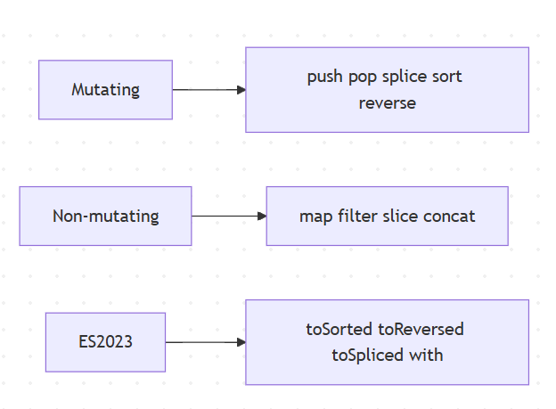
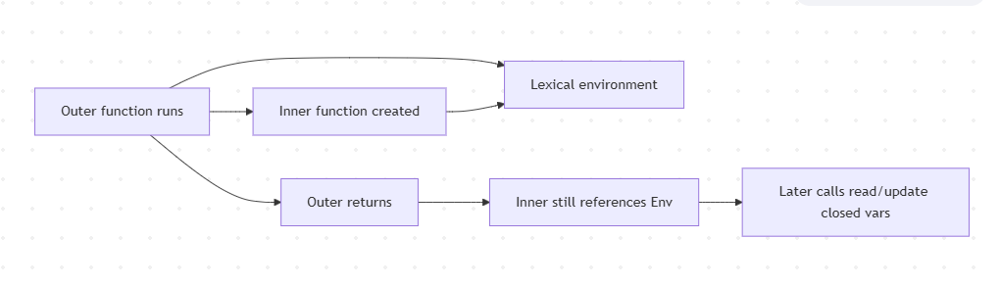
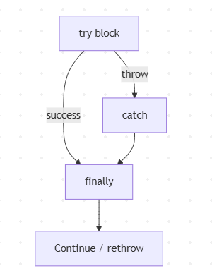
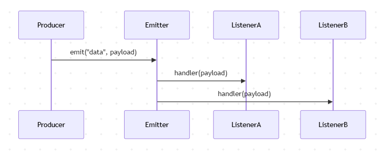
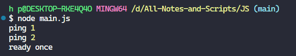
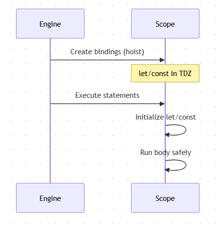
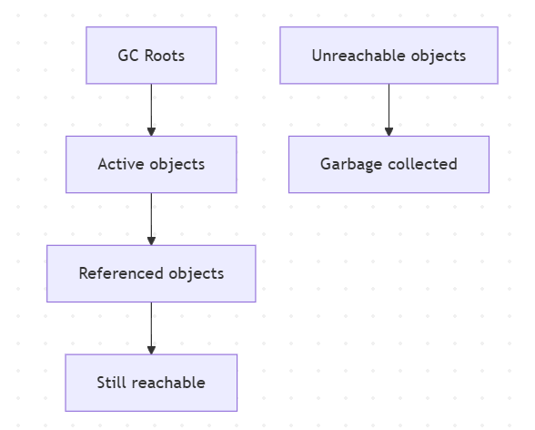
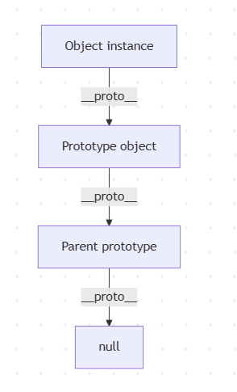
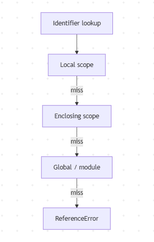

# Arrays

> Creation, mutation vs pure methods, iteration, and ES2023 immutable array methods.

---

## Explanation

Arrays are ordered, length-indexed objects optimized for sequential data. Many methods **mutate**; modern code often prefers **immutable** updates (`map`, `filter`, `toSorted`, etc.).



## Syntax

```js
const nums = [1, 2, 3];
const more = [...nums, 4];
const [first, second, ...rest] = more;
```

```bash
1
2
[3,4]
```

## Examples

### Example 1 — Basics

```js
const a = [10, 20, 30];
a.push(40);
console.log(a.length); // 4
console.log(a.at(-1)); // 40
```

### Example 2 — map / filter / reduce

```js
const nums = [1, 2, 3, 4];
const doubled = nums.map((n) => n * 2);       // [2,4,6,8]
const evens = nums.filter((n) => n % 2 === 0); // [2,4]
const sum = nums.reduce((acc, n) => acc + n, 0); // 10
console.log(doubled, evens, sum);
```

### Example 3 — ES2023 copy helpers

```js
const arr = [3, 1, 2];
console.log(arr.toSorted((a, b) => a - b)); // [1,2,3]
console.log(arr);                           // [3,1,2] unchanged
console.log(arr.toReversed());              // [2,1,3]
console.log(arr.with(1, 99));               // [3,99,2]
console.log(arr.toSpliced(1, 1, 8, 9));     // [3,8,9,2]
```

### Example 4 — find / some / every / includes

```js
const users = [
  { id: 1, active: true },
  { id: 2, active: false },
];
console.log(users.find((u) => u.id === 2));     // { id:2, active:false }
console.log(users.some((u) => u.active));       // true
console.log(users.every((u) => u.active));      // false
console.log([1, 2, 3].includes(2));             // true
```

### Example 5 — flat / flatMap

```js
console.log([1, [2, [3]]].flat(2)); // [1,2,3]
console.log([1, 2].flatMap((n) => [n, n * 10])); // [1,10,2,20]
```

### Example 6 — Sparse arrays pitfall

```js
const sparse = [1, , 3];
console.log(sparse.length); // 3
console.log(sparse.map((x) => x)); // hole preserved in map callbacks (skipped)
```

### Example 7 — Destructuring & swap

```js
let a = 1;
let b = 2;
[a, b] = [b, a];
console.log(a, b); // 2 1
```

## Common Mistakes

1. Using `sort()` / `reverse()` when immutability was expected (mutates in place).
2. `typeof [] === 'object'` — use `Array.isArray`.
3. Using `map` for side effects — use `forEach` or `for…of`.
4. Confusing `slice` (copy) with `splice` (mutate).
5. Assuming `array[-1]` works — use `array.at(-1)`.

## Best Practices

- Prefer non-mutating methods in shared/stateful code.
- Use `Array.isArray` for validation.
- Prefer `for…of` for simple iteration; functional methods for transforms.
- Avoid sparse arrays.
- For large datasets, consider streams / pagination rather than giant in-memory arrays.

## Performance Considerations

- `push`/`pop` are amortized O(1); `unshift`/`shift` are O(n).
- `splice` in the middle is O(n).
- Chaining many `map`/`filter` creates intermediate arrays — sometimes one `reduce` or a loop is better for huge data.
- `includes` / `indexOf` are O(n); use `Set` for repeated membership tests.

# Closures

> Functions that remember their lexical environment — private state, factories, and classic interview traps.

## Explanation

A **closure** is a function bundled with references to its surrounding lexical environment. When an inner function outlives its outer function, it still can access outer variables.



Closures power: data privacy, function factories, partial application, React hooks (conceptually), middleware wrappers, and memoization.

## Syntax

```js
function makeCounter(start = 0) {
  let count = start;
  return {
    inc() {
      count += 1;
      return count;
    },
    value() {
      return count;
    },
  };
}
```

## Examples

### Example 1 — Basic closure

```js
function outer() {
  const message = 'hello';
  return function inner() {
    return message;
  };
}
const fn = outer();
console.log(fn()); // hello
```

### Example 2 — Private state

```js
function createBank(initial) {
  let balance = initial;
  return {
    deposit(n) {
      balance += n;
      return balance;
    },
    withdraw(n) {
      if (n > balance) throw new Error('insufficient');
      balance -= n;
      return balance;
    },
    getBalance() {
      return balance;
    },
  };
}
const acct = createBank(100);
acct.deposit(50);
console.log(acct.getBalance()); // 150
```

# Data Types

> Primitive vs reference types, `typeof`, coercion, and equality — the foundation of every JS interview.

JavaScript has **7 primitive types** and **objects** (reference types).

| Category | Types |
|----------|--------|
| Primitives | `undefined`, `null`, `boolean`, `number`, `bigint`, `string`, `symbol` |
| Objects | Plain objects, arrays, functions, dates, maps, sets, etc. |

## Syntax

```js
const n = 42;           // number
const big = 42n;        // bigint
const s = 'hi';         // string
const ok = true;        // boolean
const u = undefined;
const z = null;
const id = Symbol('id');
const obj = { a: 1 };
```

## Examples

### Example 1 — typeof catalog

```js
console.log(typeof 1);          // 'number'
console.log(typeof NaN);        // 'number'
console.log(typeof 'x');        // 'string'
console.log(typeof true);       // 'boolean'
console.log(typeof undefined);  // 'undefined'
console.log(typeof null);       // 'object'  ← quirk
console.log(typeof {});         // 'object'
console.log(typeof []);         // 'object'
console.log(typeof (() => {})); // 'function'
console.log(typeof 10n);        // 'bigint'
console.log(typeof Symbol());   // 'symbol'
```

### Example 2 — Value vs reference

```js
let a = 1;
let b = a;
b = 2;
console.log(a, b); // 1 2

const o1 = { x: 1 };
const o2 = o1;
o2.x = 9;
console.log(o1.x); // 9  (same reference)
```

### Example 3 — Nullish vs falsy

```js
const count = 0;
console.log(count || 10);  // 10  (0 is falsy)
console.log(count ?? 10);  // 0   (only null/undefined)
```

### Example 4 — Explicit conversion

```js
Number('42');      // 42
String(42);        // '42'
Boolean(0);        // false
Boolean('0');      // true
parseInt('08', 10); // 8
```

### Example 5 — Object wrappers (avoid)

```js
const s = 'hi';
console.log(s.toUpperCase()); // HI (temporary wrapper)
// new String('hi') === 'hi' → false (object vs primitive)
```

# Error Handling

> `try/catch/finally`, error types, custom errors, rethrowing, and Node-aware patterns.

## Explanation

Errors represent unexpected or exceptional conditions. In JavaScript you `throw` any value (prefer `Error` objects). Use `try/catch/finally` for synchronous failures; async code needs `try/catch` with `await` or promise `.catch`.



### Built-in error types

`Error`, `TypeError`, `ReferenceError`, `SyntaxError`, `RangeError`, `URIError`, `EvalError` (legacy), `AggregateError`.

## Syntax

```js
try {
  risky();
} catch (err) {
  console.error(err);
  throw err; // rethrow if unhandled here
} finally {
  cleanup();
}
```

## Examples

### Example 1 — Basic try/catch

```js
try {
  JSON.parse('{bad');
} catch (err) {
  console.log(err instanceof SyntaxError); // true
  console.log(err.message);
}
```

### Example 2 — finally always runs

```js
function read() {
  try {
    return 'ok';
  } finally {
    console.log('cleanup');
  }
}
console.log(read()); // cleanup then ok
```

### Example 3 — Custom error class

```js
class AppError extends Error {
  constructor(message, { code, status = 500, cause } = {}) {
    super(message, { cause });
    this.name = 'AppError';
    this.code = code;
    this.status = status;
  }
}

function getUser(id) {
  if (!id) throw new AppError('id required', { code: 'BAD_REQUEST', status: 400 });
  return { id };
}

try {
  getUser(null);
} catch (err) {
  if (err instanceof AppError) {
    console.log(err.status, err.code); // 400 BAD_REQUEST
  }
}
```

# Events

> Event-driven patterns with Node’s `EventEmitter` — foundational for streams, HTTP, and many Node APIs.

## Explanation

Node.js is heavily **event-driven**. Many core objects (`http.Server`, streams, sockets) emit named events. The `events` module provides `EventEmitter` for custom pub/sub inside a process.



Key ideas: `on` / `once` / `off`, error events, memory leaks from forgotten listeners, and `AbortSignal` patterns in modern Node.

## Syntax

```js
const { EventEmitter } = require('events');
const bus = new EventEmitter();

bus.on('order', (order) => {
  console.log('got', order.id);
});

bus.emit('order', { id: 1 });
```

## Examples

### Example 1 — on / emit / once

```js
const { EventEmitter } = require('events');
const ee = new EventEmitter();

ee.on('ping', (n) => console.log('ping', n));
ee.once('ready', () => console.log('ready once'));

ee.emit('ping', 1);
ee.emit('ping', 2);
ee.emit('ready');
ee.emit('ready'); // ignored by once listener
```



### Example 2 — Special `error` event

```js
const { EventEmitter } = require('events');
const ee = new EventEmitter();

ee.on('error', (err) => {
  console.log('handled', err.message);
});

ee.emit('error', new Error('boom'));
// Without an 'error' listener, emit('error') throws
```

### Example 3 — removeListener / off

```js
const { EventEmitter } = require('events');
const ee = new EventEmitter();

function onData(chunk) {
  console.log(chunk);
}
ee.on('data', onData);
ee.off('data', onData);
ee.emit('data', 'x'); // no output
```

### Example 4 — Subclassing EventEmitter

```js
const { EventEmitter } = require('events');

class JobQueue extends EventEmitter {
  enqueue(job) {
    this.emit('job', job);
  }
}

const q = new JobQueue();
q.on('job', (job) => console.log('processing', job));
q.enqueue({ id: 42 });
```

# Functions

> Declarations, expressions, arrows, parameters, rest/spread, default args, and `this` binding basics.

## Explanation

Functions are first-class values: assignable, passable, returnable.

## Syntax

```js
function add(a, b = 0) {
  return a + b;
}

const mul = function (a, b) {
  return a * b;
};

const square = (n) => n * n;

function sum(...nums) {
  return nums.reduce((a, b) => a + b, 0);
}
```

## Examples

### Example 1 — Declaration vs expression

```js
console.log(declared()); // works (hoisted)
function declared() {
  return 'ok';

// console.log(expr()); // ReferenceError / TypeError depending on const/let/var
const expr = function () {
  return 'later';
};
```

### Example 2 — Default + rest

```js
function createUser(name, role = 'user', ...tags) {
  return { name, role, tags };
}
console.log(createUser('Ada'));
// { name: 'Ada', role: 'user', tags: [] }
console.log(createUser('Bob', 'admin', 'a', 'b'));
// { name: 'Bob', role: 'admin', tags: [ 'a', 'b' ] }
```

### Example 3 — Arrow lexical `this`

```js
const timer = {
  seconds: 0,
  startBroken() {
    setTimeout(function () {
      // this is not timer
      // this.seconds++;
    }, 0);
  },
  start() {
    setTimeout(() => {
      this.seconds += 1;
      console.log(this.seconds);
    }, 0);
  },
};
```

### Example 4 — Higher-order function

```js
function withLogging(fn) {
  return function (...args) {
    console.log('args', args);
    return fn(...args);
  };
}
const add = (a, b) => a + b;
const loggedAdd = withLogging(add);
console.log(loggedAdd(2, 3)); // args [2,3] then 5
```

### Example 5 — IIFE (still useful for isolation)

```js
const result = (() => {
  const secret = 42;
  return secret * 2;
})();
console.log(result); // 84
```

### Example 6 — `call` / `apply` / `bind`

```js
function greet(greeting) {
  return `${greeting}, ${this.name}`;
}
const user = { name: 'Ada' };
console.log(greet.call(user, 'Hi'));   // Hi, Ada
console.log(greet.apply(user, ['Yo'])); // Yo, Ada
const bound = greet.bind(user, 'Hello');
console.log(bound()); // Hello, Ada
```

# Hoisting

> How declarations are processed before execution — and the Temporal Dead Zone.

## Explanation

During compilation of a scope, JavaScript **registers declarations** before running statements. People call this **hoisting**. Behavior differs by declaration kind:

| Declaration | Hoisted behavior |
|-------------|------------------|
| `function` declaration | Fully hoisted (callable before line) |
| `var` | Hoisted, initialized to `undefined` |
| `let` / `const` / `class` | Hoisted but uninitialized (TDZ) until line runs |
| Function expression / arrow in `const` | Binding TDZ; value assigned at runtime |



## Syntax

```js
// Function declaration usable early
fn();
function fn() {
  return 1;
}

// let/const not usable early
// console.log(x); // ReferenceError
let x = 2;
```

## Examples

### Example 1 — `var` hoist

```js
console.log(a); // undefined
var a = 5;
console.log(a); // 5
```

### Example 2 — Function declaration hoist

```js
console.log(add(2, 3)); // 5
function add(x, y) {
  return x + y;
}
```

### Example 3 — TDZ with `let`

```js
try {
  console.log(b);
} catch (e) {
  console.log(e.name); // ReferenceError
}
let b = 1;
```

### Example 4 — Duplicate `var` vs `let`

```js
var x = 1;
var x = 2; // allowed
console.log(x); // 2

let y = 1;
// let y = 2; // SyntaxError in same scope
```

### Example 5 — Class TDZ

```js
// const p = new Person(); // ReferenceError
class Person {}
const p = new Person();
```

# Loops

> `for`, `while`, `do…while`, `for…in`, `for…of`, and when to prefer array methods.

## Explanation

Loops repeat work. Choose based on data shape and intent:

| Construct | Best for |
|-----------|----------|
| `for` | Index control, performance-sensitive |
| `while` / `do…while` | Unknown iteration count |
| `for…of` | Values of iterables (arrays, strings, Map, Set) |
| `for…in` | Enumerable keys of objects (use carefully) |
| `forEach` / `map` | Declarative transforms (no `break`) |

## Examples

### Example 1 — Classic for

```js
const nums = [10, 20, 30];
for (let i = 0; i < nums.length; i++) {
  console.log(i, nums[i]);
}
```

### Example 2 — for…of

```js
for (const n of [1, 2, 3]) {
  console.log(n);
}
for (const ch of 'hi') {
  console.log(ch);
}
```

### Example 3 — for…in pitfalls

```js
const user = { name: 'Ada', age: 36 };
for (const key in user) {
  if (Object.hasOwn(user, key)) {
    console.log(key, user[key]);
  }
}
// Prefer:
for (const [k, v] of Object.entries(user)) {
  console.log(k, v);
}
```

### Example 4 — while / break / continue

```js
let i = 0;
while (i < 5) {
  i += 1;
  if (i === 2) continue;
  if (i === 4) break;
  console.log(i); // 1 then 3
}
```

# Math

> Rounding, clamping, random numbers, trigonometry, and interview-ready numeric helpers.

## Explanation

`Math` is a built-in object providing constants and functions for numeric operations. It is not a constructor (`new Math()` throws).

Common interview uses: clamp values, random integers, rounding modes, min/max, and understanding `Math.random()` is **not** cryptographically secure.

## Syntax

```js
Math.max(1, 5, 3);
Math.min(...arr);
Math.floor(1.9);
Math.ceil(1.1);
Math.round(1.5);
Math.trunc(1.9);
Math.random();
```

## Examples

### Example 1 — Rounding modes

```js
console.log(Math.floor(1.9));  // 1
console.log(Math.ceil(1.1));   // 2
console.log(Math.round(1.5));  // 2
console.log(Math.trunc(-1.9)); // -1
console.log(Math.floor(-1.1)); // -2
```

### Example 2 — min / max / clamp

```js
const clamp = (n, min, max) => Math.min(max, Math.max(min, n));
console.log(clamp(120, 0, 100)); // 100
console.log(Math.max(1, 9, 3));  // 9
console.log(Math.min(...[4, 2, 8])); // 2
```

### Example 3 — Random integer in range

```js
function randomInt(min, max) {
  // inclusive min/max
  return Math.floor(Math.random() * (max - min + 1)) + min;
}
console.log(randomInt(1, 6)); // dice roll 1..6
```

### Example 4 — Constants & powers

```js
console.log(Math.PI);
console.log(Math.SQRT2);
console.log(Math.pow(2, 10)); // 1024
console.log(2 ** 10);         // 1024
console.log(Math.hypot(3, 4)); // 5
```

### Example 5 — Absolute & sign

```js
console.log(Math.abs(-7)); // 7
console.log(Math.sign(-5)); // -1
console.log(Math.sign(0));  // 0
```

# Memory Management & Garbage Collection

> How JS allocates, retains, and frees memory — plus leak patterns interviewers love.

## Explanation

JavaScript engines (V8 in Node/Chrome) automatically reclaim memory for objects that are no longer **reachable**. You don’t free memory manually, but you **must avoid retaining** references you don’t need.



## Syntax / Tools (Node)

```bash
node --expose-gc
node --inspect
# Chrome DevTools → Memory heap snapshots
process.memoryUsage()
```

```js
console.log(process.memoryUsage());
// { rss, heapTotal, heapUsed, external, arrayBuffers }
```

## Examples

### Example 1 — Reachability

```js
let user = { name: 'Ada' };
user = null; // previous object eligible for GC (if nothing else references it)
```

### Example 2 — Forgotten timers / listeners

```js
const cache = new Map();
setInterval(() => {
  cache.set(Date.now(), Buffer.alloc(1000));
}, 100);
// Without clearInterval + bounded cache → leak-like growth
```

### Example 3 — WeakRef / WeakMap idea

```js
const wm = new WeakMap();
let obj = { id: 1 };
wm.set(obj, 'meta');
obj = null; // entry can be GC'd because key was weak
```

# Modules

> CommonJS vs ES Modules, exports, imports, circular dependencies, and Node resolution basics.

## Explanation

Modules encapsulate code and expose a public API. Node historically used **CommonJS** (`require`/`module.exports`). Modern Node also supports **ES Modules** (`import`/`export`), controlled by `"type": "module"`, `.mjs`, or `.cjs` extensions.

### Quick comparison

| Feature | CommonJS | ESM |
|---------|----------|-----|
| Load | Synchronous `require` | Static `import` (async under the hood) |
| Export | `module.exports` | `export` / `export default` |
| Filename | `.js` default CJS unless package type | `.mjs` or `"type":"module"` |
| `__dirname` | Yes | Use `import.meta.url` |
| Conditional import | Easy | Dynamic `import()` |

## Syntax

**CommonJS**

```js
// math.cjs
function add(a, b) {
  return a + b;
}
module.exports = { add };

// app.cjs
const { add } = require('./math.cjs');
```

**ESM**

```js
// math.mjs
export function add(a, b) {
  return a + b;
}

// app.mjs
import { add } from './math.mjs';
```

## Examples

### Example 1 — Named vs default (ESM concepts)

```js
// export function parse() {}
// export default class Parser {}
// import Parser, { parse } from './parser.mjs';
```

### Example 2 — Dynamic import

```js
async function loadTool(name) {
  const mod = await import(`./tools/${name}.mjs`);
  return mod.default;
}
```

### Example 3 — `import.meta.url` for paths

```js
import path from 'node:path';
import { fileURLToPath } from 'node:url';

const __filename = fileURLToPath(import.meta.url);
const __dirname = path.dirname(__filename);
console.log(__dirname);
```

# Numbers

> IEEE-754 floating point, integer safety, `Number` methods, and `BigInt`.

## Explanation

JavaScript `number` is a double-precision float (IEEE-754). That means:

- Integers are safe only within `Number.MIN_SAFE_INTEGER` … `Number.MAX_SAFE_INTEGER` (±(2^53 − 1))
- Classic quirks: `0.1 + 0.2 !== 0.3`
- `NaN`, `Infinity`, `-0` exist

Use **`BigInt`** for arbitrary-precision integers (IDs, money in minor units sometimes, crypto sizes).

## Syntax

```js
const n = 42;
const f = 3.14;
const hex = 0xff;
const sci = 1e3;
const big = 9007199254740993n;
```

## Examples

### Example 1 — Float quirk

```js
console.log(0.1 + 0.2); // 0.30000000000000004
console.log(Math.abs(0.1 + 0.2 - 0.3) < Number.EPSILON); // true
```

### Example 2 — Safe integers

```js
console.log(Number.isSafeInteger(2 ** 53 - 1)); // true
console.log(Number.isSafeInteger(2 ** 53));     // false
console.log(9007199254740993); // 9007199254740992 (precision loss)
console.log(9007199254740993n); // 9007199254740993n
```

### Example 3 — Parsing

```js
console.log(Number('42'));      // 42
console.log(Number('42px'));    // NaN
console.log(parseInt('42px', 10)); // 42
console.log(parseFloat('3.14abc')); // 3.14
console.log(Number.parseInt('08', 10)); // 8
```

### Example 4 — NaN checks

```js
console.log(Number.isNaN(NaN)); // true
console.log(isNaN('hello'));    // true (coerces!) — avoid
console.log(Number.isNaN('hello')); // false
console.log(Number.isFinite(1 / 0)); // false
```

# Objects

> Object literals, property access, prototypes, descriptors, cloning, and ES2023/2024 helpers.

## Explanation

Almost everything non-primitive is an object. Objects are collections of properties (key → value) with a link to a **prototype** for inheritance.



Property lookup walks the prototype chain until found or `null`.

---

## Syntax

```js
const user = {
  id: 1,
  name: 'Ada',
  greet() {
    return `Hi ${this.name}`;
  },
};

const { name, ...rest } = user;
const copy = { ...user, role: 'admin' };
```

## Examples

### Example 3 — Prototype basics

```js
const proto = {
  greet() {
    return `hi ${this.name}`;
  },
};
const user = Object.create(proto);
user.name = 'Ada';
console.log(user.greet()); // hi Ada
console.log(Object.getPrototypeOf(user) === proto); // true
```

### Example 4 — Cloning

```js
const original = { a: 1, nested: { b: 2 } };
const shallow = { ...original };
shallow.nested.b = 9;
console.log(original.nested.b); // 9 (shared)

const deep = structuredClone(original);
deep.nested.b = 1;
console.log(original.nested.b); // 9
```

### Example 5 — `Object` helpers

```js
const user = { id: 1, name: 'Ada' };
console.log(Object.keys(user));              // ['id','name']
console.log(Object.values(user));            // [1,'Ada']
console.log(Object.entries(user));           // [['id',1],['name','Ada']]
console.log(Object.fromEntries([['x', 1]])); // { x: 1 }
console.log(Object.hasOwn(user, 'id'));      // true (ES2022)
```

### Example 6 — Optional chaining assignment patterns

```js
const state = { user: { profile: { age: 30 } } };
console.log(state.user?.profile?.age); // 30
```

# Scope

> Global, function, block, and lexical scope — where identifiers resolve.

## Explanation

**Scope** determines the visibility of variables. JavaScript uses **lexical (static) scope**: where you write the code determines resolution, not where you call it.

| Scope | Created by | Keywords |
|-------|------------|----------|
| Global | Script / module top level | — |
| Function | `function` / method body | `var`, params |
| Block | `{ }` | `let`, `const`, `class` |
| Module | ESM file | top-level bindings are module-scoped |



## Syntax

```js
const globalish = 'module top'; // module scope in ESM / file scope in CJS scripts

function outer() {
  const a = 1;
  if (true) {
    const b = 2; // block
    console.log(a, b);
  }
  // console.log(b); // ReferenceError
}
```

## Examples

### Example 1 — Function vs block

```js
function demo(flag) {
  if (flag) {
    var x = 'var';
    let y = 'let';
  }
  console.log(x); // 'var'
  // console.log(y); // ReferenceError
}
demo(true);
```


----------------------------------------------------------------------------------------

# Interview Questions — JavaScript Fundamentals

**Legend:** `B` Beginner · `I` Intermediate · `A` Advanced

## Variables & Types

### 1. `B` Difference between `var`, `let`, and `const`?
`var` is function-scoped and hoisted as `undefined`. `let`/`const` are block-scoped and TDZ-hoisted. `const` cannot be reassigned (but object contents may mutate).

### 2. `B` Does `const` make objects immutable?
No. It only prevents rebinding the identifier. Use `Object.freeze` (shallow) or immutable patterns for stronger guarantees.

### 3. `B` What is the Temporal Dead Zone?
The period from entering scope until `let`/`const`/`class` initialization where access throws `ReferenceError`.

### 4. `B` List JavaScript data types.
Primitives: `undefined`, `null`, `boolean`, `number`, `bigint`, `string`, `symbol`. Everything else is an object (including arrays and functions).

### 5. `I` Why is `typeof null === 'object'`?
Legacy bug from early JavaScript; kept for compatibility. Check null with `value === null`.

### 6. `B` `null` vs `undefined`?
`undefined` means missing/uninitialized. `null` is an intentional empty value assigned by the programmer/API.

### 7. `I` How do you detect an array?
`Array.isArray(value)` — not `typeof` (arrays are `'object'`).

### 8. `I` Value vs reference types?
Primitives copy by value. Objects/arrays/functions are references; assigning copies the pointer, not a deep clone.

---

## Operators & Coercion

### 9. `B` `==` vs `===`?
`==` allows coercion; `===` requires same type and value. Prefer `===`.

### 10. `I` `||` vs `??`?
`||` uses any falsy value (`0`, `''`, `false`) as missing. `??` only treats `null`/`undefined` as missing.

### 11. `I` What does optional chaining do?
`obj?.prop` short-circuits to `undefined` if the base is `null`/`undefined`, avoiding TypeError.

## Interview Questions

**Q1. How does prototype inheritance work?**
Failed own-property lookup continues on `[[Prototype]]` until `null`.

**Q2. Shallow vs deep copy?**
Shallow copies top-level only; nested refs shared. Deep copies recursively / via `structuredClone`.

**Q3. `in` vs `hasOwn`?**
`in` includes prototype; `Object.hasOwn` is own properties only.


