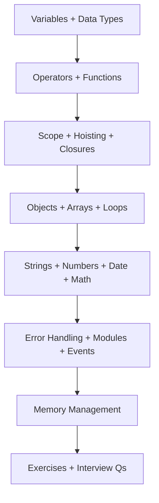

# 01 — JavaScript Fundamentals

> Core JavaScript every Node.js backend interview expects you to know deeply — from variables and types through memory and garbage collection.

---

## Who This Section Is For

- Developers preparing for Node.js / backend interviews
- Engineers who can “use JS” but need crisp mental models for scope, closures, hoisting, and GC
- Anyone starting the [InterviewPrep](../README.md) roadmap

**Prerequisites:** Basic programming familiarity. No prior Node.js required for this section.

---

## Learning Roadmap



| Phase | Topics | Focus | Est. Time |
|-------|--------|-------|-----------|
| **1. Core language** | Variables → Functions | Declarations, types, operators, functions | 2–3 days |
| **2. Execution model** | Scope, Hoisting, Closures | How JS really runs | 2–3 days |
| **3. Data structures** | Objects, Arrays, Loops | Everyday backend patterns | 2–3 days |
| **4. Built-ins** | Strings, Numbers, Date, Math | APIs interviewers quiz | 1–2 days |
| **5. Runtime skills** | Errors, Modules, Events, Memory | Production Node mindset | 2–3 days |
| **6. Drill** | Exercises + Interview Qs | Apply under pressure | Ongoing |

---

## Topic Index

| # | Topic | Folder | Key Interview Themes |
|---|--------|--------|----------------------|
| 1 | [Variables](./variables/README.md) | `variables/` | `var`/`let`/`const`, TDZ, immutability |
| 2 | [Data Types](./data-types/README.md) | `data-types/` | Primitives vs objects, `typeof`, coercion |
| 3 | [Operators](./operators/README.md) | `operators/` | `===`, `??`, `?.`, bitwise, precedence |
| 4 | [Functions](./functions/README.md) | `functions/` | Declaration vs expression, rest/spread, `this` |
| 5 | [Scope](./scope/README.md) | `scope/` | Global, function, block, lexical scope |
| 6 | [Hoisting](./hoisting/README.md) | `hoisting/` | Temporal Dead Zone, function hoisting |
| 7 | [Closures](./closures/README.md) | `closures/` | Private state, factory patterns, leaks |
| 8 | [Objects](./objects/README.md) | `objects/` | Prototypes, descriptors, cloning |
| 9 | [Arrays](./arrays/README.md) | `arrays/` | Mutating vs pure methods, ES2023 |
| 10 | [Loops](./loops/README.md) | `loops/` | `for…of`, iterators, when not to loop |
| 11 | [Strings](./strings/README.md) | `strings/` | Templates, Unicode, modern methods |
| 12 | [Numbers](./numbers/README.md) | `numbers/` | IEEE-754, `BigInt`, `Number` APIs |
| 13 | [Date](./date/README.md) | `date/` | Timezones, ISO, pitfalls |
| 14 | [Math](./math/README.md) | `math/` | Rounding, random, clamping |
| 15 | [Error Handling](./error-handling/README.md) | `error-handling/` | `try/catch`, custom errors, `finally` |
| 16 | [Modules](./modules/README.md) | `modules/` | CommonJS vs ESM, circular deps |
| 17 | [Events](./events/README.md) | `events/` | EventEmitter patterns (Node-relevant) |
| 18 | [Memory Management](./memory-management/README.md) | `memory-management/` | GC, retainers, leak patterns |

**Practice**

- [Exercises (25+)](./exercises/README.md) → [solutions](./exercises/solutions/)
- [Interview Questions (40+)](./interview-questions/README.md)

---

## How to Study

1. Read the topic `README.md` top-to-bottom.
2. Run the `.js` example files with Node:
   ```bash
   node variables/example.js
   ```
3. Answer the topic’s interview questions out loud (explain, don’t memorize).
4. After every 3–4 topics, do related exercises without peeking at solutions.
5. Finish with the consolidated [interview-questions](./interview-questions/README.md) bank.

---

## Conventions

- **Language:** ES2023 / ES2024 where useful; Node.js–compatible snippets
- **Difficulty tags:** `Beginner` · `Intermediate` · `Advanced`
- **Diagrams:** Mermaid in Markdown
- **Docs:** Prefer [MDN](https://developer.mozilla.org/en-US/docs/Web/JavaScript) as source of truth

---

## Official References

- [MDN JavaScript Guide](https://developer.mozilla.org/en-US/docs/Web/JavaScript/Guide)
- [MDN JavaScript Reference](https://developer.mozilla.org/en-US/docs/Web/JavaScript/Reference)
- [ECMAScript Language Specification](https://tc39.es/ecma262/)
- [Node.js Docs](https://nodejs.org/docs/latest/api/)

---

## Next Section

When this section feels solid → [`02-ES6-Modern-JavaScript`](../02-ES6-Modern-JavaScript/README.md)
