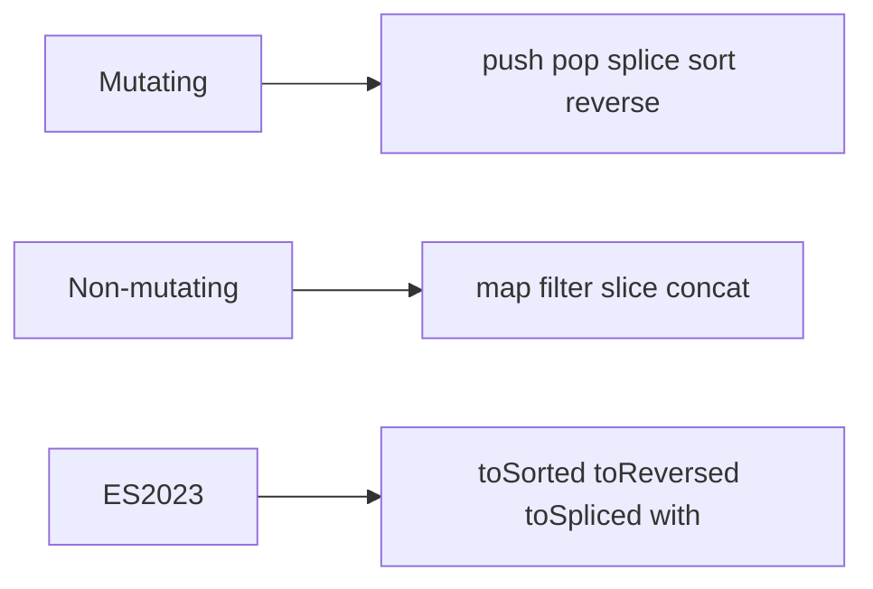

# Arrays

> Creation, mutation vs pure methods, iteration, and ES2023 immutable array methods.

**Difficulty:** Beginner → Advanced
**Docs:** [MDN: Array](https://developer.mozilla.org/en-US/docs/Web/JavaScript/Reference/Global_Objects/Array)

---

## Explanation

Arrays are ordered, length-indexed objects optimized for sequential data. Many methods **mutate**; modern code often prefers **immutable** updates (`map`, `filter`, `toSorted`, etc.).



---

## Syntax

```js
const nums = [1, 2, 3];
const more = [...nums, 4];
const [first, second, ...rest] = more;
```

---

## Examples

### Example 1 — Basics

```js
const a = [10, 20, 30];
a.push(40);
console.log(a.length); // 4
console.log(a.at(-1)); // 40
```

### Example 2 — map / filter / reduce

```js
const nums = [1, 2, 3, 4];
const doubled = nums.map((n) => n * 2);       // [2,4,6,8]
const evens = nums.filter((n) => n % 2 === 0); // [2,4]
const sum = nums.reduce((acc, n) => acc + n, 0); // 10
console.log(doubled, evens, sum);
```

### Example 3 — ES2023 copy helpers

```js
const arr = [3, 1, 2];
console.log(arr.toSorted((a, b) => a - b)); // [1,2,3]
console.log(arr);                           // [3,1,2] unchanged
console.log(arr.toReversed());              // [2,1,3]
console.log(arr.with(1, 99));               // [3,99,2]
console.log(arr.toSpliced(1, 1, 8, 9));     // [3,8,9,2]
```

### Example 4 — find / some / every / includes

```js
const users = [
  { id: 1, active: true },
  { id: 2, active: false },
];
console.log(users.find((u) => u.id === 2));     // { id:2, active:false }
console.log(users.some((u) => u.active));       // true
console.log(users.every((u) => u.active));      // false
console.log([1, 2, 3].includes(2));             // true
```

### Example 5 — flat / flatMap

```js
console.log([1, [2, [3]]].flat(2)); // [1,2,3]
console.log([1, 2].flatMap((n) => [n, n * 10])); // [1,10,2,20]
```

### Example 6 — Sparse arrays pitfall

```js
const sparse = [1, , 3];
console.log(sparse.length); // 3
console.log(sparse.map((x) => x)); // hole preserved in map callbacks (skipped)
```

### Example 7 — Destructuring & swap

```js
let a = 1;
let b = 2;
[a, b] = [b, a];
console.log(a, b); // 2 1
```

---

## Common Mistakes

1. Using `sort()` / `reverse()` when immutability was expected (mutates in place).
2. `typeof [] === 'object'` — use `Array.isArray`.
3. Using `map` for side effects — use `forEach` or `for…of`.
4. Confusing `slice` (copy) with `splice` (mutate).
5. Assuming `array[-1]` works — use `array.at(-1)`.

---

## Best Practices

- Prefer non-mutating methods in shared/stateful code.
- Use `Array.isArray` for validation.
- Prefer `for…of` for simple iteration; functional methods for transforms.
- Avoid sparse arrays.
- For large datasets, consider streams / pagination rather than giant in-memory arrays.

---

## Performance Considerations

- `push`/`pop` are amortized O(1); `unshift`/`shift` are O(n).
- `splice` in the middle is O(n).
- Chaining many `map`/`filter` creates intermediate arrays — sometimes one `reduce` or a loop is better for huge data.
- `includes` / `indexOf` are O(n); use `Set` for repeated membership tests.

---

## Interview Questions

**Q1. Mutating vs non-mutating methods?**
`push`/`splice`/`sort` mutate; `map`/`filter`/`slice`/`toSorted` return new arrays.

**Q2. How does `reduce` work?**
Accumulates a single result by iterating with an accumulator.

**Q3. Difference between `slice` and `splice`?**
`slice` copies a range; `splice` inserts/deletes in place.

**Q4. What did ES2023 add?**
`toSorted`, `toReversed`, `toSpliced`, `with` — immutable counterparts.

**Q5. How to clone an array shallowly?**
`[...arr]` or `arr.slice()`.

---

## Notes

- Run [`example.js`](./example.js) and [`example-es2023.js`](./example-es2023.js).
- Related: [Loops](../loops/README.md), [Objects](../objects/README.md).

---

## References

- [MDN: Array](https://developer.mozilla.org/en-US/docs/Web/JavaScript/Reference/Global_Objects/Array)
- [MDN: Array.prototype.toSorted](https://developer.mozilla.org/en-US/docs/Web/JavaScript/Reference/Global_Objects/Array/toSorted)
