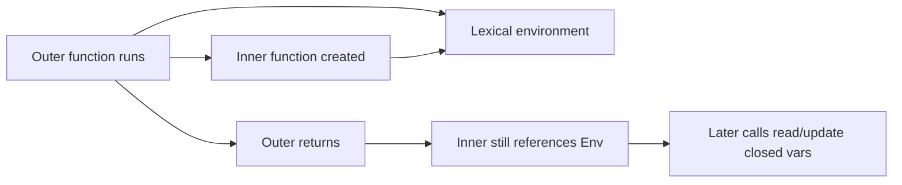

# Closures

> Functions that remember their lexical environment — private state, factories, and classic interview traps.

**Difficulty:** Intermediate → Advanced  
**Docs:** [MDN: Closures](https://developer.mozilla.org/en-US/docs/Web/JavaScript/Closures)

---

## Explanation

A **closure** is a function bundled with references to its surrounding lexical environment. When an inner function outlives its outer function, it still can access outer variables.



Closures power: data privacy, function factories, partial application, React hooks (conceptually), middleware wrappers, and memoization.

---

## Syntax

```js
function makeCounter(start = 0) {
  let count = start;
  return {
    inc() {
      count += 1;
      return count;
    },
    value() {
      return count;
    },
  };
}
```

---

## Examples

### Example 1 — Basic closure

```js
function outer() {
  const message = 'hello';
  return function inner() {
    return message;
  };
}
const fn = outer();
console.log(fn()); // hello
```

### Example 2 — Private state

```js
function createBank(initial) {
  let balance = initial;
  return {
    deposit(n) {
      balance += n;
      return balance;
    },
    withdraw(n) {
      if (n > balance) throw new Error('insufficient');
      balance -= n;
      return balance;
    },
    getBalance() {
      return balance;
    },
  };
}
const acct = createBank(100);
acct.deposit(50);
console.log(acct.getBalance()); // 150
```

### Example 3 — Loop trap with `var`

```js
for (var i = 0; i < 3; i++) {
  setTimeout(() => console.log(i), 0);
}
// 3 3 3

for (let j = 0; j < 3; j++) {
  setTimeout(() => console.log(j), 0);
}
// 0 1 2
```

### Example 4 — Function factory

```js
function multiplyBy(factor) {
  return (n) => n * factor;
}
const double = multiplyBy(2);
console.log(double(21)); // 42
```

### Example 5 — Module pattern

```js
const service = (() => {
  const cache = new Map();
  return {
    get(key) {
      return cache.get(key);
    },
    set(key, val) {
      cache.set(key, val);
    },
  };
})();
service.set('a', 1);
console.log(service.get('a')); // 1
```

### Example 6 — Stale closure caution

```js
function createWatcher() {
  let latest = 0;
  return {
    set(v) {
      latest = v;
    },
    // Captures binding, not a snapshot of the number — reads current value
    read() {
      return latest;
    },
  };
}
```

---

## Common Mistakes

1. Loop + `var` + async callback sharing one binding.
2. Accidentally retaining large objects in closures → memory leaks.
3. Thinking closures copy values — they close over **bindings**.
4. Overusing closures when a simple object/class is clearer.
5. Creating closures inside hot paths unnecessarily.

---

## Best Practices

- Use closures for encapsulation when modules/classes are heavier than needed.
- Prefer `let` in loops with async callbacks.
- Be mindful of what you capture (especially large arrays/buffers).
- Document private-state APIs clearly.
- In Node, prefer module scope for singletons; closures for per-instance privacy.

---

## Performance Considerations

- Each closure retains referenced outer bindings — can pin memory.
- Don’t close over entire `req`/`res` objects longer than needed in long-lived timers.
- Engines optimize common closure patterns well; leaks are about retention, not “closure overhead.”

---

## Interview Questions

**Q1. What is a closure?**  
A function plus its lexical environment, allowing access to outer variables after the outer function returned.

**Q2. Common real-world uses?**  
Private state, factories, debouncing, middleware, partial application, callbacks.

**Q3. Why does `var` in a loop print the same value asynchronously?**  
One shared binding mutated to the final value before callbacks run.

**Q4. Can closures cause memory leaks?**  
Yes, if they retain large unreachable-from-business-logic objects via lingering references.

**Q5. Closure vs scope?**  
Scope is visibility rules; a closure is a runtime persistence of a scope’s bindings for a function.

---

## Notes

- Run [`example.js`](./example.js) and [`example-loop.js`](./example-loop.js).
- Related: [Scope](../scope/README.md), [Memory Management](../memory-management/README.md).

---

## References

- [MDN: Closures](https://developer.mozilla.org/en-US/docs/Web/JavaScript/Closures)
- [MDN: Lexical environment (guide via Closures)](https://developer.mozilla.org/en-US/docs/Web/JavaScript/Closures#lexical_scoping)
