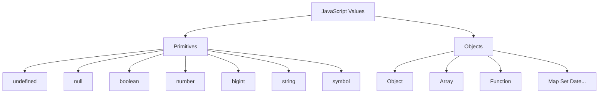

# Data Types

> Primitive vs reference types, `typeof`, coercion, and equality — the foundation of every JS interview.

**Difficulty:** Beginner → Intermediate  
**Docs:** [MDN: Data types](https://developer.mozilla.org/en-US/docs/Web/JavaScript/Data_structures) · [typeof](https://developer.mozilla.org/en-US/docs/Web/JavaScript/Reference/Operators/typeof)

---

## Explanation

JavaScript has **7 primitive types** and **objects** (reference types).

| Category | Types |
|----------|--------|
| Primitives | `undefined`, `null`, `boolean`, `number`, `bigint`, `string`, `symbol` |
| Objects | Plain objects, arrays, functions, dates, maps, sets, etc. |

Primitives are **immutable** and compared by value. Objects are compared by **reference**.



### `typeof` quirks

| Expression | Result |
|------------|--------|
| `typeof null` | `"object"` (legacy bug) |
| `typeof []` | `"object"` |
| `typeof function(){}` | `"function"` |
| `typeof 1n` | `"bigint"` |
| `typeof Symbol()` | `"symbol"` |

Detect arrays with `Array.isArray(x)`, not `typeof`.

---

## Syntax

```js
const n = 42;           // number
const big = 42n;        // bigint
const s = 'hi';         // string
const ok = true;        // boolean
const u = undefined;
const z = null;
const id = Symbol('id');
const obj = { a: 1 };
```

---

## Examples

### Example 1 — typeof catalog

```js
console.log(typeof 1);          // 'number'
console.log(typeof NaN);        // 'number'
console.log(typeof 'x');        // 'string'
console.log(typeof true);       // 'boolean'
console.log(typeof undefined);  // 'undefined'
console.log(typeof null);       // 'object'  ← quirk
console.log(typeof {});         // 'object'
console.log(typeof []);         // 'object'
console.log(typeof (() => {})); // 'function'
console.log(typeof 10n);        // 'bigint'
console.log(typeof Symbol());   // 'symbol'
```

### Example 2 — Value vs reference

```js
let a = 1;
let b = a;
b = 2;
console.log(a, b); // 1 2

const o1 = { x: 1 };
const o2 = o1;
o2.x = 9;
console.log(o1.x); // 9  (same reference)
```

### Example 3 — Nullish vs falsy

```js
const count = 0;
console.log(count || 10);  // 10  (0 is falsy)
console.log(count ?? 10);  // 0   (only null/undefined)
```

### Example 4 — Explicit conversion

```js
Number('42');      // 42
String(42);        // '42'
Boolean(0);        // false
Boolean('0');      // true
parseInt('08', 10); // 8
```

### Example 5 — Object wrappers (avoid)

```js
const s = 'hi';
console.log(s.toUpperCase()); // HI (temporary wrapper)
// new String('hi') === 'hi' → false (object vs primitive)
```

---

## Common Mistakes

1. Using `typeof null === 'object'` as a null check → use `x === null`.
2. Comparing objects with `===` expecting deep equality.
3. Mixing `number` and `bigint` in arithmetic (`1 + 1n` throws).
4. Relying on loose `==` coercion.
5. Treating empty array/`{}` as falsy (they are truthy).

---

## Best Practices

- Prefer `===` / `!==`.
- Use `??` when `0`, `''`, or `false` are valid values.
- Check null with `x == null` (covers null + undefined) only when intentional; otherwise be explicit.
- Use `Array.isArray`, `Number.isNaN`, `Number.isFinite`.
- Document when APIs return `null` vs `undefined`.

---

## Performance Considerations

- Primitive comparisons are cheap; deep object equality is expensive — avoid naive recursive equality in hot paths.
- Boxing primitives (`new Number`) adds allocation — never use wrappers in production.
- Prefer primitives over boxed objects for maps/keys when possible.

---

## Interview Questions

**Q1. Primitive vs reference?**  
Primitives copy by value; objects share references.

**Q2. Why is `typeof null` `"object"`?**  
Historical bug from early JS; kept for compatibility.

**Q3. Difference between `null` and `undefined`?**  
`undefined` = uninitialized / missing. `null` = intentional empty.

**Q4. Is `NaN` a number?**  
`typeof NaN === 'number'`, but `NaN !== NaN`. Use `Number.isNaN`.

**Q5. How to detect an array?**  
`Array.isArray(value)`.

---

## Notes

- Run [`example.js`](./example.js).
- Related: [Operators](../operators/README.md), [Objects](../objects/README.md).

---

## References

- [MDN: Data structures](https://developer.mozilla.org/en-US/docs/Web/JavaScript/Data_structures)
- [MDN: Type coercion](https://developer.mozilla.org/en-US/docs/Web/JavaScript/Guide/Data_structures#type_coercion)
