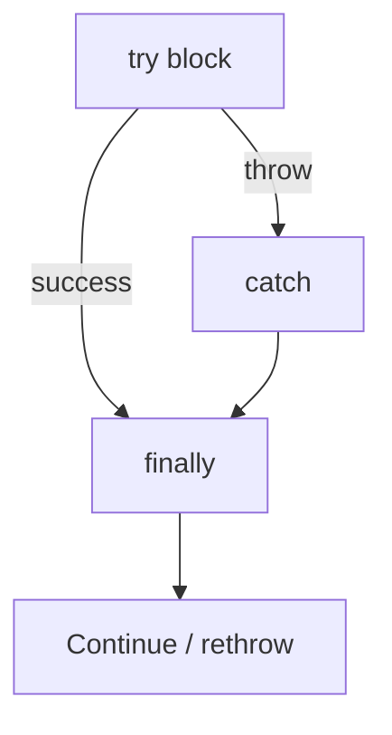

# Error Handling

> `try/catch/finally`, error types, custom errors, rethrowing, and Node-aware patterns.

**Difficulty:** Beginner → Advanced  
**Docs:** [MDN: Error](https://developer.mozilla.org/en-US/docs/Web/JavaScript/Reference/Global_Objects/Error) · [Control flow and error handling](https://developer.mozilla.org/en-US/docs/Web/JavaScript/Guide/Control_flow_and_error_handling)

---

## Explanation

Errors represent unexpected or exceptional conditions. In JavaScript you `throw` any value (prefer `Error` objects). Use `try/catch/finally` for synchronous failures; async code needs `try/catch` with `await` or promise `.catch`.



### Built-in error types

`Error`, `TypeError`, `ReferenceError`, `SyntaxError`, `RangeError`, `URIError`, `EvalError` (legacy), `AggregateError`.

---

## Syntax

```js
try {
  risky();
} catch (err) {
  console.error(err);
  throw err; // rethrow if unhandled here
} finally {
  cleanup();
}
```

---

## Examples

### Example 1 — Basic try/catch

```js
try {
  JSON.parse('{bad');
} catch (err) {
  console.log(err instanceof SyntaxError); // true
  console.log(err.message);
}
```

### Example 2 — finally always runs

```js
function read() {
  try {
    return 'ok';
  } finally {
    console.log('cleanup');
  }
}
console.log(read()); // cleanup then ok
```

### Example 3 — Custom error class

```js
class AppError extends Error {
  constructor(message, { code, status = 500, cause } = {}) {
    super(message, { cause });
    this.name = 'AppError';
    this.code = code;
    this.status = status;
  }
}

function getUser(id) {
  if (!id) throw new AppError('id required', { code: 'BAD_REQUEST', status: 400 });
  return { id };
}

try {
  getUser(null);
} catch (err) {
  if (err instanceof AppError) {
    console.log(err.status, err.code); // 400 BAD_REQUEST
  }
}
```

### Example 4 — Optional catch binding & cause

```js
try {
  throw new Error('outer', { cause: new Error('root') });
} catch (err) {
  console.log(err.message);       // outer
  console.log(err.cause.message); // root
}
```

### Example 5 — Guard clauses vs deep try

```js
function divide(a, b) {
  if (typeof a !== 'number' || typeof b !== 'number') {
    throw new TypeError('numbers required');
  }
  if (b === 0) throw new RangeError('division by zero');
  return a / b;
}
```

### Example 6 — AggregateError

```js
try {
  throw new AggregateError([new Error('a'), new Error('b')], 'multiple');
} catch (err) {
  console.log(err.errors.length); // 2
}
```

---

## Common Mistakes

1. Catching errors and swallowing them silently.
2. Throwing strings instead of `Error` (loses stack).
3. Using try/catch for normal control flow excessively.
4. Forgetting async errors aren’t caught by surrounding sync `try` without `await`.
5. Not cleaning up resources in `finally`.

---

## Best Practices

- Throw operational vs programmer errors deliberately (Node philosophy).
- Create domain error classes with `code` / `status`.
- Attach `cause` for wrapping.
- Log with stack at boundaries; map to HTTP responses in Express error middleware.
- Fail fast on invariant violations.

---

## Performance Considerations

- `throw` is expensive relative to normal branches — don’t use exceptions for expected hot-path control flow.
- Creating stack traces costs CPU; avoid throw storms.
- Prefer validation before expensive work.

---

## Interview Questions

**Q1. What does `finally` do?**  
Runs after try/catch regardless of success, throw, or return (with nuanced return override rules).

**Q2. Why extend `Error`?**  
Preserves stack + `instanceof` checks; adds domain fields.

**Q3. Sync try/catch and promises?**  
Rejected promises skip sync catch unless awaited/`catch`ed.

**Q4. Operational vs programmer errors?**  
Operational: expected runtime failures (network). Programmer: bugs (should crash/fix).

**Q5. What is `error.cause`?**  
Standard field for wrapping the underlying error.

---

## Notes

- Run [`example.js`](./example.js) and [`example-custom-error.js`](./example-custom-error.js).
- Related: [Functions](../functions/README.md), [Modules](../modules/README.md).

---

## References

- [MDN: try...catch](https://developer.mozilla.org/en-US/docs/Web/JavaScript/Reference/Statements/try...catch)
- [MDN: Error](https://developer.mozilla.org/en-US/docs/Web/JavaScript/Reference/Global_Objects/Error)
- [Node.js: Error handling](https://nodejs.org/en/learn/getting-started/error-handling-in-nodejs)
