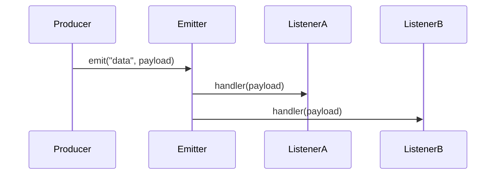

# Events

> Event-driven patterns with Node’s `EventEmitter` — foundational for streams, HTTP, and many Node APIs.

**Difficulty:** Intermediate → Advanced  
**Docs:** [Node.js Events](https://nodejs.org/api/events.html) · [MDN: EventTarget (browser contrast)](https://developer.mozilla.org/en-US/docs/Web/API/EventTarget)

---

## Explanation

Node.js is heavily **event-driven**. Many core objects (`http.Server`, streams, sockets) emit named events. The `events` module provides `EventEmitter` for custom pub/sub inside a process.



Key ideas: `on` / `once` / `off`, error events, memory leaks from forgotten listeners, and `AbortSignal` patterns in modern Node.

---

## Syntax

```js
const { EventEmitter } = require('events');
const bus = new EventEmitter();

bus.on('order', (order) => {
  console.log('got', order.id);
});

bus.emit('order', { id: 1 });
```

---

## Examples

### Example 1 — on / emit / once

```js
const { EventEmitter } = require('events');
const ee = new EventEmitter();

ee.on('ping', (n) => console.log('ping', n));
ee.once('ready', () => console.log('ready once'));

ee.emit('ping', 1);
ee.emit('ping', 2);
ee.emit('ready');
ee.emit('ready'); // ignored by once listener
```

### Example 2 — Special `error` event

```js
const { EventEmitter } = require('events');
const ee = new EventEmitter();

ee.on('error', (err) => {
  console.log('handled', err.message);
});

ee.emit('error', new Error('boom'));
// Without an 'error' listener, emit('error') throws
```

### Example 3 — removeListener / off

```js
const { EventEmitter } = require('events');
const ee = new EventEmitter();

function onData(chunk) {
  console.log(chunk);
}
ee.on('data', onData);
ee.off('data', onData);
ee.emit('data', 'x'); // no output
```

### Example 4 — Subclassing EventEmitter

```js
const { EventEmitter } = require('events');

class JobQueue extends EventEmitter {
  enqueue(job) {
    this.emit('job', job);
  }
}

const q = new JobQueue();
q.on('job', (job) => console.log('processing', job));
q.enqueue({ id: 42 });
```

### Example 5 — Max listeners warning

```js
const { EventEmitter } = require('events');
const ee = new EventEmitter();
ee.setMaxListeners(2);
// Adding many listeners without removal triggers a memory leak warning
```

### Example 6 — Async listeners caution

```js
ee.on('task', async () => {
  throw new Error('async failure'); // not caught by emitter automatically
});
// Prefer explicit error handling inside async listeners
```

---

## Common Mistakes

1. Forgetting `error` listeners → process crash on `emit('error')`.
2. Adding listeners every request without removing → leaks.
3. Assuming async listener errors propagate to emitter.
4. Emitting before listeners are registered.
5. Using EventEmitter for cross-service communication (prefer message queues).

---

## Best Practices

- Always handle `error` events on emitters that may emit them.
- Prefer `once` for one-shot lifecycle events.
- Remove listeners when objects are disposed.
- Document event names and payloads.
- For request-scoped work, avoid global emitters with unbounded listeners.

---

## Performance Considerations

- Emitting to many listeners is O(n) per emit.
- Listener leaks are a top Node memory issue — monitor `listenerCount`.
- Don’t use EventEmitter as a hot in-process bus for millions of events/sec without measuring.

---

## Interview Questions

**Q1. What is EventEmitter?**  
A Node pub/sub utility: register listeners and emit named events with arguments.

**Q2. Why is `error` special?**  
If emitted with no listeners, EventEmitter throws.

**Q3. `on` vs `once`?**  
`once` removes itself after first call.

**Q4. Common leak pattern?**  
Registering listeners in a loop/request handler without cleanup.

**Q5. EventEmitter vs message queue?**  
In-process vs distributed/durable cross-service messaging.

---

## Notes

- Run [`example.js`](./example.js) and [`example-subclass.js`](./example-subclass.js).
- Related: [Error Handling](../error-handling/README.md), [Memory Management](../memory-management/README.md).

---

## References

- [Node.js EventEmitter](https://nodejs.org/api/events.html#class-eventemitter)
- [Node.js EventEmitter error events](https://nodejs.org/api/events.html#error-events)
