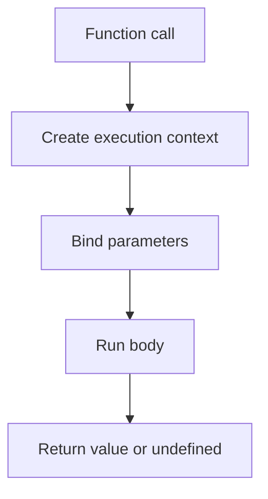

# Functions

> Declarations, expressions, arrows, parameters, rest/spread, default args, and `this` binding basics.

**Difficulty:** Beginner → Advanced  
**Docs:** [MDN: Functions](https://developer.mozilla.org/en-US/docs/Web/JavaScript/Guide/Functions) · [Arrow functions](https://developer.mozilla.org/en-US/docs/Web/JavaScript/Reference/Functions/Arrow_functions)

---

## Explanation

Functions are first-class values: assignable, passable, returnable. Forms:

| Form | Hoisted? | Own `this`? | `arguments`? |
|------|----------|-------------|--------------|
| Function declaration | Yes | Yes | Yes |
| Function expression | No | Yes | Yes |
| Arrow function | No | Lexical `this` | No |
| Method | No | Receiver | Yes |



---

## Syntax

```js
function add(a, b = 0) {
  return a + b;
}

const mul = function (a, b) {
  return a * b;
};

const square = (n) => n * n;

function sum(...nums) {
  return nums.reduce((a, b) => a + b, 0);
}
```

---

## Examples

### Example 1 — Declaration vs expression

```js
console.log(declared()); // works (hoisted)
function declared() {
  return 'ok';

// console.log(expr()); // ReferenceError / TypeError depending on const/let/var
const expr = function () {
  return 'later';
};
```

### Example 2 — Default + rest

```js
function createUser(name, role = 'user', ...tags) {
  return { name, role, tags };
}
console.log(createUser('Ada'));
// { name: 'Ada', role: 'user', tags: [] }
console.log(createUser('Bob', 'admin', 'a', 'b'));
// { name: 'Bob', role: 'admin', tags: [ 'a', 'b' ] }
```

### Example 3 — Arrow lexical `this`

```js
const timer = {
  seconds: 0,
  startBroken() {
    setTimeout(function () {
      // this is not timer
      // this.seconds++;
    }, 0);
  },
  start() {
    setTimeout(() => {
      this.seconds += 1;
      console.log(this.seconds);
    }, 0);
  },
};
```

### Example 4 — Higher-order function

```js
function withLogging(fn) {
  return function (...args) {
    console.log('args', args);
    return fn(...args);
  };
}
const add = (a, b) => a + b;
const loggedAdd = withLogging(add);
console.log(loggedAdd(2, 3)); // args [2,3] then 5
```

### Example 5 — IIFE (still useful for isolation)

```js
const result = (() => {
  const secret = 42;
  return secret * 2;
})();
console.log(result); // 84
```

### Example 6 — `call` / `apply` / `bind`

```js
function greet(greeting) {
  return `${greeting}, ${this.name}`;
}
const user = { name: 'Ada' };
console.log(greet.call(user, 'Hi'));   // Hi, Ada
console.log(greet.apply(user, ['Yo'])); // Yo, Ada
const bound = greet.bind(user, 'Hello');
console.log(bound()); // Hello, Ada
```

---

## Common Mistakes

1. Using arrow functions as object methods that need dynamic `this`.
2. Assuming arrows have `arguments` — use rest params.
3. Forgetting default parameters are evaluated at call time.
4. Mutating arguments / shared default objects: `function f(opts = {})` is fine; don’t mutate a shared default reference created once incorrectly.
5. Confusing hoisting of declarations vs `const fn = () => {}`.

---

## Best Practices

- Prefer pure functions for business logic when practical.
- Use arrows for callbacks; named declarations/methods when `this` or stack traces matter.
- Keep parameter lists short; prefer an options object for 3+ args.
- Name functions for clearer stack traces.
- Avoid deep nesting — extract helpers.

---

## Performance Considerations

- Creating functions inside hot loops allocates closures each iteration — hoist when possible.
- `.bind` creates a new function; prefer arrows or bind once at construction.
- Excessively higher-order wrapping can hurt readability more than speed; profile before micro-optimizing.

---

## Interview Questions

**Q1. Difference between declaration and expression?**  
Declarations are hoisted as callable; expressions follow `var`/`let`/`const` rules.

**Q2. How do arrow functions handle `this`?**  
They capture lexical `this` from the enclosing scope — no own binding.

**Q3. What is a first-class function?**  
A value that can be stored, passed, and returned like any other data.

**Q4. Rest vs spread?**  
Rest collects arguments into an array; spread expands an iterable into arguments/elements.

**Q5. What does a function return if no `return`?**  
`undefined`.

---

## Notes

- Run [`example.js`](./example.js) and [`example-this.js`](./example-this.js).
- Related: [Scope](../scope/README.md), [Closures](../closures/README.md).

---

## References

- [MDN: Functions](https://developer.mozilla.org/en-US/docs/Web/JavaScript/Guide/Functions)
- [MDN: this](https://developer.mozilla.org/en-US/docs/Web/JavaScript/Reference/Operators/this)
