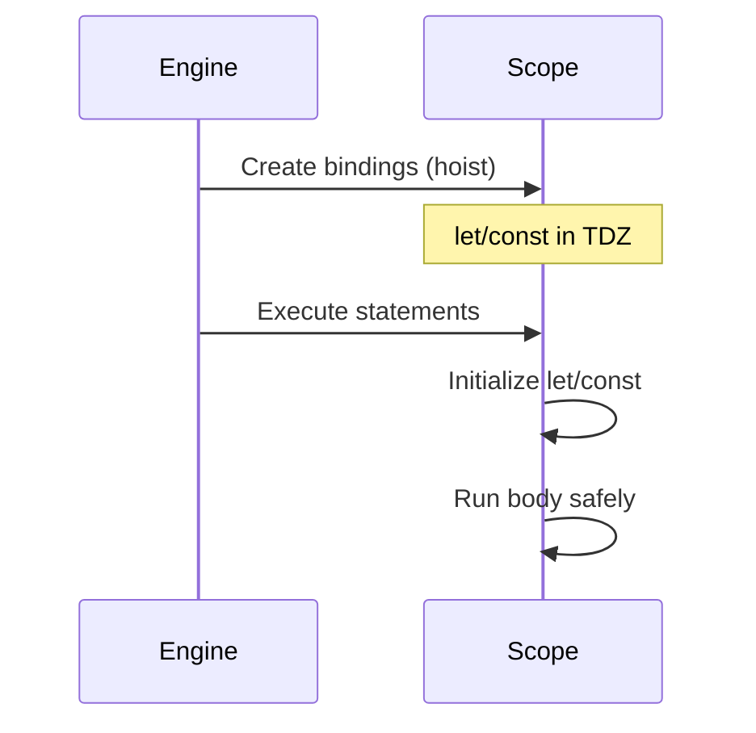

# Hoisting

> How declarations are processed before execution — and the Temporal Dead Zone.

**Difficulty:** Beginner → Intermediate  
**Docs:** [MDN: Hoisting](https://developer.mozilla.org/en-US/docs/Glossary/Hoisting)

---

## Explanation

During compilation of a scope, JavaScript **registers declarations** before running statements. People call this **hoisting**. Behavior differs by declaration kind:

| Declaration | Hoisted behavior |
|-------------|------------------|
| `function` declaration | Fully hoisted (callable before line) |
| `var` | Hoisted, initialized to `undefined` |
| `let` / `const` / `class` | Hoisted but uninitialized (TDZ) until line runs |
| Function expression / arrow in `const` | Binding TDZ; value assigned at runtime |



---

## Syntax

```js
// Function declaration usable early
fn();
function fn() {
  return 1;
}

// let/const not usable early
// console.log(x); // ReferenceError
let x = 2;
```

---

## Examples

### Example 1 — `var` hoist

```js
console.log(a); // undefined
var a = 5;
console.log(a); // 5
```

### Example 2 — Function declaration hoist

```js
console.log(add(2, 3)); // 5
function add(x, y) {
  return x + y;
}
```

### Example 3 — TDZ with `let`

```js
try {
  console.log(b);
} catch (e) {
  console.log(e.name); // ReferenceError
}
let b = 1;
```

### Example 4 — Duplicate `var` vs `let`

```js
var x = 1;
var x = 2; // allowed
console.log(x); // 2

let y = 1;
// let y = 2; // SyntaxError in same scope
```

### Example 5 — Class TDZ

```js
// const p = new Person(); // ReferenceError
class Person {}
const p = new Person();
```

### Example 6 — Inner function overshadowing

```js
console.log(typeof foo); // 'function' (outer declaration)
function foo() {
  return 'outer';
}
{
  // TDZ for inner foo if using let/const expression patterns;
  // function declarations in blocks are browser/engine nuanced —
  // prefer const fn = () => {} in blocks.
}
```

---

## Common Mistakes

1. Thinking `let` is “not hoisted” — it is, but TDZ blocks access.
2. Relying on function declaration hoisting across tangled files.
3. Using `var` and reading `undefined` without noticing.
4. Mixing `class` usage before declaration.
5. Assuming block-level `function` declarations are consistent everywhere — prefer `const`.

---

## Best Practices

- Declare before use — don’t rely on hoisting.
- Prefer `const`/`let` and function expressions/arrows for clarity.
- Keep one declaration style per codebase.
- Put helpers above usage or use module exports clearly.

---

## Performance Considerations

- Hoisting itself is a language semantics concern, not a runtime optimization knob.
- Readable declaration order helps humans and tooling more than micro-performance.

---

## Interview Questions

**Q1. Are `let` and `const` hoisted?**  
Yes, but they remain in the TDZ until initialization.

**Q2. Difference between hoisted `var` and `function`?**  
`var` → `undefined`; function declaration → callable function object.

**Q3. What is TDZ?**  
Window where accessing a `let`/`const`/`class` binding throws `ReferenceError`.

**Q4. Does hoisting move code literally?**  
No — it’s a mental model for binding creation before evaluation.

**Q5. Why can you call a function declaration before its line?**  
The binding is initialized with the function object during instantiation of the scope.

---

## Notes

- Run [`example.js`](./example.js).
- Related: [Variables](../variables/README.md), [Scope](../scope/README.md).

---

## References

- [MDN: Hoisting](https://developer.mozilla.org/en-US/docs/Glossary/Hoisting)
- [MDN: let TDZ](https://developer.mozilla.org/en-US/docs/Web/JavaScript/Reference/Statements/let#temporal_dead_zone_tdz)
