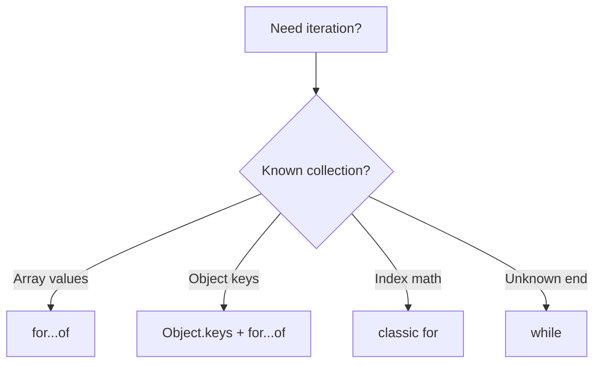

# Loops

> `for`, `while`, `do…while`, `for…in`, `for…of`, and when to prefer array methods.

**Difficulty:** Beginner → Intermediate  
**Docs:** [MDN: Loops and iteration](https://developer.mozilla.org/en-US/docs/Web/JavaScript/Guide/Loops_and_iteration)

---

## Explanation

Loops repeat work. Choose based on data shape and intent:

| Construct | Best for |
|-----------|----------|
| `for` | Index control, performance-sensitive |
| `while` / `do…while` | Unknown iteration count |
| `for…of` | Values of iterables (arrays, strings, Map, Set) |
| `for…in` | Enumerable keys of objects (use carefully) |
| `forEach` / `map` | Declarative transforms (no `break`) |



---

## Syntax

```js
for (let i = 0; i < n; i++) {}
for (const item of list) {}
for (const [k, v] of Object.entries(obj)) {}
while (condition) {}
```

---

## Examples

### Example 1 — Classic for

```js
const nums = [10, 20, 30];
for (let i = 0; i < nums.length; i++) {
  console.log(i, nums[i]);
}
```

### Example 2 — for…of

```js
for (const n of [1, 2, 3]) {
  console.log(n);
}
for (const ch of 'hi') {
  console.log(ch);
}
```

### Example 3 — for…in pitfalls

```js
const user = { name: 'Ada', age: 36 };
for (const key in user) {
  if (Object.hasOwn(user, key)) {
    console.log(key, user[key]);
  }
}
// Prefer:
for (const [k, v] of Object.entries(user)) {
  console.log(k, v);
}
```

### Example 4 — while / break / continue

```js
let i = 0;
while (i < 5) {
  i += 1;
  if (i === 2) continue;
  if (i === 4) break;
  console.log(i); // 1 then 3
}
```

### Example 5 — for await…of (async iterable concept)

```js
async function readAll(asyncIterable) {
  for await (const chunk of asyncIterable) {
    console.log(chunk);
  }
}
```

### Example 6 — Map / Set

```js
const map = new Map([['a', 1], ['b', 2]]);
for (const [k, v] of map) {
  console.log(k, v);
}
```

---

## Common Mistakes

1. Using `for…in` on arrays (string indices, prototype keys).
2. Mutating a collection while iterating unpredictably.
3. Expecting `break` inside `forEach` (use `for…of`).
4. Off-by-one errors in index loops.
5. Infinite `while` without exit condition updates.

---

## Best Practices

- Prefer `for…of` for array values.
- Use `Object.keys` / `entries` instead of `for…in` for plain objects.
- Use array methods for transforms; loops for control flow (`break`, early exit).
- Cache `length` only if profiling proves needed (engines usually optimize).
- Labelled statements exist but rarely improve clarity — avoid.

---

## Performance Considerations

- Classic `for` can be fastest for tight numeric loops; readability usually wins.
- Avoid creating functions per iteration in hot paths when unnecessary.
- For huge arrays, consider streaming / chunking in Node.

---

## Interview Questions

**Q1. `for…in` vs `for…of`?**  
`for…in` → keys; `for…of` → iterable values.

**Q2. Can you `break` from `forEach`?**  
No — use `for…of` or `some`/`every`.

**Q3. What is an iterable?**  
An object implementing `@@iterator` (e.g., Array, Map, Set, string).

**Q4. When prefer `while`?**  
When the end condition isn’t a simple index range.

**Q5. Is `for await…of` useful in Node?**  
Yes — for async iterables like streams in object mode / custom async generators.

---

## Notes

- Run [`example.js`](./example.js).
- Related: [Arrays](../arrays/README.md), [Objects](../objects/README.md).

---

## References

- [MDN: for...of](https://developer.mozilla.org/en-US/docs/Web/JavaScript/Reference/Statements/for...of)
- [MDN: Iteration protocols](https://developer.mozilla.org/en-US/docs/Web/JavaScript/Reference/Iteration_protocols)
