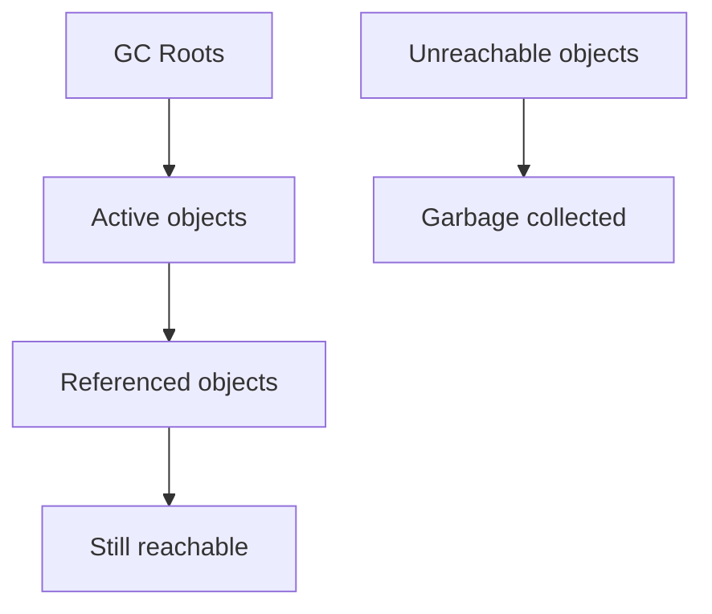

# Memory Management & Garbage Collection

> How JS allocates, retains, and frees memory — plus leak patterns interviewers love.

**Difficulty:** Intermediate → Advanced  
**Docs:** [MDN: Memory management](https://developer.mozilla.org/en-US/docs/Web/JavaScript/Memory_management) · [Node.js: Memory](https://nodejs.org/en/docs/guides/diagnostics/memory/)

---

## Explanation

JavaScript engines (V8 in Node/Chrome) automatically reclaim memory for objects that are no longer **reachable**. You don’t free memory manually, but you **must avoid retaining** references you don’t need.

### Reachability

An object is alive if reachable from roots (stack, globals, in-use closures, handles).



### V8 GC (high level)

- **Young generation** (nursery/scavenge): short-lived objects
- **Old generation** (mark-sweep/compact): longer-lived objects
- Algorithms evolve (e.g., Orinoco, concurrent marking) — interview for concepts, not version trivia

---

## Syntax / Tools (Node)

```bash
node --expose-gc
node --inspect
# Chrome DevTools → Memory heap snapshots
process.memoryUsage()
```

```js
console.log(process.memoryUsage());
// { rss, heapTotal, heapUsed, external, arrayBuffers }
```

---

## Examples

### Example 1 — Reachability

```js
let user = { name: 'Ada' };
user = null; // previous object eligible for GC (if nothing else references it)
```

### Example 2 — Closure retention

```js
function createHandler() {
  const huge = Buffer.alloc(10_000_000);
  return function onEvent(type) {
    if (type === 'ping') return 'pong';
    // huge is retained even if unused in this branch
    return huge.length;
  };
}
```

### Example 3 — Forgotten timers / listeners

```js
const cache = new Map();
setInterval(() => {
  cache.set(Date.now(), Buffer.alloc(1000));
}, 100);
// Without clearInterval + bounded cache → leak-like growth
```

### Example 4 — Detached references in caches

```js
const cache = new Map();
function getUser(id) {
  if (!cache.has(id)) cache.set(id, { id, data: '...' });
  return cache.get(id);
}
// Unbounded Map grows forever — use LRU / TTL
```

### Example 5 — WeakRef / WeakMap idea

```js
const wm = new WeakMap();
let obj = { id: 1 };
wm.set(obj, 'meta');
obj = null; // entry can be GC'd because key was weak
```

### Example 6 — Measuring

```js
const before = process.memoryUsage().heapUsed;
const arr = new Array(1e6).fill(0);
const after = process.memoryUsage().heapUsed;
console.log('approx bytes', after - before);
```

---

## Common Leak Patterns (Node)

1. Unbounded caches / global Maps / arrays
2. EventEmitter listeners never removed
3. Uncleared `setInterval` / lingering timeouts holding closures
4. Closures capturing large request/response objects
5. Growing `Buffer`/array lists in long-lived services
6. Circular references with native handles (less common with modern GC, but resources still need cleanup)

---

## Best Practices

- Bound all caches (size + TTL).
- Remove listeners and clear timers on shutdown/dispose.
- Prefer streaming large payloads over buffering entirely.
- Null out large locals when a long-lived closure would otherwise retain them (or restructure).
- Use heap snapshots when debugging real leaks.
- Prefer `WeakMap`/`WeakSet` for metadata tied to object lifetime.

---

## Performance Considerations

- GC pauses can affect latency — reduce allocation churn in hot paths.
- Short-lived objects are cheap; promoting huge volumes to old space hurts.
- `Buffer.alloc` vs `allocUnsafe` tradeoffs (security vs speed).
- Monitor `heapUsed`, RSS, and event-loop lag in production.

---

## Interview Questions

**Q1. How does GC know what to free?**  
Objects not reachable from roots.

**Q2. Does JS have manual free?**  
No general manual free; you drop references / close resources.

**Q3. Common Node leak?**  
Global unbounded cache or EventEmitter listener accumulation.

**Q4. What is a retainers path?**  
Chain of references keeping an object alive (visible in heap snapshots).

**Q5. WeakMap vs Map for caching?**  
WeakMap keys don’t prevent GC of the key object; Map keeps strong refs. WeakMap isn’t iterable for listing all entries.

**Q6. Young vs old generation?**  
New objects start young; survivors may promote to old generation with different collection strategies.

---

## Notes

- Run [`example.js`](./example.js) and [`example-leak-patterns.js`](./example-leak-patterns.js) (demo only — bounded).
- Related: [Closures](../closures/README.md), [Events](../events/README.md).

---

## References

- [MDN: Memory management](https://developer.mozilla.org/en-US/docs/Web/JavaScript/Memory_management)
- [Node.js diagnostics — memory](https://nodejs.org/en/docs/guides/diagnostics/memory/)
- [V8 blog: garbage collection](https://v8.dev/blog/trash-talk)
