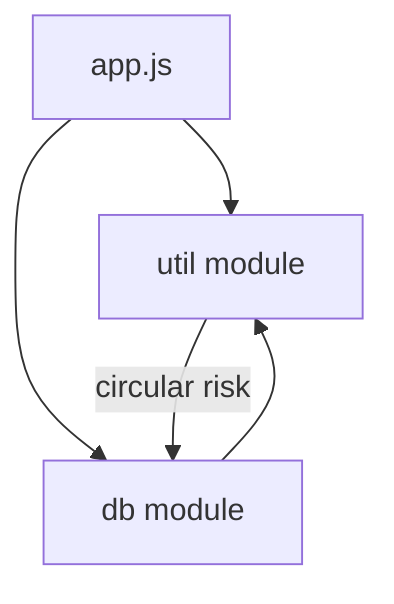

# Modules

> CommonJS vs ES Modules, exports, imports, circular dependencies, and Node resolution basics.

**Difficulty:** Intermediate → Advanced  
**Docs:** [MDN: Modules](https://developer.mozilla.org/en-US/docs/Web/JavaScript/Guide/Modules) · [Node.js Modules](https://nodejs.org/api/modules.html) · [Node.js ESM](https://nodejs.org/api/esm.html)

---

## Explanation

Modules encapsulate code and expose a public API. Node historically used **CommonJS** (`require`/`module.exports`). Modern Node also supports **ES Modules** (`import`/`export`), controlled by `"type": "module"`, `.mjs`, or `.cjs` extensions.



### Quick comparison

| Feature | CommonJS | ESM |
|---------|----------|-----|
| Load | Synchronous `require` | Static `import` (async under the hood) |
| Export | `module.exports` | `export` / `export default` |
| Filename | `.js` default CJS unless package type | `.mjs` or `"type":"module"` |
| `__dirname` | Yes | Use `import.meta.url` |
| Conditional import | Easy | Dynamic `import()` |

---

## Syntax

**CommonJS**

```js
// math.cjs
function add(a, b) {
  return a + b;
}
module.exports = { add };

// app.cjs
const { add } = require('./math.cjs');
```

**ESM**

```js
// math.mjs
export function add(a, b) {
  return a + b;
}

// app.mjs
import { add } from './math.mjs';
```

---

## Examples

### Example 1 — Named vs default (ESM concepts)

```js
// export function parse() {}
// export default class Parser {}
// import Parser, { parse } from './parser.mjs';
```

### Example 2 — Dynamic import

```js
async function loadTool(name) {
  const mod = await import(`./tools/${name}.mjs`);
  return mod.default;
}
```

### Example 3 — Circular dependency hazard

```js
// a.js requires b.js which requires a.js
// Partially initialized exports can be undefined — redesign to break cycles
```

### Example 4 — `import.meta.url` for paths

```js
import path from 'node:path';
import { fileURLToPath } from 'node:url';

const __filename = fileURLToPath(import.meta.url);
const __dirname = path.dirname(__filename);
console.log(__dirname);
```

### Example 5 — Re-exports

```js
// index.js
export { add, sub } from './math.js';
export { default as Calculator } from './calculator.js';
```

---

## Common Mistakes

1. Mixing CJS `require` of ESM-only packages incorrectly.
2. Forgetting file extensions in Node ESM relative imports.
3. Mutating `exports` incorrectly (`exports = {}` does not replace `module.exports`).
4. Circular imports causing `undefined` bindings.
5. Assuming `__dirname` exists in ESM.

---

## Best Practices

- Pick one module system per package; prefer ESM for new greenfield if ecosystem allows.
- Use explicit exports barrel files carefully (tree-shaking / load cost).
- Keep modules focused (single responsibility).
- Avoid circular dependencies — extract shared constants/types.
- Use `node:` prefix for built-ins (`node:fs`, `node:path`).

---

## Performance Considerations

- CJS `require` is sync and cached after first load.
- ESM static imports are hoisted and evaluated once (live bindings).
- Dynamic `import()` is useful for optional/heavy features (lazy load).
- Huge dependency graphs increase cold-start time — relevant for serverless.

---

## Interview Questions

**Q1. CommonJS vs ESM?**  
CJS: sync `require`, `module.exports`. ESM: static `import/export`, live bindings, formal standard.

**Q2. Are modules cached?**  
Yes — subsequent imports/requires reuse evaluated module.

**Q3. What are live bindings in ESM?**  
Imported names reflect updates to exported bindings.

**Q4. How do you get `__dirname` in ESM?**  
From `import.meta.url` via `fileURLToPath`.

**Q5. How to break circular deps?**  
Extract shared module, delay require, or redesign interfaces.

---

## Notes

- Run CJS demo: [`example.cjs`](./example.cjs) with [`math-util.cjs`](./math-util.cjs).
- Related: [Functions](../functions/README.md), [Error Handling](../error-handling/README.md).

---

## References

- [MDN: JavaScript modules](https://developer.mozilla.org/en-US/docs/Web/JavaScript/Guide/Modules)
- [Node.js: ECMAScript modules](https://nodejs.org/api/esm.html)
- [Node.js: CommonJS](https://nodejs.org/api/modules.html)
