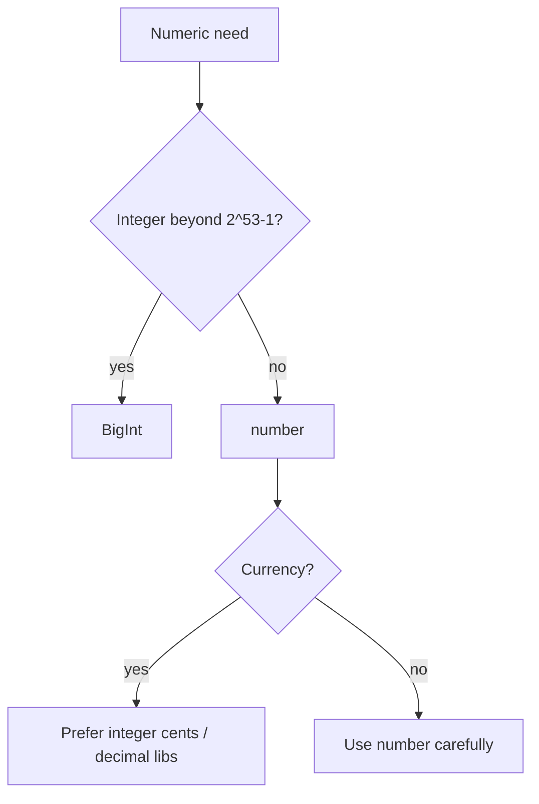

# Numbers

> IEEE-754 floating point, integer safety, `Number` methods, and `BigInt`.

**Difficulty:** Beginner → Intermediate  
**Docs:** [MDN: Number](https://developer.mozilla.org/en-US/docs/Web/JavaScript/Reference/Global_Objects/Number) · [BigInt](https://developer.mozilla.org/en-US/docs/Web/JavaScript/Reference/Global_Objects/BigInt)

---

## Explanation

JavaScript `number` is a double-precision float (IEEE-754). That means:

- Integers are safe only within `Number.MIN_SAFE_INTEGER` … `Number.MAX_SAFE_INTEGER` (±(2^53 − 1))
- Classic quirks: `0.1 + 0.2 !== 0.3`
- `NaN`, `Infinity`, `-0` exist

Use **`BigInt`** for arbitrary-precision integers (IDs, money in minor units sometimes, crypto sizes).



---

## Syntax

```js
const n = 42;
const f = 3.14;
const hex = 0xff;
const sci = 1e3;
const big = 9007199254740993n;
```

---

## Examples

### Example 1 — Float quirk

```js
console.log(0.1 + 0.2); // 0.30000000000000004
console.log(Math.abs(0.1 + 0.2 - 0.3) < Number.EPSILON); // true
```

### Example 2 — Safe integers

```js
console.log(Number.isSafeInteger(2 ** 53 - 1)); // true
console.log(Number.isSafeInteger(2 ** 53));     // false
console.log(9007199254740993); // 9007199254740992 (precision loss)
console.log(9007199254740993n); // 9007199254740993n
```

### Example 3 — Parsing

```js
console.log(Number('42'));      // 42
console.log(Number('42px'));    // NaN
console.log(parseInt('42px', 10)); // 42
console.log(parseFloat('3.14abc')); // 3.14
console.log(Number.parseInt('08', 10)); // 8
```

### Example 4 — NaN checks

```js
console.log(Number.isNaN(NaN)); // true
console.log(isNaN('hello'));    // true (coerces!) — avoid
console.log(Number.isNaN('hello')); // false
console.log(Number.isFinite(1 / 0)); // false
```

### Example 5 — Rounding helpers

```js
console.log((1.005).toFixed(2)); // '1.00' (string; float caveats)
console.log(Math.round(1.5)); // 2
console.log(Math.trunc(-1.9)); // -1
```

### Example 6 — BigInt rules

```js
console.log(10n + 5n); // 15n
// console.log(10n + 5); // TypeError
console.log(10n > 5); // true (comparison allowed)
console.log(Number(10n)); // 10
```

---

## Common Mistakes

1. Using floats for money without a strategy.
2. Using global `isNaN` instead of `Number.isNaN`.
3. Mixing `bigint` and `number` in arithmetic.
4. Assuming `parseInt` without radix.
5. Comparing floats with `===` without tolerance.

---

## Best Practices

- Store money as integer minor units (cents) or use a decimal library.
- Prefer `Number.isFinite` / `Number.isInteger` / `Number.isSafeInteger`.
- Always pass radix to `parseInt`.
- Use `BigInt` for large IDs (snowflakes, DB bigints) when needed.
- Validate numeric input at API boundaries.

---

## Performance Considerations

- `number` arithmetic is heavily optimized; `BigInt` is slower — use only when required.
- Avoid repeated string↔number conversions in hot loops.
- Prefer bitwise ops only for true bit flags within 32-bit range.

---

## Interview Questions

**Q1. Why is `0.1 + 0.2 !== 0.3`?**  
Binary floating-point can’t represent those decimals exactly.

**Q2. What is `Number.MAX_SAFE_INTEGER`?**  
`2^53 - 1` — largest integer safely represented as `number`.

**Q3. `parseInt` vs `Number`?**  
`Number('12px')` → `NaN`; `parseInt('12px', 10)` → `12`.

**Q4. When use BigInt?**  
Integers outside safe range or APIs requiring bigint.

**Q5. Difference between `NaN` and `Infinity`?**  
`NaN` = invalid numeric result; `Infinity` = overflow / divide-by-zero style extremes.

---

## Notes

- Run [`example.js`](./example.js).
- Related: [Math](../math/README.md), [Operators](../operators/README.md).

---

## References

- [MDN: Number](https://developer.mozilla.org/en-US/docs/Web/JavaScript/Reference/Global_Objects/Number)
- [MDN: BigInt](https://developer.mozilla.org/en-US/docs/Web/JavaScript/Reference/Global_Objects/BigInt)
- [IEEE-754 overview (MDN floats)](https://developer.mozilla.org/en-US/docs/Web/JavaScript/Reference/Global_Objects/Number#number_encoding)
