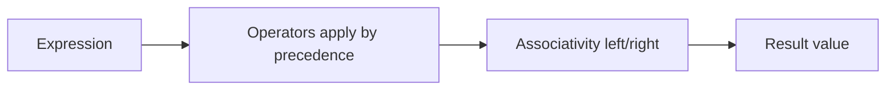

# Operators

> Arithmetic, comparison, logical, nullish, optional chaining, bitwise, and precedence — interview favorites.

**Difficulty:** Beginner → Intermediate  
**Docs:** [MDN: Expressions and operators](https://developer.mozilla.org/en-US/docs/Web/JavaScript/Guide/Expressions_and_operators)

---

## Explanation

Operators produce values from operands. Interview focus areas: **strict equality**, **short-circuiting**, **`??` vs `||`**, **optional chaining (`?.`)**, and **precedence**.



### Categories

| Category | Examples |
|----------|----------|
| Arithmetic | `+ - * / % **` |
| Assignment | `= += -= *= &&=` |
| Comparison | `=== !== < > <= >=` |
| Logical | `&& \|\| !` |
| Nullish | `?? ??= ` |
| Optional | `?.` |
| Bitwise | `& \| ^ ~ << >> >>>` |
| Other | `typeof`, `instanceof`, `in`, `delete`, `void`, `,` |

---

## Syntax

```js
const sum = a + b;
const ok = user?.profile?.email ?? 'n/a';
const flag = options.enabled ?? true;
obj.count ??= 0;
```

---

## Examples

### Example 1 — `==` vs `===`

```js
console.log(0 == false);   // true  (coercion)
console.log(0 === false);  // false
console.log('' == 0);      // true
console.log(null == undefined); // true
console.log(null === undefined); // false
```

### Example 2 — Short-circuit

```js
true && console.log('runs');   // runs
false && console.log('skip');  // (no log)
null || 'fallback';            // 'fallback'
0 || 'fallback';               // 'fallback'
0 ?? 'fallback';               // 0
```

### Example 3 — Optional chaining

```js
const user = { profile: null };
console.log(user.profile?.name); // undefined (no throw)
console.log(user.methods?.save?.()); // undefined
```

### Example 4 — Nullish assignment

```js
const cfg = { retries: 0 };
cfg.retries ??= 3;
console.log(cfg.retries); // 0
cfg.timeout ??= 5000;
console.log(cfg.timeout); // 5000
```

### Example 5 — Precedence

```js
console.log(1 + 2 * 3);     // 7
console.log((1 + 2) * 3);   // 9
console.log(true || false && false); // true  (&& before ||)
```

### Example 6 — Bitwise (flags)

```js
const READ = 1;   // 001
const WRITE = 2;  // 010
const EXEC = 4;   // 100
let perms = READ | WRITE; // 011 = 3
console.log((perms & WRITE) !== 0); // true
```

---

## Common Mistakes

1. Using `==` and getting surprised by coercion.
2. Using `||` when `0`/`''` should be kept → use `??`.
3. Optional chaining on the left of assignment (`a?.b = 1` is invalid).
4. Forgetting `**` is right-associative: `2 ** 3 ** 2 === 512`.
5. Mixing `bigint` with number operators incorrectly.

---

## Best Practices

- Always prefer `===` / `!==`.
- Use `??` for defaults when falsy values are valid.
- Use `?.` for deep optional access; don’t overuse on required data.
- Parenthesize complex expressions — readability > relying on precedence memory.
- Prefer explicit helpers over cryptic bitwise code unless flags are established.

---

## Performance Considerations

- Operator choice is rarely a bottleneck; branch predictability and allocations matter more.
- Avoid repeated deep `?.` chains in hot loops — cache intermediate objects.
- Bitwise ops on numbers coerce to 32-bit signed integers — know the limits.

---

## Interview Questions

**Q1. `||` vs `??`?**  
`||` falls through on any falsy value; `??` only on `null`/`undefined`.

**Q2. What does optional chaining return when missing?**  
`undefined` (does not throw).

**Q3. Why prefer `===`?**  
No type coercion; predictable comparisons.

**Q4. What is short-circuit evaluation?**  
`&&`/`||`/`??` stop evaluating once the result is known — useful for guards.

**Q5. Result of `typeof NaN === 'number' && NaN === NaN`?**  
`false` because `NaN === NaN` is false.

---

## Notes

- Run [`example.js`](./example.js).
- Related: [Data Types](../data-types/README.md), [Numbers](../numbers/README.md).

---

## References

- [MDN: Operator precedence](https://developer.mozilla.org/en-US/docs/Web/JavaScript/Reference/Operators/Operator_precedence)
- [MDN: Nullish coalescing](https://developer.mozilla.org/en-US/docs/Web/JavaScript/Reference/Operators/Nullish_coalescing)
- [MDN: Optional chaining](https://developer.mozilla.org/en-US/docs/Web/JavaScript/Reference/Operators/Optional_chaining)
