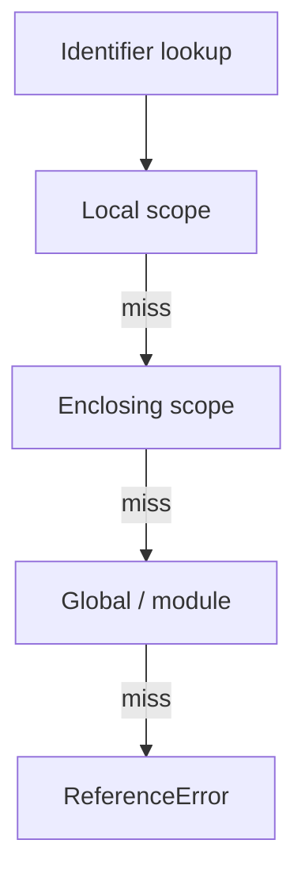

# Scope

> Global, function, block, and lexical scope — where identifiers resolve.

**Difficulty:** Beginner → Intermediate  
**Docs:** [MDN: Scope](https://developer.mozilla.org/en-US/docs/Glossary/Scope) · [Closures](https://developer.mozilla.org/en-US/docs/Web/JavaScript/Closures)

---

## Explanation

**Scope** determines the visibility of variables. JavaScript uses **lexical (static) scope**: where you write the code determines resolution, not where you call it.

| Scope | Created by | Keywords |
|-------|------------|----------|
| Global | Script / module top level | — |
| Function | `function` / method body | `var`, params |
| Block | `{ }` | `let`, `const`, `class` |
| Module | ESM file | top-level bindings are module-scoped |



---

## Syntax

```js
const globalish = 'module top'; // module scope in ESM / file scope in CJS scripts

function outer() {
  const a = 1;
  if (true) {
    const b = 2; // block
    console.log(a, b);
  }
  // console.log(b); // ReferenceError
}
```

---

## Examples

### Example 1 — Function vs block

```js
function demo(flag) {
  if (flag) {
    var x = 'var';
    let y = 'let';
  }
  console.log(x); // 'var'
  // console.log(y); // ReferenceError
}
demo(true);
```

### Example 2 — Lexical nesting

```js
const theme = 'dark';
function render() {
  function button() {
    console.log(theme); // dark (lexical)
  }
  button();
}
render();
```

### Example 3 — Shadowing

```js
let id = 'outer';
function run() {
  let id = 'inner';
  console.log(id); // inner
}
run();
console.log(id); // outer
```

### Example 4 — Loop + `let` per iteration

```js
for (let i = 0; i < 3; i++) {
  setTimeout(() => console.log(i), 0);
}
// 0 1 2  (each iteration has its own `i`)
```

### Example 5 — Module scope (concept)

```js
// In ESM, top-level `const secret` is NOT on globalThis
const secret = 123;
console.log(globalThis.secret); // undefined (typically)
```

---

## Common Mistakes

1. Expecting `var` to be block-scoped.
2. Accidental globals from missing declarations (sloppy mode).
3. Confusing dynamic `this` with lexical scope of variables.
4. Assuming `setTimeout` callback creates a new variable scope for `var` loop indices.
5. Pollution of global scope in scripts.

---

## Best Practices

- Prefer block scope (`let`/`const`).
- Keep scopes small; avoid deeply nested functions when extractable.
- Never rely on globals for app state in Node — use modules.
- Use modules to encapsulate private bindings.

---

## Performance Considerations

- Deep scope chains are rarely costly; closure retention of large objects is the real issue.
- Avoid capturing huge objects in long-lived nested functions.

---

## Interview Questions

**Q1. What is lexical scope?**  
Variable resolution based on where code is written (nesting), determined at author time.

**Q2. Global vs module scope?**  
In ESM, top-level bindings are module-private, not automatic globals.

**Q3. Does a block create scope for `var`?**  
No — only for `let`/`const`/`class`.

**Q4. What happens when lookup fails?**  
`ReferenceError`.

**Q5. Why does `let` in `for` fix classic closure bugs?**  
Each iteration gets a fresh binding.

---

## Notes

- Run [`example.js`](./example.js).
- Related: [Hoisting](../hoisting/README.md), [Closures](../closures/README.md).

---

## References

- [MDN: Scope](https://developer.mozilla.org/en-US/docs/Glossary/Scope)
- [MDN: Closures](https://developer.mozilla.org/en-US/docs/Web/JavaScript/Closures)
