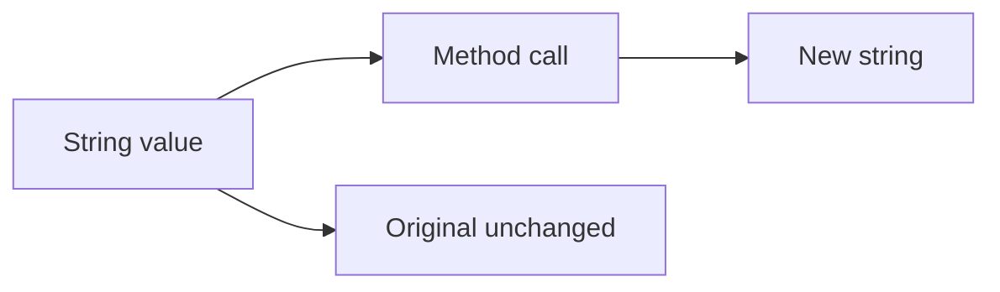

# Strings

> Immutability, templates, searching, slicing, Unicode awareness, and modern string methods.

**Difficulty:** Beginner → Intermediate  
**Docs:** [MDN: String](https://developer.mozilla.org/en-US/docs/Web/JavaScript/Reference/Global_Objects/String)

---

## Explanation

Strings are **immutable** sequences of UTF-16 code units. Methods return new strings. Prefer template literals for composition and tagged templates for DSLs/escaping.



---

## Syntax

```js
const name = 'Ada';
const msg = `Hello, ${name}!`;
const multi = `line1
line2`;
```

---

## Examples

### Example 1 — Basics

```js
const s = 'Node.js';
console.log(s.length);        // 7
console.log(s[0]);            // N
console.log(s.at(-1));        // s
console.log(s.toUpperCase()); // NODE.JS
```

### Example 2 — Search & extract

```js
const url = 'https://api.example.com/users';
console.log(url.includes('api'));      // true
console.log(url.startsWith('https'));  // true
console.log(url.endsWith('/users'));   // true
console.log(url.indexOf('example'));   // 12
console.log(url.slice(8, 11));         // api
```

### Example 3 — Split / join / replace

```js
const csv = 'a,b,c';
console.log(csv.split(',')); // ['a','b','c']
console.log(['a', 'b'].join('-')); // a-b
console.log('foo foo'.replace('foo', 'bar'));    // bar foo
console.log('foo foo'.replaceAll('foo', 'bar')); // bar bar
```

### Example 4 — Trim & pad

```js
console.log('  hi  '.trim()); // 'hi'
console.log('5'.padStart(3, '0')); // 005
console.log('5'.padEnd(3, '0'));   // 500
```

### Example 5 — Template literals

```js
const user = { name: 'Ada', role: 'admin' };
const html = `<div>${user.name} (${user.role})</div>`;
console.log(html);
```

### Example 6 — Unicode / code points

```js
const emoji = '🙂';
console.log(emoji.length); // 2 (UTF-16 code units)
console.log([...emoji].length); // 1
console.log(emoji.codePointAt(0).toString(16)); // 1f642
```

### Example 7 — `isWellFormed` / `toWellFormed` (ES2024)

```js
const broken = '\uD800';
console.log(broken.isWellFormed()); // false
console.log(broken.toWellFormed()); // replacement character string
```

---

## Common Mistakes

1. Treating strings as mutable.
2. Using `==` with numbers accidentally (`'10' > '9'` is lexicographic).
3. Incorrect Unicode length assumptions.
4. Building huge strings with `+=` in tight loops (sometimes use array + `join`).
5. Not sanitizing user strings before HTML (XSS) — backend still must escape for templates.

---

## Best Practices

- Prefer template literals over concatenation.
- Use `replaceAll` for global literal replaces; `replace` with `/g` for regex.
- Normalize input with `trim`, case-fold carefully (`toLocaleLowerCase` when needed).
- Validate encodings at system boundaries.
- For binary data use `Buffer`, not strings.

---

## Performance Considerations

- Strings are immutable; large concatenations may allocate often — profile and use builders when needed.
- Regex-heavy parsing can dominate CPU — cache compiled regexes.
- Avoid repeatedly slicing giant strings in hot paths.

---

## Interview Questions

**Q1. Are strings mutable?**  
No — methods return new strings.

**Q2. Template literal vs concatenation?**  
Templates are clearer, multi-line friendly, and expression-interpolating.

**Q3. Why can `str.length` disagree with visible characters?**  
UTF-16 code units vs Unicode code points / grapheme clusters.

**Q4. `slice` vs `substring`?**  
Prefer `slice` (supports negative indices; clearer). Avoid `substr` (legacy).

**Q5. How to do global replace of a string literal?**  
`replaceAll` or `replace` with global regex.

---

## Notes

- Run [`example.js`](./example.js).
- Related: [Numbers](../numbers/README.md), [Arrays](../arrays/README.md).

---

## References

- [MDN: String](https://developer.mozilla.org/en-US/docs/Web/JavaScript/Reference/Global_Objects/String)
- [MDN: Template literals](https://developer.mozilla.org/en-US/docs/Web/JavaScript/Reference/Template_literals)
