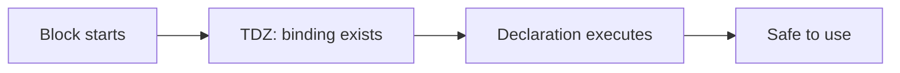

# Variables

> How JavaScript stores and binds values — `var`, `let`, `const`, Temporal Dead Zone, and immutability myths.

**Difficulty:** Beginner → Intermediate  
**Docs:** [MDN: let](https://developer.mozilla.org/en-US/docs/Web/JavaScript/Reference/Statements/let) · [const](https://developer.mozilla.org/en-US/docs/Web/JavaScript/Reference/Statements/const) · [var](https://developer.mozilla.org/en-US/docs/Web/JavaScript/Reference/Statements/var)

---

## Explanation

A **variable** is a named binding to a value. In modern JavaScript you almost always use `let` or `const`. Prefer `const` by default; use `let` when reassignment is required. Avoid `var` in new code.

| Keyword | Scope | Hoisted? | Reassign? | Redeclare same scope? |
|---------|-------|----------|-----------|------------------------|
| `var` | Function | Yes (`undefined`) | Yes | Yes |
| `let` | Block | Yes (TDZ) | Yes | No |
| `const` | Block | Yes (TDZ) | No | No |

### Temporal Dead Zone (TDZ)

From the start of a block until the `let`/`const` line runs, the binding exists but cannot be accessed. Reading it throws `ReferenceError`.



### `const` is not deep immutability

`const` prevents **rebinding** the identifier. Object and array contents can still change unless you freeze them (shallow) or use immutable patterns.

---

## Syntax

```js
const API_URL = 'https://api.example.com';
let retryCount = 0;
var legacyFlag = true; // avoid in new code

retryCount += 1;
// API_URL = 'other'; // TypeError
```

Destructuring declarations:

```js
const { id, name } = user;
const [first, ...rest] = items;
```

---

## Examples

### Example 1 — Block scope vs function scope

```js
function demo() {
  if (true) {
    var a = 1;
    let b = 2;
    const c = 3;
  }
  console.log(a); // 1
  // console.log(b); // ReferenceError
  // console.log(c); // ReferenceError
}
demo();
```

**Expected:** `1` (then errors if you uncomment `b`/`c`).

### Example 2 — TDZ

```js
{
  // console.log(x); // ReferenceError
  let x = 10;
  console.log(x); // 10
}
```

### Example 3 — `const` object mutation

```js
const user = { name: 'Ada' };
user.name = 'Grace';
console.log(user.name); // Grace
// user = {}; // TypeError
```

### Example 4 — Shadowing

```js
let count = 1;
{
  let count = 2;
  console.log(count); // 2
}
console.log(count); // 1
```

### Example 5 — Global `var` vs `let`

```js
var g1 = 'var-global';
let g2 = 'let-global';
// In browsers: window.g1 === 'var-global', window.g2 === undefined
// In Node: neither attaches to a browser window; avoid globals either way
console.log(g1, g2);
```

**Expected:** `var-global let-global`

---

## Common Mistakes

1. Using `var` and expecting block scope.
2. Believing `const` freezes nested properties.
3. Accessing `let`/`const` before declaration (TDZ).
4. Redeclaring with `let` in the same scope.
5. Accidental globals (assigning without declaration in non-strict mode).

---

## Best Practices

- Default to `const`; switch to `let` only when reassignment is needed.
- Never use `var` in new codebases.
- Name constants clearly (`MAX_RETRIES`, `DEFAULT_PORT`).
- Prefer destructuring for readability.
- Enable `"use strict"` / ESM (always strict) to catch accidental globals.

---

## Performance Considerations

- Binding choice (`let` vs `const`) has negligible runtime cost; engines optimize both.
- Accidental globals and large long-lived bindings can hurt memory more than keyword choice.
- Prefer small scopes — bindings die sooner → better GC eligibility.

---

## Interview Questions

**Q1. Difference between `var`, `let`, and `const`?**  
`var` is function-scoped and hoisted as `undefined`. `let`/`const` are block-scoped and TDZ-hoisted. `const` cannot be reassigned.

**Q2. Does `const` make objects immutable?**  
No — only the binding. Mutate properties freely unless you use `Object.freeze` (shallow) or immutable data patterns.

**Q3. What is the Temporal Dead Zone?**  
The period between entering a scope and initializing a `let`/`const` binding where access throws `ReferenceError`.

**Q4. Can you redeclare `let`?**  
Not in the same scope. Nested blocks may shadow.

**Q5. Why avoid `var`?**  
Function scope + hoisting surprises, accidental redeclarations, and loop-closure bugs.

---

## Notes

- Run [`example.js`](./example.js) and [`example-tdz.js`](./example-tdz.js).
- Related: [Scope](../scope/README.md), [Hoisting](../hoisting/README.md).

---

## References

- [MDN: Grammar and types — Declarations](https://developer.mozilla.org/en-US/docs/Web/JavaScript/Guide/Grammar_and_types#declarations)
- [MDN: Temporal dead zone](https://developer.mozilla.org/en-US/docs/Web/JavaScript/Reference/Statements/let#temporal_dead_zone_tdz)
