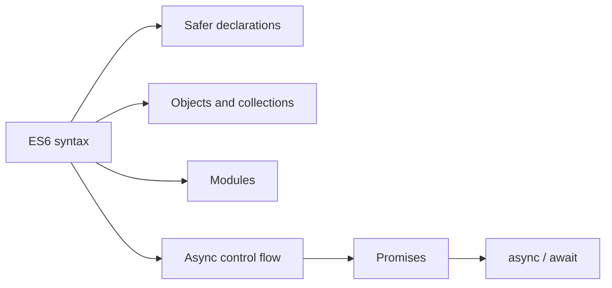

# ES6 and Modern JavaScript

Modern JavaScript introduced lexical bindings, modules, classes, promises, safer property access, and new collection types. Learn each folder in order, run its example, then solve the section exercises.

## Topic map

| Topic | Main interview idea |
| --- | --- |
| `let-const` | block scope, TDZ, immutable bindings |
| `arrow-functions` | lexical `this`, concise callbacks |
| `template-literals` | interpolation and tagged templates |
| `destructuring` | extracting values safely |
| `spread-rest` | copying versus collecting values |
| `modules` | live bindings and dependency boundaries |
| `default-parameters` | defaults apply only to `undefined` |
| `classes` | prototype-based inheritance syntax |
| `promises` / `async-await` | asynchronous composition |
| `symbol` / `bigint` | unique keys and arbitrary integers |
| `map-weakmap` / `set-weakset` | keyed and unique collections |
| `optional-chaining` / `nullish-coalescing` | null-safe reads and defaults |
| `dynamic-imports` | lazy-loaded modules |
| `generators-iterators` | pull-based sequences |
| `proxy-reflect` | metaprogramming with invariants |

## Study workflow

1. Read the topic `README.md`.
2. Run its `example.js` with Node (use an `.mjs` file or `"type": "module"` for ESM examples).
3. Predict the output before running it.
4. Complete the exercises without copying the example.
5. Answer the interview questions aloud, including trade-offs.

## Compatibility note

The examples target current Node.js. Babel/transpilation may be needed only when supporting older runtimes or browsers. Prefer native syntax when the deployment runtime supports it.

See [exercises](exercises/README.md) and [interview questions](interview-questions/README.md) after completing the topic guides.
