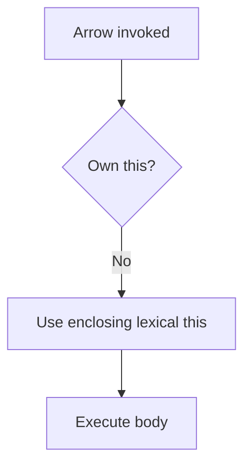

# Arrow Functions

Arrow functions provide concise function expressions and lexically capture `this`, `arguments`, `super`, and `new.target` from their surrounding scope. They are ideal for callbacks, but not universal replacements for functions.

## Internal working

An arrow has no own `this`; resolving `this` walks outward to the enclosing non-arrow function or module scope. It also has no `prototype`, so `new arrow()` throws.



## Syntax and use cases

```js
const square = value => value * value;
const format = (name, active) => ({ name, active });
const timer = {
  seconds: 0,
  start() { setInterval(() => { this.seconds += 1; }, 1000); },
};
```

Use them for array methods, promises, and callbacks that should retain an enclosing method's `this`.

## Mistakes and best practices

- Do not use an arrow for object methods that need dynamic receiver semantics.
- Do not use one as a constructor.
- Wrap an object literal body in parentheses: `() => ({ ok: true })`.
- Use a normal function when an API intentionally supplies `this` (for example many event handlers).

## Interview checks

1. Why can `bind` not give an arrow a different `this`?
2. How does an arrow affect `arguments`?
3. When is an arrow event listener a bug?

Run [example.js](example.js).
