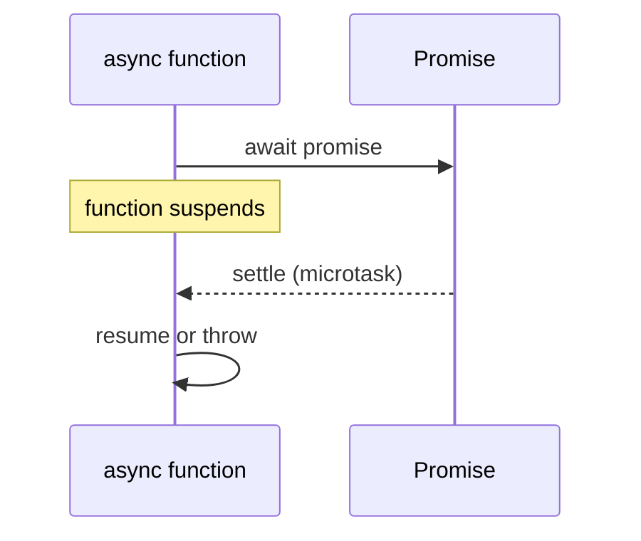

# Async/Await

`async`/`await` is promise syntax that makes asynchronous code read top-to-bottom. An `async` function always returns a Promise; `await` pauses only that function until a promise settles.

## Syntax and internal working

```js
async function loadUser(id) {
  const response = await fetch(`/users/${id}`);
  if (!response.ok) throw new Error("Request failed");
  return response.json();
}
```

Calling `loadUser()` immediately returns a pending Promise. At `await`, JavaScript registers a continuation in the microtask queue and lets the event loop run other work. A fulfilled promise resumes with its value; a rejected one throws at the `await`.



## Examples

```js
const doubleLater = (n) => Promise.resolve(n * 2);
async function run() { console.log(await doubleLater(21)); }
run(); // 42

async function safeParse(text) {
  try { return JSON.parse(text); }
  catch { return null; }
}
safeParse("bad").then(console.log); // null

async function parallel() {
  const [a, b] = await Promise.all([doubleLater(2), doubleLater(3)]);
  console.log(a + b); // 10
}
parallel();
```

Use it for HTTP, database, files, and sequential dependent work. Start independent operations before awaiting them, then combine with `Promise.all`.

## Common mistakes and best practices

- `await` outside an async function is invalid in CommonJS (top-level await works in ESM).
- Do not write `await` inside `forEach`; it does not await the callback. Use `for...of` for serial work or `Promise.all(items.map(...))` for parallel work.
- Catch errors at a level that can meaningfully recover; never silently swallow unexpected failures.
- Use `Promise.allSettled` when every result matters, including failures. `Promise.all` rejects on the first failure.
- Avoid accidental serialization: `const a = await A(); const b = await B()` is slower than starting both first when independent.

## Interview questions

**Does `await` block JavaScript?** No. It suspends the current async function; the event loop can execute other tasks.

**How does `async` differ from `new Promise`?** It is syntax that creates and composes promises; it does not make CPU-bound work non-blocking.

**What happens when an awaited promise rejects?** `await` throws the rejection reason, so `try/catch` can handle it.

**When should work be sequential?** When the next operation needs the prior result or order has side effects.

## References

- [MDN: async function](https://developer.mozilla.org/docs/Web/JavaScript/Reference/Statements/async_function)
- [MDN: await](https://developer.mozilla.org/docs/Web/JavaScript/Reference/Operators/await)
