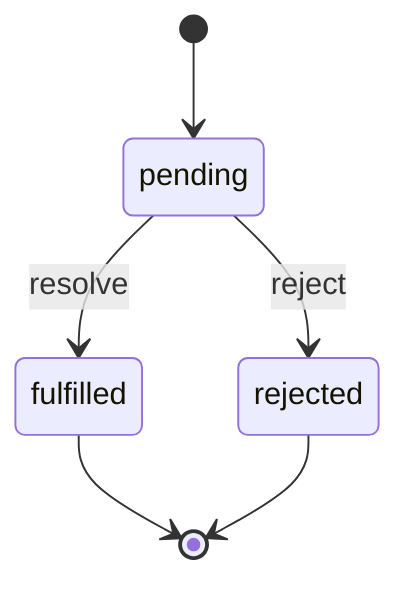

# Promises

A Promise represents the eventual result of asynchronous work. It is initially pending, then settles exactly once as fulfilled with a value or rejected with a reason.

## Syntax and internal working

```js
const promise = new Promise((resolve, reject) => {
  setTimeout(() => resolve("ready"), 100);
});
```

Handlers registered with `.then`, `.catch`, and `.finally` run asynchronously in the microtask queue after settlement. `.then` returns a new promise, adopting a returned value, returned promise, or thrown error.



## Examples

```js
Promise.resolve(2)
  .then((n) => n * 3)
  .then(console.log); // 6

Promise.reject(new Error("offline"))
  .catch((error) => console.log(error.message)); // offline

Promise.all([Promise.resolve("a"), Promise.resolve("b")])
  .then(console.log); // ["a", "b"]
```

Use promises for asynchronous APIs and composing independent or sequential operations. Prefer wrapping callback APIs once at their boundary rather than scattering callbacks.

## Common mistakes and best practices

- Never leave a promise rejection unhandled; return/await the chain and catch at an appropriate boundary.
- Do not use `new Promise` around an API that already returns a promise (“Promise constructor antipattern”).
- `Promise.all` rejects fast; `Promise.allSettled` collects every outcome; `Promise.race` settles with the first; `Promise.any` fulfills with the first success.
- A `throw` in a `.then` becomes a rejection in the next link.

## Interview questions

**Can a settled promise change state?** No. Its outcome is immutable.

**Why are `.then` callbacks asynchronous even for `Promise.resolve()`?** Promise reactions run as microtasks to provide consistent ordering.

**How does `return` in `.then` differ from `throw`?** Return fulfills the next promise (or adopts a returned promise); throw rejects it.

## References

- [MDN: Promise](https://developer.mozilla.org/docs/Web/JavaScript/Reference/Global_Objects/Promise)
- [MDN: Using promises](https://developer.mozilla.org/docs/Web/JavaScript/Guide/Using_promises)
