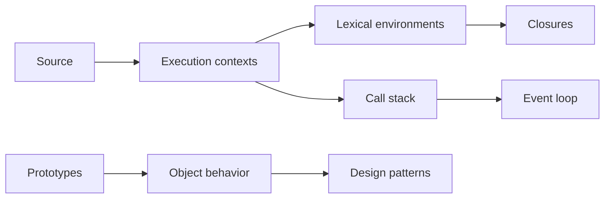

# Advanced JavaScript

This section explains the runtime model behind JavaScript behavior, then applies it to reusable utilities and architecture. Master execution contexts, environments, the event loop, closures, and prototypes before memorizing patterns.

## Order

1. Runtime fundamentals: execution context, lexical environment, call stack, event loop.
2. Object/function mechanics: closures, prototypes, `this`, bind/call/apply.
3. Browser patterns: event delegation, debounce, throttle.
4. Functional patterns: currying, memoization, composition, functional programming.
5. Design: SOLID principles adapted for JavaScript.

Every topic guide includes an explanation, mechanics, pitfalls, interview prompts, and an executable example. The utility examples intentionally validate inputs and preserve `this`.

## Topics

### Runtime fundamentals

- [Execution Context](./execution-context/) — contexts, creation vs execution, `this` in the context model
- [Lexical Environment](./lexical-environment/) — environment records, outer links, block scopes
- [Call Stack](./call-stack/) — LIFO frames, overflow, sync vs scheduled work
- [Event Loop](./event-loop/) — microtasks, macrotasks, ordering guarantees

### Object and function mechanics

- [Closures Deep Dive](./closures-deep-dive/) — retained environments, privacy, memory
- [Prototypes](./prototypes/) — `[[Prototype]]` chain, `class`, constructors
- [this Keyword](./this-keyword/) — call-site rules vs lexical arrows
- [Bind / Call / Apply](./bind-call-apply/) — explicit receivers and partial arguments

### Browser and timing patterns

- [Event Delegation](./event-delegation/) — one listener, many targets, bubbling
- [Debounce and Throttle](./debounce-throttle/) — rate-limit expensive handlers

### Functional patterns

- [Currying](./currying/) — unary stages and partial configuration
- [Memoization](./memoization/) — cache pure results by input
- [Composition](./composition/) — `pipe` / `compose` pipelines
- [Functional Programming](./functional-programming/) — purity, immutability, combinators

### Design and practice

- [SOLID Principles](./solid-principles/) — SOLID adapted for JavaScript
- [Exercises](./exercises/) — hands-on drills
- [Interview Questions](./interview-questions/) — prompt bank for this section
