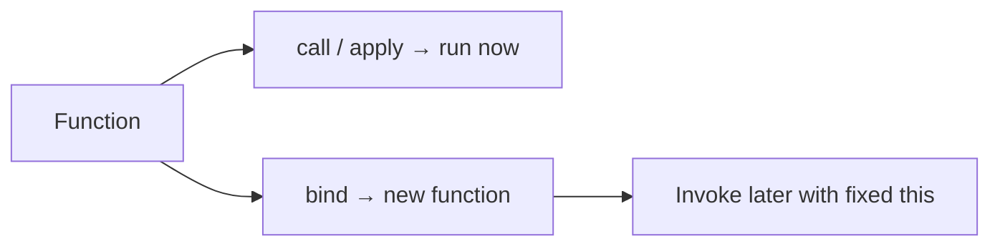

# Bind, Call, and Apply

> Explicit control of `this` and argument lists. `call`/`apply` invoke immediately; `bind` returns a new function with a fixed receiver (and optional partial args).

**Difficulty:** Intermediate  
**Related:** [this Keyword](../this-keyword/) · [Closures Deep Dive](../closures-deep-dive/) · [Currying](../currying/)

---

## Explanation

| Method | Invokes now? | `this` | Arguments |
|--------|--------------|--------|-----------|
| `fn.call(thisArg, a, b)` | Yes | `thisArg` | List |
| `fn.apply(thisArg, [a, b])` | Yes | `thisArg` | Array-like |
| `fn.bind(thisArg, a)` | No | Locked | Partial + later |



```js
function intro(greeting, punct) {
  return `${greeting}, ${this.name}${punct}`;
}

const user = { name: "Ada" };
intro.call(user, "Hello", "!"); // Hello, Ada!
intro.apply(user, ["Hi", "."]); // Hi, Ada.
const bound = intro.bind(user, "Hey");
bound("?"); // Hey, Ada?
```

## Soft-binding and utilities

Hard `bind` cannot be overridden by a later `.call` on the **bound** function’s `this` (the bound receiver wins). That is why bound methods are safe as callbacks.

```js
const bound = intro.bind(user);
bound.call({ name: "Other" }, "X", "!"); // still Ada
```

## Borrowing methods

```js
const arrayLike = { 0: "a", 1: "b", length: 2 };
Array.prototype.join.call(arrayLike, "-"); // "a-b"
```

Modern code often prefers `Array.from` / spread over `apply` for arg spreading:

```js
Math.max(...nums); // instead of Math.max.apply(null, nums)
```

## Partial application with `bind`

```js
const log = console.log.bind(console, "[app]");
log("ready"); // [app] ready
```

For richer partials, prefer explicit wrappers or [currying](../currying/).

## Implementing a minimal `bind` (interview)

```js
Function.prototype.myBind = function myBind(thisArg, ...preset) {
  const original = this;
  return function bound(...later) {
    return original.apply(thisArg, preset.concat(later));
  };
};
```

Production engines also handle `new boundFn()` specially; a full polyfill must.

## Common mistakes

- Using `apply` with huge arrays (stack limits); prefer loops / chunking.
- Re-binding on every render/event without need (creates new function identities).
- Binding arrows — arrows ignore `thisArg` from `bind`/`call`/`apply`.
- Forgetting that `bind` returns a **new** function (`fn === fn.bind(x)` is false).

## Best practices

- Bind once (constructor / init) when the same callback is registered repeatedly.
- Prefer arrows for lexical `this` when partial binding is the only goal.
- Use `call` for known arity; `apply` when you already have an array of args (or use spread).
- Do not patch `Function.prototype` in libraries; keep helpers local.

## Interview questions

1. Difference between `call` and `apply`?
2. Can you change `this` of a bound function with `.call` later?
3. What does `bind` return?
4. Why does `fn.bind(obj)` create a new reference each time?
5. How would you borrow `Array.prototype.map` on an array-like?

## Run the example

```bash
node example.js
```
