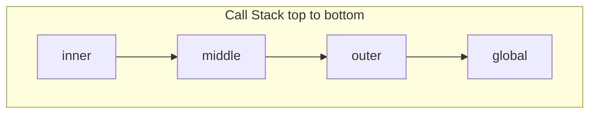
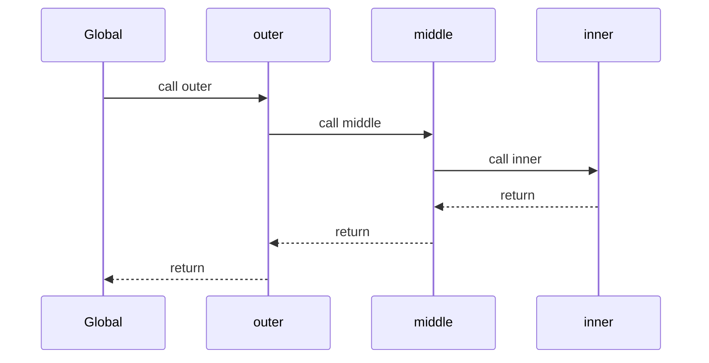

# Call Stack

> LIFO structure of active execution contexts. Synchronous calls push; returns pop. Overflow throws `RangeError: Maximum call stack size exceeded`.

**Difficulty:** Intermediate  
**Related:** [Execution Context](../execution-context/) · [Event Loop](../event-loop/) · [Closures Deep Dive](../closures-deep-dive/)

---

## Explanation

The **call stack** tracks which function is running and who called it. Each stack frame is an execution context (roughly: locals, `this`, return address).



```js
function outer() {
  middle();
}
function middle() {
  inner();
}
function inner() {
  console.trace("stack");
}
outer();
// Stack (top first): inner → middle → outer → (module/global)
```

## Push and pop timeline



Only one frame runs at a time on the main thread. Async APIs schedule work for later; they do **not** grow the stack while waiting (see [Event Loop](../event-loop/)).

## Stack overflow

Unbounded recursion or mutual recursion without a base case exhausts the stack:

```js
function boom() {
  return boom();
}
// boom(); // RangeError: Maximum call stack size exceeded
```

Tail-call optimization is not reliably available in JS engines for general code—do not depend on it. Prefer loops or explicit stacks for deep algorithms.

## Stack vs heap (interview framing)

| Call stack | Heap |
|------------|------|
| Frames for active calls | Objects, closures, large data |
| LIFO, fixed-ish limit | GC-managed |
| Cleared on return | May outlive the frame via closures |

A returned function can still reference heap-allocated environment records even though its defining frame was popped.

## Debugging with the stack

- `console.trace()` / debugger Call Stack panel
- Error `stack` property (V8 format)
- Avoid catching and rethrowing without preserving `cause` / original stack when diagnosing production issues

## Common mistakes

- Assuming `setTimeout(fn, 0)` runs before the current function returns (it waits until the stack is empty and the timer is due).
- Blaming “async” for stack growth—async usually *shrinks* the synchronous stack.
- Infinite recursion from accidental self-calls (e.g., getter calling itself).
- Deep recursive tree walks on large inputs without converting to iterative form.

## Best practices

- Keep call depth reasonable; convert deep recursion to iteration.
- Prefer clear function boundaries so stack traces stay readable.
- Use async/await so suspension points are obvious in stack traces (async stacks in modern Node/browsers).
- When wrapping errors, attach `cause: original` (ES2022).

## Interview questions

1. What is pushed onto the call stack when `foo()` runs?
2. What happens when a function returns?
3. Why does `setTimeout(fn, 0)` not interrupt the current stack?
4. How does a closure survive after its outer frame is popped?
5. How would you rewrite deep recursion to avoid overflow?

## Run the example

```bash
node example.js
```
