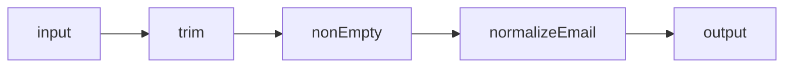

# Function Composition

> Build complex behavior by chaining small functions: `compose(f, g)(x) = f(g(x))` and `pipe(g, f)(x) = f(g(x))`. Prefer `pipe` for left-to-right readability.

**Difficulty:** Intermediate  
**Related:** [Functional Programming](../functional-programming/) · [Currying](../currying/) · [Memoization](../memoization/)

---

## Explanation

Composition replaces nested calls with a pipeline of single-purpose steps.

```js
// Nested
normalize(trim(value));

// Composed
pipe(trim, normalize)(value);
```



| Helper | Order |
|--------|-------|
| `pipe(f, g, h)` | `h(g(f(x)))` — left → right |
| `compose(h, g, f)` | `h(g(f(x)))` — mathematical right → left |

Most application code reads better with **`pipe`**.

## Unary stages

Composition works cleanly when each stage takes **one** argument (the value flowing through). Multi-arg functions should be partially applied or curried first:

```js
const mul = (n) => (x) => x * n;
pipe(Number, mul(2), String)("21"); // "42"
```

## Error handling

Decide whether stages throw (fail fast) or return `Result`/`Either`-style values. Mixing silent `null` returns with throwing stages makes pipelines hard to reason about—pick one convention per pipeline.

```js
const nonEmpty = (value) => {
  if (!value) throw new Error("Value is required");
  return value;
};
```

## Async composition

Promises need an async pipe:

```js
const pipeAsync =
  (...fns) =>
  (input) =>
    fns.reduce((p, fn) => Promise.resolve(p).then(fn), Promise.resolve(input));
```

Do not silently mix sync `pipe` with async stages without awaiting.

## Common mistakes

- Composing functions that mutate shared inputs mid-pipeline.
- Point-free chains so dense that stack traces and debugging suffer.
- Forgetting that `compose` argument order is the reverse of reading order.
- Passing non-functions into `pipe` (validate in production utilities).

## Best practices

- Keep stages pure and named when non-trivial.
- Validate types at the pipeline entrance.
- Prefer `pipe` in app code; mention `compose` in interviews for math familiarity.
- Combine with [currying](../currying/) for configurable stages (`withTimeout(ms)`).

## Interview questions

1. Implement `pipe` and `compose`.
2. When is composition better than a single large function?
3. How do you compose async functions?
4. Why do stages usually need to be unary?
5. How does composition relate to the Open/Closed principle?

## Run the example

```bash
node example.js
```
