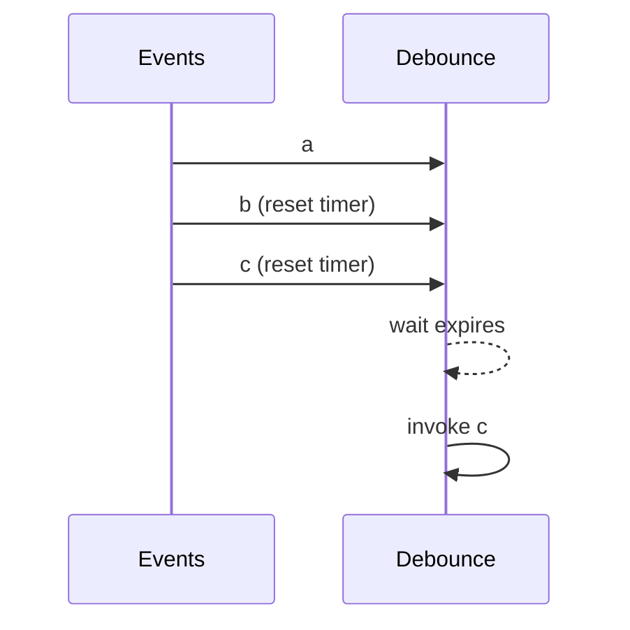

# Debounce and Throttle

Debounce waits for inactivity; throttle limits a hot source to one call per interval. Both reduce expensive work from input, resize, scroll, telemetry, or autocomplete events.

Use debounce for search and saving drafts. Use throttle for progress reporting and scroll position. The [example](example.js) preserves `this`, validates arguments, supports debounce cancellation/flush, and performs a trailing throttle invocation.

## Pitfalls

- Creating a new wrapped function per event defeats debouncing.
- Cancel timers during component teardown.
- State whether leading/trailing behavior is required; it changes UX.
- Do not debounce a security-critical action without understanding lost calls.

## Interview checks

1. Draw timelines for both patterns.
2. Why must a wrapper retain `this` and latest arguments?
3. How would you add leading-edge debounce?
