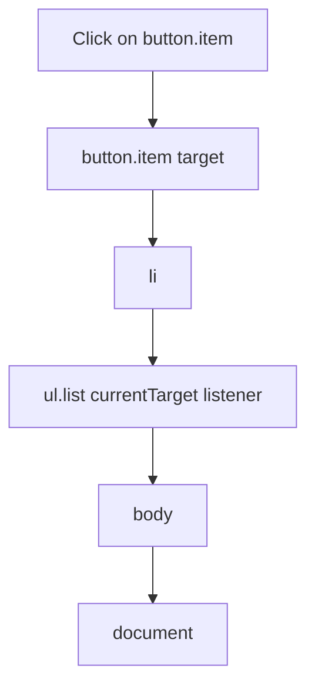

# Event Delegation

> Attach one listener to a common ancestor and handle events from many children via bubbling (`event.target` / `event.currentTarget`). Scales for dynamic lists.

**Difficulty:** Intermediate  
**Related:** [Event Loop](../event-loop/) · [Debounce / Throttle](../debounce-throttle/) · [this Keyword](../this-keyword/)

---

## Explanation

DOM events (most types) **bubble** from the target up through ancestors. Instead of `N` listeners on `N` buttons, use **one** listener on a parent.



```js
list.addEventListener("click", (event) => {
  const item = event.target.closest("[data-action]");
  if (!item || !list.contains(item)) return;
  console.log(item.dataset.action);
});
```

| Property | Meaning |
|----------|---------|
| `event.target` | Deepest element that was interacted with |
| `event.currentTarget` | Element whose listener is running |
| `event.closest(selector)` | Walk up from target to find a match |

## Why it matters

- Dynamic rows/buttons work without re-binding.
- Lower memory and registration cost.
- Central place for authorization / logging of UI actions.

## Capture vs bubble

```js
parent.addEventListener("click", handler, true); // capture (top → down)
parent.addEventListener("click", handler, false); // bubble (default)
```

Delegation almost always uses the **bubble** phase. Stop carefully: `stopPropagation` on a child can prevent the parent delegate from seeing the event.

## Non-bubbling events

Some events do not bubble (e.g. `focus`, `blur`—use `focusin`/`focusout`; `mouseenter`/`mouseleave`—use `mouseover`/`mouseout` with care). Check MDN before delegating.

## Node / non-DOM analogy

The same idea appears in UI trees and event buses: handle at a parent with a type/action filter instead of wiring every leaf.

## Common mistakes

- Using `event.target` alone when clicks land on nested `<span>` inside a button—use `closest`.
- Forgetting `list.contains(item)` so matches outside the root are ignored incorrectly when using document-level delegates.
- Delegating non-bubbling events without the capture/`focusin` alternative.
- Heavy work in the delegate without filtering—every click on the subtree runs your code.

## Best practices

- Put stable `data-*` attributes on actionable elements.
- Early-return when `closest` finds nothing.
- Combine with debounce/throttle for high-frequency events (`input`, `scroll`) on the delegated root.
- Remove the single listener on teardown.

## Interview questions

1. What is event delegation and why use it?
2. Difference between `target` and `currentTarget`?
3. How do you handle clicks on dynamically added buttons?
4. Which events are hard to delegate and what do you use instead?
5. How does `closest` help with nested markup?

## Run the example

```bash
node example.js
```

The example simulates bubbling with a tiny EventTarget tree so it runs in Node without a browser.
