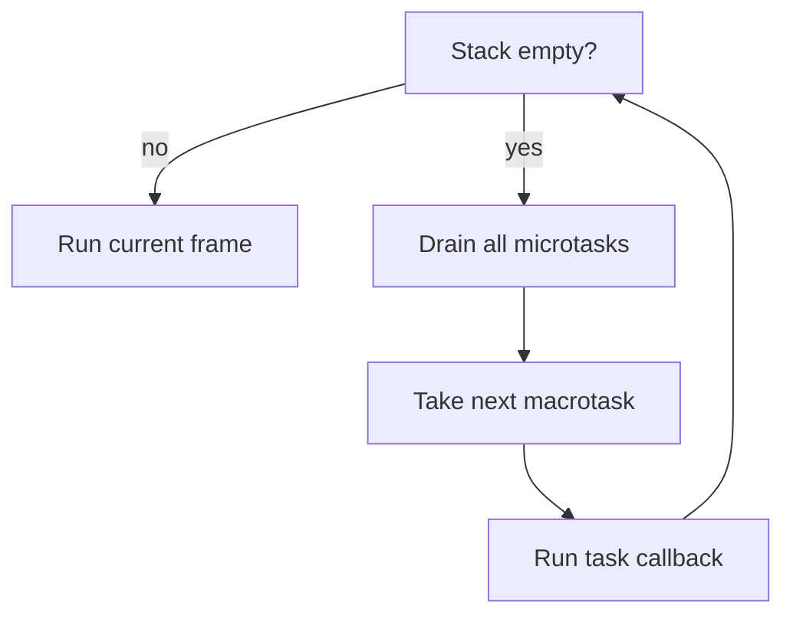
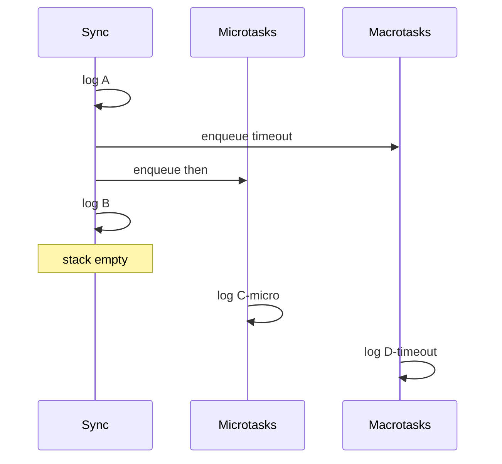

# Event Loop

> Coordinates the call stack, microtask queue, and macrotask (task) queues so JavaScript stays single-threaded yet non-blocking.

**Difficulty:** Intermediate → Advanced  
**Related:** [Call Stack](../call-stack/) · [Execution Context](../execution-context/) · [Debounce / Throttle](../debounce-throttle/)

---

## Explanation

JavaScript on the main thread runs **one** thing at a time. Long I/O does not block if work is deferred to the host (timers, network, FS) and callbacks are queued.

Core pieces:

| Piece | Role |
|-------|------|
| Call stack | Currently running sync code |
| Microtask queue | Promises, `queueMicrotask`, `MutationObserver` |
| Task queue (macrotasks) | `setTimeout`, `setInterval`, I/O, UI events (browser) |
| Event loop | “When stack is empty, drain microtasks, then take one task” |



## Ordering rules (interview-critical)

1. Run synchronous code to completion (stack empty).
2. **Drain the entire microtask queue** (new microtasks enqueued during drain also run).
3. Render opportunity (browsers; simplified).
4. Take **one** macrotask, then go back to step 1.

```js
console.log("A");
setTimeout(() => console.log("D-timeout"), 0);
Promise.resolve().then(() => console.log("C-micro"));
console.log("B");
// A, B, C-micro, D-timeout
```



## Node.js extras (high level)

Node’s model is related but richer (`process.nextTick`, phases of the libuv loop). Interview-safe summary:

- `process.nextTick` runs before other microtasks in many cases (prefer `queueMicrotask` / Promises for portable code).
- `setImmediate` vs `setTimeout(0)` timing depends on phase; do not rely on a fixed winner across environments.

## Starvation

An endless microtask chain (`Promise.then` that always queues another) never yields to macrotasks or rendering—UI freezes / timers stall. Always leave a path to drain.

## Common mistakes

- Believing `setTimeout(fn, 0)` means “run immediately” or “before promises”.
- Mixing `async/await` mental model without realizing `await` continues as a microtask.
- Blocking the stack with heavy sync work (crypto, huge JSON.parse)—the loop cannot interleave.
- Assuming Node and browser queue priorities are identical in every detail.

## Best practices

- Keep handlers short; push heavy work to workers or break into chunks (`setImmediate` / `scheduler` / queues).
- Prefer Promises/`async` for control flow; know they schedule microtasks.
- Use `queueMicrotask` when you need “after current JS, before next task”.
- Measure and avoid microtask storms in reactive systems.

## Interview questions

1. Print order: sync, `Promise.then`, `setTimeout(0)`?
2. What happens if a microtask schedules another microtask?
3. Difference between microtasks and macrotasks?
4. Why can a tight `while(true)` prevent timers from firing?
5. How does `async function` relate to microtasks after `await`?

## Run the example

```bash
node example.js
```
