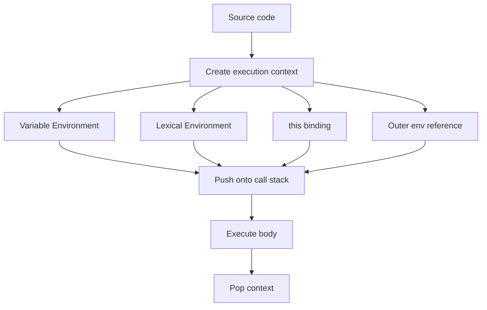

# Execution Context

> The runtime environment created every time JavaScript code runs: variable environment, lexical environment, `this`, and the outer reference.

**Difficulty:** Intermediate → Advanced  
**Related:** [Lexical Environment](../lexical-environment/) · [Call Stack](../call-stack/) · [Closures Deep Dive](../closures-deep-dive/) · [this Keyword](../this-keyword/)

---

## Explanation

An **execution context** is the abstract machine state for one run of code. The engine creates:

| Context type | When created |
|--------------|--------------|
| Global | Script starts |
| Function | Function is invoked |
| Eval | `eval` runs (avoid in production) |

Each context has:

- **Variable Environment** — bindings for `var` and function declarations
- **Lexical Environment** — `let`/`const`, nested scopes, outer link
- **`this` binding** — set by how the function was called (or lexical for arrows)
- **Outer environment reference** — chain for identifier lookup



## Creation vs execution

**Creation phase (simplified):**

1. Create the environment records.
2. Hoist `var` (initialized to `undefined`) and function declarations.
3. Allocate TDZ for `let`/`const` until their declarations run.
4. Bind `this` and `arguments` (non-arrow functions).

**Execution phase:**

1. Assign values as statements run.
2. Resolve free identifiers by walking the outer chain.
3. Return; the context is popped from the call stack.

```js
function greet(name) {
  var message = "Hello";
  const suffix = "!";
  return `${message}, ${name}${suffix}`;
}

greet("Ada");
// 1. New function execution context
// 2. name = "Ada", message = undefined then "Hello", suffix = "!"
// 3. Return string; context pops
```

## Global vs function context

```js
"use strict";

const globalValue = 1;

function outer() {
  const local = 2;
  function inner() {
    return globalValue + local;
  }
  return inner();
}

console.log(outer()); // 3
```

`inner`’s context does not own `globalValue` or `local`; lookup walks outer environments. That retained outer link is the foundation of closures.

## `this` is part of the context, not the lexical scope

```js
const obj = {
  label: "box",
  show() {
    return this.label;
  },
};

obj.show(); // "box" — this = obj
const detached = obj.show;
detached(); // undefined (strict) — this is not lexical
```

Arrow functions copy `this` from the surrounding lexical environment instead of receiving a call-site binding.

## Common mistakes

- Confusing “scope” (where bindings live) with “context” (the full runtime record including `this`).
- Assuming every function call creates the same `this` as the definition site.
- Thinking `eval` contexts are safe or equivalent to normal scopes.
- Ignoring TDZ: `let`/`const` exist in the environment but throw if read before init.

## Best practices

- Prefer `let`/`const` so bindings are block-scoped and TDZ-safe.
- Treat `this` as call-site dependent unless you use arrows or `.bind`.
- Model async callbacks as new contexts that may outlive the original stack frame via closures.
- Draw the call stack + environment chain when debugging unexpected identifiers or `this`.

## Interview questions

1. What is created when a function is invoked?
2. How do variable environment and lexical environment differ in modern engines (simplified interview answer)?
3. Why can a nested function read outer `const` after the outer function returned?
4. Does an arrow function get its own execution context? What about its own `this`?
5. What happens to a context when its function returns?

## Run the example

```bash
node example.js
```
