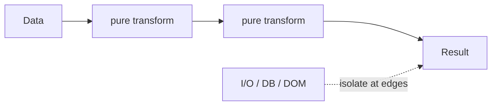

# Functional Programming in JavaScript

> Prefer pure functions, immutable updates, and composition of small transforms. JS is multi-paradigm—use FP where it clarifies data flow, not as dogma.

**Difficulty:** Intermediate → Advanced  
**Related:** [Composition](../composition/) · [Currying](../currying/) · [Memoization](../memoization/) · [Closures Deep Dive](../closures-deep-dive/)

---

## Explanation

Core ideas:

| Idea | Meaning |
|------|---------|
| Pure function | Same inputs → same output; no observable side effects |
| Immutability | Prefer new data over in-place mutation |
| First-class functions | Pass/return/store functions |
| Composition | `h(x) = f(g(x))` — build pipelines |
| Declarative style | Describe *what* (`map`/`filter`) over *how* (manual loops) |



## Pure vs impure

```js
// Pure
const add = (a, b) => a + b;

// Impure — depends on / changes outside state
let tax = 0.2;
const withTax = (n) => n * (1 + tax);
```

Push I/O to the edges: pure core, impure adapters.

## Immutability patterns

```js
const pushImmutable = (arr, item) => [...arr, item];
const setProp = (obj, key, value) => ({ ...obj, [key]: value });
```

For deep structures, structuredClone / libraries / reducers help; shallow copies are enough when nesting is controlled.

## Useful combinators

```js
const map = (fn) => (arr) => arr.map(fn);
const filter = (fn) => (arr) => arr.filter(fn);
const pipe =
  (...fns) =>
  (x) =>
    fns.reduce((v, f) => f(v), x);
```

See [Composition](../composition/) for `pipe`/`compose` detail and [Currying](../currying/) for partial configuration.

## FP-friendly JS features

- Arrow functions, rest/spread, destructuring
- `Array`/`Map`/`Set` methods
- Optional chaining / nullish coalescing for safe data access
- Generators / iterators for lazy sequences

## What to avoid

- Over-abstracting into custom algebraic types when a function and tests suffice
- Mutating arguments inside “pure” helpers
- Giant point-free pipelines that obscure debugging
- Ignoring performance of accidental O(n²) copies in hot paths

## Common mistakes

- Calling something “pure” while it logs, reads `Date.now()`, or mutates inputs.
- Spreading class instances / losing prototypes.
- Using `sort` / `splice` in place when callers expect immutability (`toSorted` / copy first).

## Best practices

- Name intermediate steps when pipelines grow past ~3 stages.
- Keep reducers pure in state management.
- Validate at boundaries; trust pure core less needs defensive noise.
- Combine with [SOLID](../solid-principles/) sense: small functions with one reason to change.

## Interview questions

1. What makes a function pure?
2. How do you update nested state immutably?
3. `map`/`filter`/`reduce` — when is `reduce` the wrong default?
4. Difference between composition and inheritance for reuse?
5. How does memoization relate to purity?

## Run the example

```bash
node example.js
```
