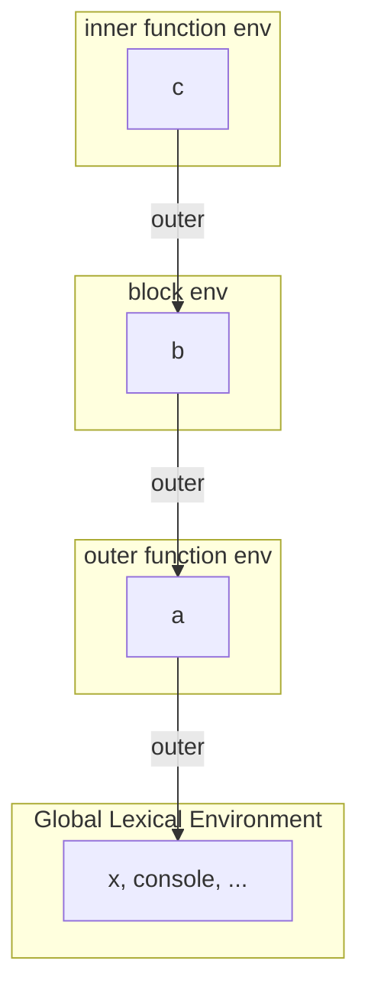

# Lexical Environment

> The structure that holds identifier bindings for a scope and links to the outer environment. Closures are retained lexical environments.

**Difficulty:** Intermediate → Advanced  
**Related:** [Execution Context](../execution-context/) · [Closures Deep Dive](../closures-deep-dive/) · [Scope](../../01-JavaScript-Fundamentals/scope/)

---

## Explanation

A **lexical environment** has two parts:

1. **Environment record** — the map of names → values for that scope
2. **Outer reference** — link to the parent lexical environment (`null` at global)

Environments are created for:

- Global scope
- Function bodies
- Blocks (`{}`) with `let`/`const`/`class`
- `catch` clauses
- Modules (module environment)



Lookup for identifier `name`:

1. Search the current environment record.
2. If missing, follow `outer` and repeat.
3. If the chain ends with no match → `ReferenceError`.

## Lexical vs dynamic

JavaScript uses **lexical (static) scoping**: where the function is *written* decides which outer environment it closes over—not where it is *called*.

```js
const x = "global";

function printX() {
  console.log(x);
}

function run() {
  const x = "local";
  printX(); // "global" — printX's outer env is global, not run()
}

run();
```

## Blocks create environments

```js
function demo(flag) {
  const a = 1;
  if (flag) {
    const b = 2; // block environment nested under function env
    return a + b;
  }
  // return b; // ReferenceError — b's environment is gone / inaccessible
  return a;
}
```

`var` ignores block boundaries (function-scoped). Prefer `let`/`const` so block environments match visual structure.

## Closures = environment retention

When a function escapes its defining scope, the engine keeps the lexical environment(s) that function still needs:

```js
function createBank(balance) {
  return {
    deposit(n) {
      balance += n;
      return balance;
    },
    getBalance() {
      return balance;
    },
  };
}

const acct = createBank(100);
acct.deposit(40); // 140 — `balance` still lives in createBank's env
```

## Common mistakes

- Believing variables are copied into closures; bindings are shared references to the environment record.
- Expecting `var` in a loop to create per-iteration environments (it does not; `let` does).
- Confusing lexical environment with `this` binding.
- Holding large objects in closed-over state longer than needed (memory retention).

## Best practices

- Keep closed-over state minimal and intentional.
- Prefer block-scoped bindings for loop callbacks.
- Name environments mentally when reading nested code: “which record owns this name?”
- Use modules for public/private API boundaries instead of deep nested closures when clarity suffers.

## Interview questions

1. What two components make up a lexical environment?
2. Why does a function called elsewhere still see its defining scope’s variables?
3. How does `let` in a `for` loop differ from `var` regarding environments?
4. Can two closures share the same environment record? When?
5. What is the outer reference of the global environment?

## Run the example

```bash
node example.js
```
