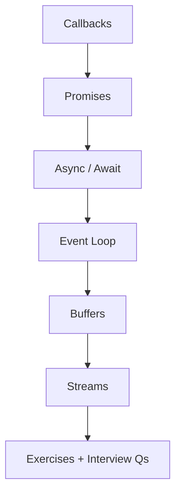
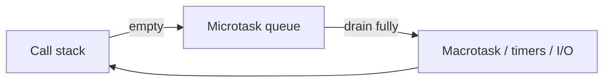

# 04 — Asynchronous JavaScript

> Master the event loop, promises, async/await, buffers, and streams — the foundation of every Node.js I/O answer in interviews.

---

## Who This Section Is For

- Developers who use `async`/`await` but cannot explain microtasks vs macrotasks
- Backend candidates who must reason about callback ordering, backpressure, and non-blocking I/O
- Anyone coming from [03-Advanced-JavaScript](../03-Advanced-JavaScript/README.md) into Node runtime topics

**Prerequisites:** Closures, the call stack, and basic Promise syntax.

---

## Learning Roadmap



| Phase | Topics | Focus | Est. Time |
|-------|--------|-------|-----------|
| **1. Legacy → modern** | Callbacks → Promises | Error-first style, Promise chaining, rejection | 1–2 days |
| **2. Syntax ergonomics** | Async/Await | Sequential vs parallel, try/catch, top-level await | 1 day |
| **3. Runtime model** | Event Loop | Stack, microtasks, timers, I/O phases | 1–2 days |
| **4. Binary I/O** | Buffers + Streams | Chunks, backpressure, pipe patterns | 1–2 days |
| **5. Drill** | Exercises + Interview Qs | Predict output; design streaming endpoints | Ongoing |

---

## Topic Index

| # | Topic | Folder | Key Interview Themes |
|---|--------|--------|----------------------|
| 1 | [Callbacks](./callbacks/README.md) | `callbacks/` | Error-first, pyramid of doom, inversion of control |
| 2 | [Promises](./promises/README.md) | `promises/` | States, `all`/`race`/`allSettled`/`any`, unhandled rejection |
| 3 | [Async/Await](./async-await/README.md) | `async-await/` | Sequential vs parallel, error boundaries |
| 4 | [Event Loop](./event-loop/README.md) | `event-loop/` | Microtask drain, timer phases, “what prints next?” |
| 5 | [Buffers](./buffers/README.md) | `buffers/` | Binary data, encoding, allocation |
| 6 | [Streams](./streams/README.md) | `streams/` | Readable/Writable, backpressure, `pipeline` |

**Practice**

- [Exercises](./exercises/README.md)
- [Interview Questions](./interview-questions/README.md)

---

## How to Study

1. Read each topic README, then run its `example.js`.
2. For event-loop topics, predict console output **before** running.
3. Rewrite one callback-based example with Promises, then with `async`/`await`.
4. Build a tiny file copy with streams and explain backpressure aloud.
5. Drill interview questions until you can draw the event-loop diagram from memory.

```bash
node event-loop/example.js
node promises/example.js
node streams/example.js
```

---

## Interview Focus

- Explain why `Promise.then` runs before `setTimeout(..., 0)`.
- Contrast `Promise.all` vs `allSettled` for fan-out I/O.
- Describe Node stream backpressure and when to use `pipeline`.
- Name failure modes: unhandled rejection, blocking the event loop, unbounded buffering.



---

## Common Pitfalls

- Assuming `await` parallelizes automatically (it does not — use `Promise.all`).
- Forgetting to return or `await` a Promise inside `map`/`forEach`.
- Blocking the event loop with CPU-heavy sync work.
- Ignoring stream errors / not destroying streams on failure.

---

## Official Documentation

- [MDN — Using promises](https://developer.mozilla.org/en-US/docs/Web/JavaScript/Guide/Using_promises)
- [Node.js — Event loop](https://nodejs.org/en/learn/asynchronous-work/event-loop-timers-and-nexttick)
- [Node.js — Streams](https://nodejs.org/api/stream.html)
