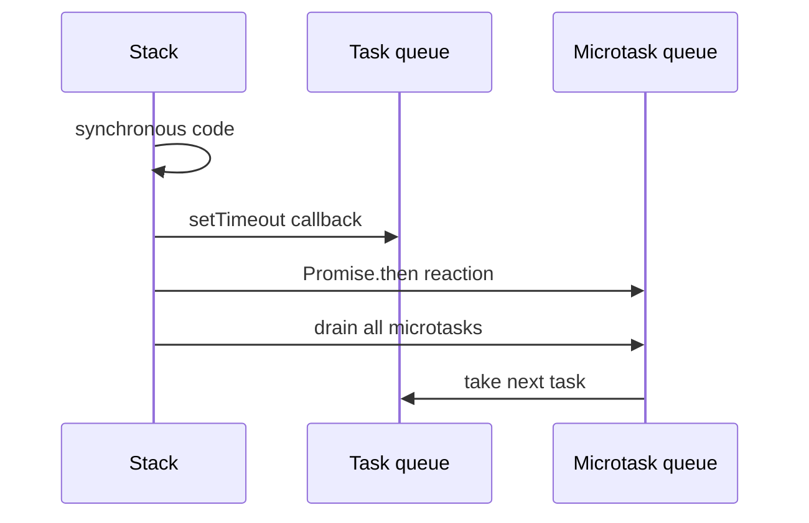

# Event Loop

JavaScript executes synchronous work on a call stack. Host APIs complete work outside it; their callbacks are queued. After the stack empties, JavaScript drains microtasks before taking the next task.

In Node.js, details include event-loop phases and `process.nextTick`, whose queue runs ahead of promise microtasks. Avoid unbounded `nextTick` or Promise scheduling: it can starve I/O and timers.

## Interview checks

1. Predict `sync`, `Promise.then`, `setTimeout` ordering.
2. Why does a zero-delay timeout not run immediately?
3. What is microtask starvation?
