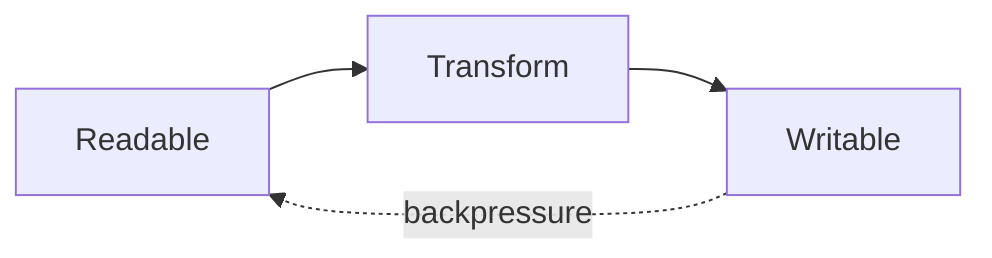

# Node.js Streams

Streams process data incrementally instead of loading all data into memory. Readable streams produce chunks; writable streams consume them; duplex streams do both; transforms alter chunks.

Use `stream/promises` `pipeline` so errors and cleanup propagate through the whole chain. Respect backpressure: if `.write()` returns `false`, wait for `drain`; `pipeline` handles this for connected streams.

## Interview checks

1. Why is `pipe` alone less safe than `pipeline`?
2. What does highWaterMark mean?
3. How does backpressure prevent memory growth?
