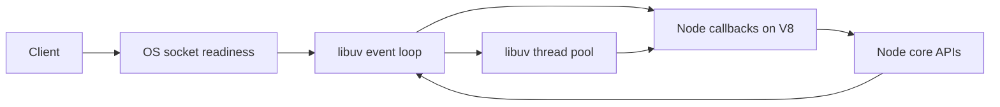
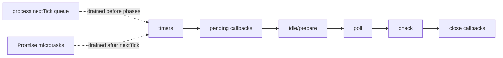

# Node.js Internals and Core APIs

This section is an interview-focused path from fundamentals to production trade-offs. Use each topic's runnable example as a starting point, then implement the exercise and explain the failure modes aloud.

## Core runtime map

Node combines V8 for JavaScript execution with Node's C++ bindings and libuv for event-loop coordination. JavaScript runs on one main execution thread per process; asynchronous I/O is multiplexed, while selected expensive operations use the libuv worker pool. Scale CPU work with worker threads or processes, and preserve responsiveness by keeping callbacks short.

## Topics

- [Node Architecture](./architecture/README.md)
- [V8 and libuv](./v8-libuv/README.md)
- [Event Loop](./event-loop/README.md)
- [Process](./process/README.md)
- [Worker Threads](./worker-threads/README.md)
- [Cluster](./cluster/README.md)
- [Child Processes](./child-process/README.md)
- [Modules and npm](./modules-npm/README.md)
- [package.json and package-lock](./package-json/README.md)
- [Timers](./timers/README.md)
- [Events](./events/README.md)
- [Streams](./streams/README.md)
- [Buffers](./buffers/README.md)
- [File System](./file-system/README.md)
- [Path](./path/README.md)
- [OS](./os/README.md)
- [Crypto](./crypto/README.md)
- [HTTP and HTTPS](./http-https/README.md)
- [DNS and URL](./dns-url/README.md)
- [Console and REPL](./console-repl/README.md)
- [Node.js Exercises](./exercises/README.md)
- [Node.js Interview Questions](./interview-questions/README.md)

## Study sequence

1. Read the concept and official reference.
2. Run and modify `example.js` in a disposable environment.
3. Complete the exercise, including its unhappy path.
4. Answer the questions without notes; use metrics or query plans to support performance claims.

## Official documentation

- [Node.js Internals and Core APIs](https://nodejs.org/docs/latest/api/)
