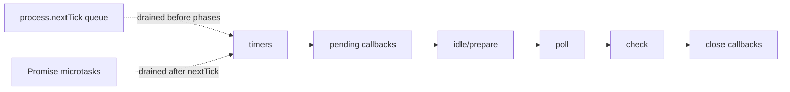

# Event Loop

> **Interview goal:** explain the mechanism, identify the trade-off, then show how you would verify it in production.

## What it is

The event loop schedules JavaScript callbacks between phases; it is cooperative, so long synchronous work blocks all requests.

## Scheduling model



## Core APIs and concepts

- timers, pending callbacks, poll, check, close callbacks, process.nextTick, queueMicrotask, setImmediate
- Prefer official API contracts over folklore; behavior can vary across Node, Express, MongoDB, Mongoose, MySQL, and PostgreSQL versions.
- Keep input validation, authorization, limits, error translation, and observability close to the system boundary.

## Practical example

```js
import { setTimeout as delay } from "node:timers/promises";

// Keep asynchronous work bounded and propagate failures.
async function retry(operation, attempts = 3) {
  for (let attempt = 1; attempt <= attempts; attempt += 1) {
    try { return await operation(); }
    catch (error) {
      if (attempt === attempts) throw error;
      await delay(100 * 2 ** (attempt - 1)); // add jitter in production
    }
  }
}

const result = await retry(async () => "completed safely");
console.log(result);
```

The runnable starter is in [`example.js`](./example.js). Adapt it with explicit tests and environment-specific configuration; do not paste credentials into source.

## Production notes

1. Measure before optimizing: collect latency, error, saturation, and execution-plan evidence.
2. Make timeouts, resource limits, retries, and cancellation intentional.
3. Treat all external input and operational metadata as untrusted until validated or redacted.

## Interview questions with answer direction

1. **Order process.nextTick, Promise.then, setTimeout(0), and setImmediate and explain the caveats.**  
   Start with the invariant or runtime behavior, then state the trade-off and a concrete operational example.
2. **Explain why recursive nextTick can starve I/O.**  
   Mention failure modes, observability, and how you would test the claim.
3. **What would change at 10× traffic or data volume?**  
   Discuss bottlenecks, load distribution, indexes/caching/queues where relevant, and correctness first.

## Exercises

- [ ] Build an ordering experiment and run it from both the main module and an I/O callback.
- [ ] Write a failing test for its error or boundary case.
- [ ] Record the metric, trace, explain plan, or benchmark that would prove the implementation is correct.

## Official references

- [Node.js Internals and Core APIs documentation](https://nodejs.org/docs/latest/api/)
