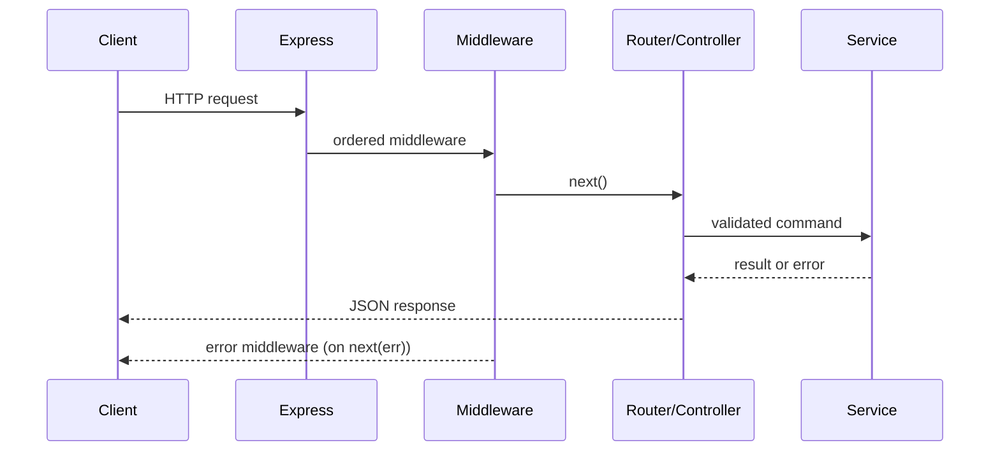

# Express.js Production Patterns

This section is an interview-focused path from fundamentals to production trade-offs. Use each topic's runnable example as a starting point, then implement the exercise and explain the failure modes aloud.

## Production request path

Build routes as a thin HTTP adapter: parse and validate input, authenticate and authorize, call a service, map expected failures to stable HTTP errors, and log structured outcomes. Put cross-cutting concerns in ordered middleware.

## Topics

- [Routing](./routing/README.md)
- [Middleware](./middleware/README.md)
- [Request Lifecycle](./request-lifecycle/README.md)
- [Error Handling](./error-handling/README.md)
- [Validation](./validation/README.md)
- [File Upload](./file-upload/README.md)
- [Logging](./logging/README.md)
- [CORS](./cors/README.md)
- [Cookies and Sessions](./cookies-sessions/README.md)
- [JWT Authentication](./jwt-auth/README.md)
- [Rate Limiting](./rate-limiting/README.md)
- [Security](./security/README.md)
- [REST APIs](./rest-apis/README.md)
- [API Versioning](./api-versioning/README.md)
- [Express Exercises](./exercises/README.md)
- [Express Interview Questions](./interview-questions/README.md)

## Study sequence

1. Read the concept and official reference.
2. Run and modify `example.js` in a disposable environment.
3. Complete the exercise, including its unhappy path.
4. Answer the questions without notes; use metrics or query plans to support performance claims.

## Official documentation

- [Express.js Production Patterns](https://expressjs.com/en/guide/routing.html)
