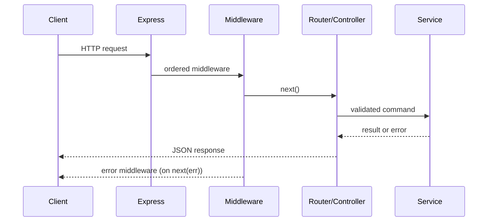

# Request Lifecycle

> **Interview goal:** explain the mechanism, identify the trade-off, then show how you would verify it in production.

## What it is

A request crosses server parsing, middleware, routing, handlers, error middleware, and response finalization.

## Request lifecycle



## Core APIs and concepts

- req, res, next, headersSent, finish, close
- Prefer official API contracts over folklore; behavior can vary across Node, Express, MongoDB, Mongoose, MySQL, and PostgreSQL versions.
- Keep input validation, authorization, limits, error translation, and observability close to the system boundary.

## Practical example

```js
import express from "express";
const app = express();
app.use(express.json({ limit: "100kb" }));

app.get("/api/v1/widgets/:id", async (req, res, next) => {
  try {
    const widget = await loadWidget(req.params.id); // service owns persistence
    if (!widget) return res.status(404).json({ error: { code: "NOT_FOUND" } });
    res.json({ data: widget });
  } catch (error) { next(error); }
});

app.use((error, req, res, next) => {
  if (res.headersSent) return next(error);
  console.error({ error, requestId: req.id }); // redact sensitive fields in real logger
  res.status(error.statusCode || 500).json({ error: { code: "INTERNAL_ERROR" } });
});
```

The runnable starter is in [`example.js`](./example.js). Adapt it with explicit tests and environment-specific configuration; do not paste credentials into source.

## Production notes

1. Measure before optimizing: collect latency, error, saturation, and execution-plan evidence.
2. Make timeouts, resource limits, retries, and cancellation intentional.
3. Treat all external input and operational metadata as untrusted until validated or redacted.

## Interview questions with answer direction

1. **How do errors reach Express error middleware?**  
   Start with the invariant or runtime behavior, then state the trade-off and a concrete operational example.
2. **What is the difference between finish and close?**  
   Mention failure modes, observability, and how you would test the claim.
3. **What would change at 10× traffic or data volume?**  
   Discuss bottlenecks, load distribution, indexes/caching/queues where relevant, and correctness first.

## Exercises

- [ ] Trace a request ID from ingress to logs and response.
- [ ] Write a failing test for its error or boundary case.
- [ ] Record the metric, trace, explain plan, or benchmark that would prove the implementation is correct.

## Official references

- [Express.js Production Patterns documentation](https://expressjs.com/en/guide/routing.html)
