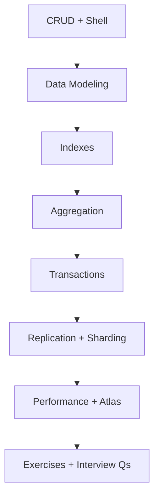
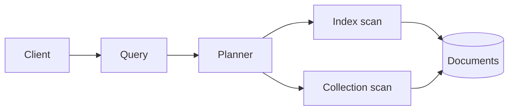

# 07 — MongoDB

> Interview-focused path from document modeling and CRUD through indexes, aggregation, transactions, replication, and sharding.

---

## Who This Section Is For

- Backend engineers designing Mongo schemas and queries for production APIs
- Candidates who must justify indexes with `explain("executionStats")`
- Anyone moving from SQL-only experience into document stores

**Prerequisites:** JSON/BSON intuition and basic Node async I/O. Pair with [08-Mongoose](../08-Mongoose/README.md) for ODM ergonomics.

---

## Learning Roadmap

| Phase | Topics | Focus | Est. Time |
|-------|--------|-------|-----------|
| **1. Operations** | CRUD, shell queries | Filters, projections, updates | 1–2 days |
| **2. Design** | Data modeling | Embed vs reference, growth, access patterns | 2 days |
| **3. Speed** | Indexes, aggregation, performance | Compound indexes, pipelines, explain | 2–3 days |
| **4. Consistency** | Transactions | Multi-doc ACID, retryable writes | 1 day |
| **5. Ops** | Replication, sharding, Atlas/backup | HA, scale-out, restore drills | 1–2 days |
| **6. Drill** | Exercises + Interview Qs | Model + index under a prompt | Ongoing |

---

## Topic Index

| # | Topic | Folder | Key Interview Themes |
|---|--------|--------|----------------------|
| 1 | [CRUD](./crud/README.md) | `crud/` | Insert/find/update/delete semantics |
| 2 | [Aggregation](./aggregation/README.md) | `aggregation/` | `$match`, `$group`, `$lookup`, pipeline order |
| 3 | [Indexes](./indexes/README.md) | `indexes/` | Compound, unique, TTL, covered queries |
| 4 | [Transactions](./transactions/README.md) | `transactions/` | Sessions, abort/commit, when not to use |
| 5 | [Replication](./replication/README.md) | `replication/` | Primary/secondary, write concern, read preference |
| 6 | [Sharding](./sharding/README.md) | `sharding/` | Shard key choice, hotspots |
| 7 | [Data Modeling](./data-modeling/README.md) | `data-modeling/` | Embed vs ref, unbounded arrays |
| 8 | [Performance](./performance/README.md) | `performance/` | Working set, explain, profiling |
| 9 | [Atlas and Backup](./atlas-backup/README.md) | `atlas-backup/` | Backups, PITR, security |
| 10 | [Shell Queries](./shell-queries/README.md) | `shell-queries/` | mongosh cookbook |

**Practice**

- [Exercises](./exercises/README.md)
- [Interview Questions](./interview-questions/README.md)

---

## How to Study

1. State the **access pattern** before writing a schema or index.
2. Run each `example.js` against a disposable database (local or Atlas free tier).
3. After every index change, prove it with `explain("executionStats")`.
4. Complete the exercise unhappy paths (duplicate key, transaction abort).
5. Practice aloud: “I would embed X because …; I would index Y because …”

---

## Interview Focus

- Start answers with access pattern, cardinality, document growth, and atomicity needs.
- Justify indexes with measured plans, not folklore.
- Know write concern / read preference trade-offs for replication.
- Explain when multi-document transactions are necessary vs single-document atomic updates.

---

## Common Pitfalls

- Unbounded arrays that break the 16 MB document limit.
- Indexes that match neither sort nor filter order.
- Overusing `$lookup` instead of redesigning for read path.
- Claiming “we use transactions” without a clear multi-doc invariant.

---

## Official Documentation

- [MongoDB Manual](https://www.mongodb.com/docs/manual/)
- [Aggregation Pipeline](https://www.mongodb.com/docs/manual/core/aggregation-pipeline/)
- [Indexes](https://www.mongodb.com/docs/manual/indexes/)
