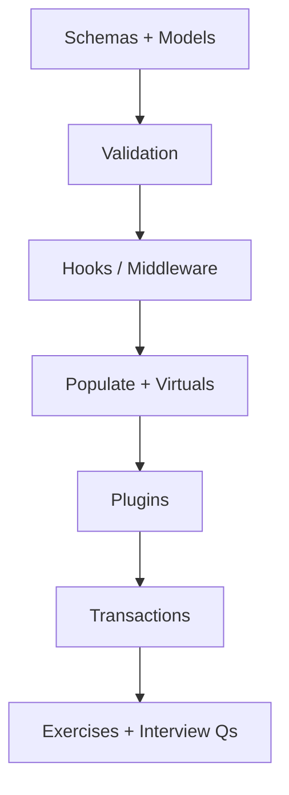
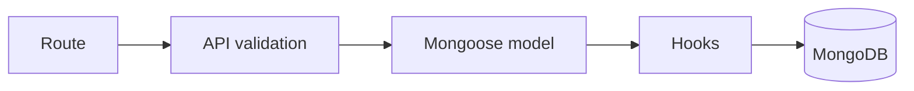

# 08 — Mongoose

> Schema ergonomics, validation, hooks, populate, virtuals, plugins, and transactions — without losing sight of the MongoDB data model underneath.

---

## Who This Section Is For

- Node developers building Express APIs with Mongoose
- Candidates asked to explain populate cost, middleware order, or schema vs DB indexes
- Anyone who finished [07-MongoDB](../07-MongoDB/README.md) and needs the ODM layer

**Prerequisites:** MongoDB CRUD, indexes, and basic Express routing.

---

## Learning Roadmap

| Phase | Topics | Focus | Est. Time |
|-------|--------|-------|-----------|
| **1. Schema core** | Schemas/Models, Validation | Types, required, custom validators | 1–2 days |
| **2. Lifecycle** | Hooks, Middleware | pre/post save, query middleware | 1 day |
| **3. Relations** | Populate, Virtuals | Refs, lean queries, computed fields | 1–2 days |
| **4. Extensibility** | Plugins, Transactions | Reusable schema plugins, sessions | 1 day |
| **5. Drill** | Exercises + Interview Qs | Design a blog/order schema under time | Ongoing |

---

## Topic Index

| # | Topic | Folder | Key Interview Themes |
|---|--------|--------|----------------------|
| 1 | [Schemas and Models](./schemas-models/README.md) | `schemas-models/` | Schema types, indexes at schema level |
| 2 | [Validation](./validation/README.md) | `validation/` | Built-in + custom, `runValidators` |
| 3 | [Hooks](./hooks/README.md) | `hooks/` | pre/post document hooks |
| 4 | [Populate](./populate/README.md) | `populate/` | N+1 risk, select, lean |
| 5 | [Virtuals](./virtuals/README.md) | `virtuals/` | Getters, virtual populate |
| 6 | [Plugins](./plugins/README.md) | `plugins/` | Shared schema behavior |
| 7 | [Middleware](./middleware/README.md) | `middleware/` | Query vs document middleware |
| 8 | [Transactions](./transactions/README.md) | `transactions/` | `startSession`, withTransaction |

**Practice**

- [Exercises](./exercises/README.md)
- [Interview Questions](./interview-questions/README.md)

---

## How to Study

1. Treat Mongoose as a convenience layer — still design indexes and document shape for MongoDB.
2. Run examples; break validators on purpose and inspect error shapes.
3. Trace one `pre('save')` hook and one query middleware path end-to-end.
4. Compare `populate` vs manual `$lookup` / application joins; discuss latency.
5. Answer interview questions with a concrete schema (Task, Post, Order).

---

## Interview Focus

- “Populate is not a SQL join” — second query (or pipeline), select fields, avoid deep nesting.
- Validation that only runs on `save` vs `update` with `runValidators: true`.
- Hook pitfalls: `findOneAndUpdate` skipping document middleware.
- Dual validation: Mongoose schema + API-layer schema (Zod/Joi) at trust boundaries.

---

## Common Pitfalls

- Forgetting schema indexes still need to match real query/sort patterns.
- Over-populating lists (hydrate entire graphs for a list endpoint).
- Mutating documents in hooks without understanding `this` / next().
- Assuming soft-delete plugins filter every query automatically.

---

## Official Documentation

- [Mongoose Docs](https://mongoosejs.com/docs/)
- [Middleware](https://mongoosejs.com/docs/middleware.html)
- [Populate](https://mongoosejs.com/docs/populate.html)
