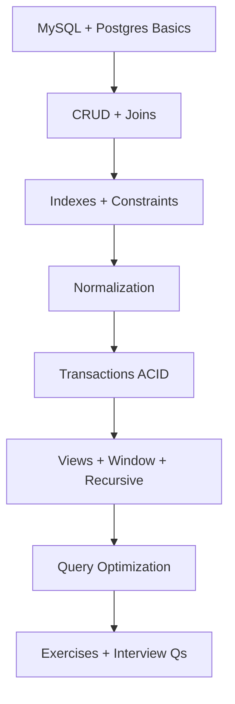
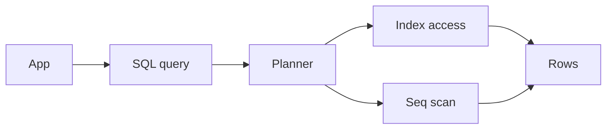

# 09 — SQL (MySQL & PostgreSQL)

> Portable SQL first, then database-specific planners, locking, JSON features, and operational differences interviewers care about.

---

## Who This Section Is For

- Backend candidates expected to write joins, window functions, and explain plans
- Engineers comparing SQL vs Mongo for the same domain
- Anyone who needs ACID/transaction vocabulary for system design rounds

**Prerequisites:** Relational basics (tables, keys). Node drivers (`mysql2` / `pg`) help for examples.

---

## Learning Roadmap

| Phase | Topics | Focus | Est. Time |
|-------|--------|-------|-----------|
| **1. Dialects** | MySQL / PostgreSQL basics | Types, clients, dialect quirks | 1–2 days |
| **2. Query core** | CRUD, Joins | INNER/LEFT, multi-join, nulls | 2 days |
| **3. Integrity** | Indexes, constraints, normalization | PK/FK/unique, 1NF–3NF/BCNF | 2 days |
| **4. Advanced SQL** | Transactions, views, windows, recursive | Isolation, CTEs, analytics | 2–3 days |
| **5. Performance** | Query optimization | EXPLAIN, covering indexes | 1–2 days |
| **6. Drill** | Exercises + Interview Qs | Write SQL on a whiteboard | Ongoing |

---

## Topic Index

| # | Topic | Folder | Key Interview Themes |
|---|--------|--------|----------------------|
| 1 | [MySQL Basics](./mysql-basics/README.md) | `mysql-basics/` | Engine, types, common syntax |
| 2 | [PostgreSQL Basics](./postgresql-basics/README.md) | `postgresql-basics/` | JSONB, schemas, extensions |
| 3 | [SQL CRUD](./crud/README.md) | `crud/` | Insert/update/delete patterns |
| 4 | [Joins](./joins/README.md) | `joins/` | Join types, anti-joins |
| 5 | [Indexes and Constraints](./indexes-constraints/README.md) | `indexes-constraints/` | B-tree, unique, FK cascades |
| 6 | [Normalization](./normalization/README.md) | `normalization/` | Trade-offs vs denormalization |
| 7 | [Transactions and ACID](./transactions-acid/README.md) | `transactions-acid/` | Isolation levels, deadlocks |
| 8 | [Views, Procedures, Functions](./views-procedures/README.md) | `views-procedures/` | When to encapsulate in DB |
| 9 | [Window Functions](./window-functions/README.md) | `window-functions/` | RANK, LAG, partitions |
| 10 | [Recursive Queries](./recursive-queries/README.md) | `recursive-queries/` | Hierarchies, CTEs |
| 11 | [Query Optimization](./query-optimization/README.md) | `query-optimization/` | EXPLAIN, index strategy |

**Practice**

- [Exercises](./exercises/README.md)
- [Interview Questions](./interview-questions/README.md)

---

## How to Study

1. State the portable SQL idea first, then name MySQL vs Postgres specifics when they matter.
2. Run examples against a local Docker MySQL/Postgres; compare EXPLAIN outputs.
3. Rewrite one Mongo access pattern as normalized tables + joins.
4. Practice isolation-level questions with a concrete race (lost update, phantom read).
5. Time-box whiteboard SQL: joins + one window function without docs.

---

## Interview Focus

- “Why this index?” — filter columns, sort order, selectivity, covering.
- Isolation level choice for checkout / inventory.
- When denormalization beats 3NF for read-heavy APIs.
- Postgres JSONB vs MySQL JSON for semi-structured fields.

---

## Common Pitfalls

- Selecting `*` and joining wide tables for list APIs.
- Missing FK indexes on child tables.
- Holding transactions open across network/HTTP calls.
- Confusing OFFSET pagination with keyset/cursor pagination at scale.

---

## Official Documentation

- [PostgreSQL Docs](https://www.postgresql.org/docs/current/)
- [MySQL Reference Manual](https://dev.mysql.com/doc/refman/en/)
