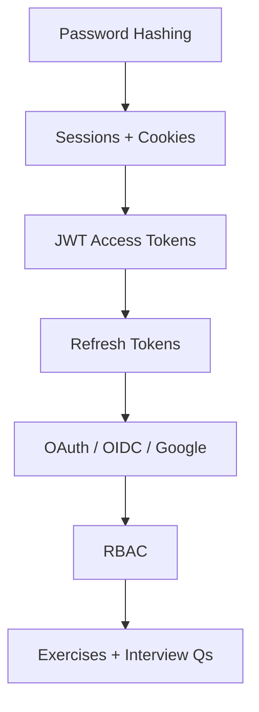
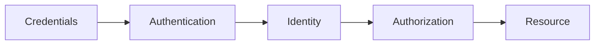

# 10 — Authentication & Authorization

> Identity (authentication) and permissions (authorization): passwords, sessions, JWTs, refresh rotation, OAuth/OIDC, and RBAC.

---

## Who This Section Is For

- API developers shipping login, refresh, and protected routes
- Candidates who must compare cookies vs Bearer tokens under XSS/CSRF
- Anyone building [02-auth-service](../19-Projects/02-auth-service/README.md) or securing REST APIs

**Prerequisites:** HTTP cookies/headers, bcrypt basics, Express middleware.

---

## Learning Roadmap

| Phase | Topics | Focus | Est. Time |
|-------|--------|-------|-----------|
| **1. Credentials** | Password hashing | bcrypt/argon2, salt, timing | 0.5–1 day |
| **2. Server sessions** | Sessions & cookies | HttpOnly, Secure, SameSite | 1 day |
| **3. Stateless tokens** | JWT + Refresh | Claims, expiry, rotation, revocation | 1–2 days |
| **4. Federated login** | OAuth, Google OIDC | Auth code + PKCE | 1–2 days |
| **5. Authorization** | RBAC | Roles, ownership, tenant checks | 1 day |
| **6. Drill** | Exercises + Interview Qs | Threat-model a login flow | Ongoing |

---

## Topic Index

| # | Topic | Folder | Key Interview Themes |
|---|--------|--------|----------------------|
| 1 | [JWT](./jwt/README.md) | `jwt/` | Structure, signing, pitfalls of long-lived JWT |
| 2 | [OAuth 2.0](./oauth/README.md) | `oauth/` | Grants, scopes, auth code |
| 3 | [Sessions and Cookies](./sessions-cookies/README.md) | `sessions-cookies/` | Store, fixation, CSRF |
| 4 | [Refresh Tokens](./refresh-tokens/README.md) | `refresh-tokens/` | Rotation, reuse detection |
| 5 | [Password Hashing](./password-hashing/README.md) | `password-hashing/` | bcrypt cost, never plaintext |
| 6 | [RBAC](./rbac/README.md) | `rbac/` | Role vs resource ownership |
| 7 | [Google OAuth / OIDC](./google-oauth/README.md) | `google-oauth/` | ID tokens, linking accounts |

**Practice**

- [Exercises](./exercises/README.md)
- [Interview Questions](./interview-questions/README.md)

---

## How to Study

1. Draw credential → identity → authorization → resource for every flow.
2. Implement register/login/refresh/logout stubs; never store raw refresh tokens.
3. Threat-model: stolen access token, stolen refresh cookie, CSRF on cookie auth.
4. Practice explaining why authorization must be enforced server-side every request.
5. Link concepts to [12-Security](../12-Security/README.md) (XSS, CSRF, secrets).

---

## Interview Focus

- Access token short TTL + refresh rotation with reuse detection.
- Cookie flags and when to prefer Authorization Bearer.
- Difference between authentication and authorization (with RBAC example).
- Logout / blacklist / session revocation strategies and their limits.

---

## Common Pitfalls

- Putting secrets or PII in JWT payloads.
- Long-lived JWTs with no revocation story.
- Checking roles only on the client.
- Using implicit grant / storing tokens in `localStorage` without discussing XSS.

---

## Official Documentation

- [OAuth 2.0 RFC 6749](https://datatracker.ietf.org/doc/html/rfc6749)
- [JWT Introduction (jwt.io)](https://jwt.io/introduction)
- [OWASP Authentication Cheat Sheet](https://cheatsheetseries.owasp.org/cheatsheets/Authentication_Cheat_Sheet.html)
