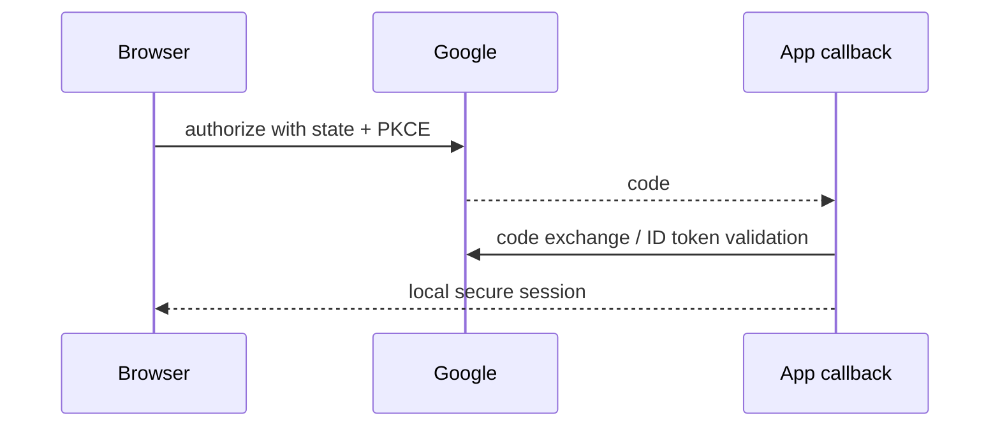

# Google Login with OpenID Connect

Google login uses OpenID Connect over OAuth 2.0. Google authenticates the user; your backend verifies the ID token and creates an application session or tokens.

## What to know

- **Verification:** Validate Google signature keys, issuer, audience/client ID, expiry, and nonce when applicable.
- **Identity:** Link the provider account by stable Google `sub`, not mutable email.
- **Flow:** Use Authorization Code + PKCE, validate `state`, exchange server-side, then create a local session.

## Flow



## Interview answer framework

State the problem first, identify the trust or responsibility boundary, explain the implementation choice, and finish with a trade-off or failure mode. Server-side validation and authorization are mandatory even when a client also performs checks.

## Run the example

```bash
node example.js
```

Examples show the essential control-flow shape. Install the named dependencies, validate configuration at startup, and use real secrets only through a secret manager or environment.

## Questions to rehearse

1. What threat, failure, or scaling problem does this solve?
2. Which input or dependency is untrusted, and where is it constrained?
3. What metric, test, or log would prove it works in production?
