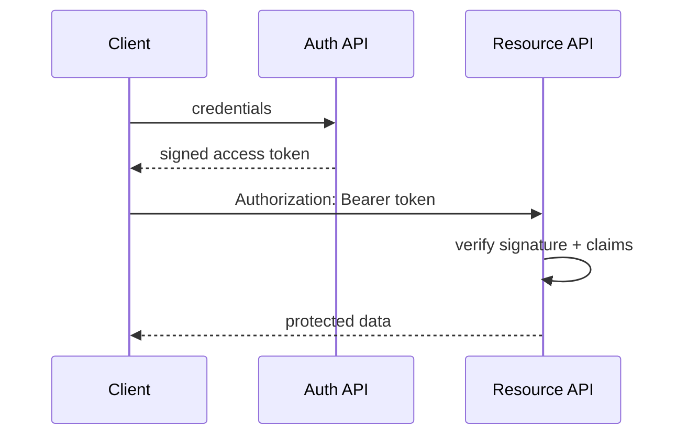

# JSON Web Tokens (JWT)

A JWT is a signed compact claim set. Its payload is Base64URL encoded, not encrypted; a valid signature detects tampering but does not hide contents.

## What to know

- **Verification:** Allow-list algorithms and validate signature, `iss`, `aud`, `exp`, and `nbf`.
- **Claims:** Keep only necessary, non-secret claims such as stable `sub`, expiry, and perhaps a token ID.
- **Lifecycle:** Use short-lived access tokens and key rotation with `kid`; do not make tokens indefinitely valid.

## Flow



## Interview answer framework

State the problem first, identify the trust or responsibility boundary, explain the implementation choice, and finish with a trade-off or failure mode. Server-side validation and authorization are mandatory even when a client also performs checks.

## Run the example

```bash
node example.js
```

Examples show the essential control-flow shape. Install the named dependencies, validate configuration at startup, and use real secrets only through a secret manager or environment.

## Questions to rehearse

1. What threat, failure, or scaling problem does this solve?
2. Which input or dependency is untrusted, and where is it constrained?
3. What metric, test, or log would prove it works in production?
