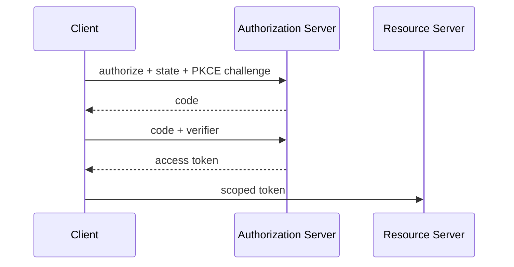

# OAuth 2.0

OAuth 2.0 is delegated authorization: a resource owner grants a client constrained API access without sharing their password. OpenID Connect adds standardized identity.

## What to know

- **Roles:** Know resource owner, client, authorization server, and resource server.
- **PKCE:** Authorization Code with PKCE is the default for browser and native clients; bind the code to its initiating client.
- **State and scope:** `state` correlates the browser flow and defends CSRF; request the minimum scope.

## Flow



## Interview answer framework

State the problem first, identify the trust or responsibility boundary, explain the implementation choice, and finish with a trade-off or failure mode. Server-side validation and authorization are mandatory even when a client also performs checks.

## Run the example

```bash
node example.js
```

Examples show the essential control-flow shape. Install the named dependencies, validate configuration at startup, and use real secrets only through a secret manager or environment.

## Questions to rehearse

1. What threat, failure, or scaling problem does this solve?
2. Which input or dependency is untrusted, and where is it constrained?
3. What metric, test, or log would prove it works in production?
