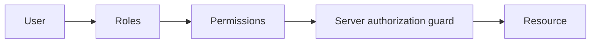

# Role-Based Access Control (RBAC)

RBAC maps users to roles and roles to permissions. It is a baseline; tenant membership, resource ownership, and contextual rules often require more checks.

## What to know

- **Permissions:** Model action/resource permissions such as `invoice:read`, not only role names.
- **Enforcement:** Authenticate then authorize at the route or service boundary on every protected action.
- **Tenancy:** Check tenant and resource scope separately: an admin in tenant A has no implicit power in tenant B.

## Flow



## Interview answer framework

State the problem first, identify the trust or responsibility boundary, explain the implementation choice, and finish with a trade-off or failure mode. Server-side validation and authorization are mandatory even when a client also performs checks.

## Run the example

```bash
node example.js
```

Examples show the essential control-flow shape. Install the named dependencies, validate configuration at startup, and use real secrets only through a secret manager or environment.

## Questions to rehearse

1. What threat, failure, or scaling problem does this solve?
2. Which input or dependency is untrusted, and where is it constrained?
3. What metric, test, or log would prove it works in production?
