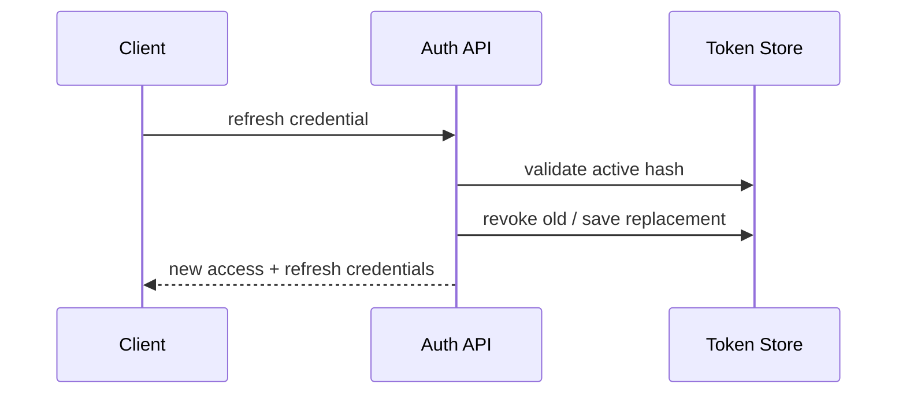

# Refresh Tokens

Refresh tokens are long-lived credentials used to obtain short-lived access tokens. Model them as revocable server-side state.

## What to know

- **Rotation:** Replace and invalidate the old refresh token on every use; token reuse indicates theft and should revoke its family.
- **Storage:** For browsers, prefer an HttpOnly Secure cookie plus CSRF protection; never expose the token to JavaScript.
- **Revocation:** Store a hash, family/session ID, expiry, device metadata, and revocation state.

## Flow



## Interview answer framework

State the problem first, identify the trust or responsibility boundary, explain the implementation choice, and finish with a trade-off or failure mode. Server-side validation and authorization are mandatory even when a client also performs checks.

## Run the example

```bash
node example.js
```

Examples show the essential control-flow shape. Install the named dependencies, validate configuration at startup, and use real secrets only through a secret manager or environment.

## Questions to rehearse

1. What threat, failure, or scaling problem does this solve?
2. Which input or dependency is untrusted, and where is it constrained?
3. What metric, test, or log would prove it works in production?
