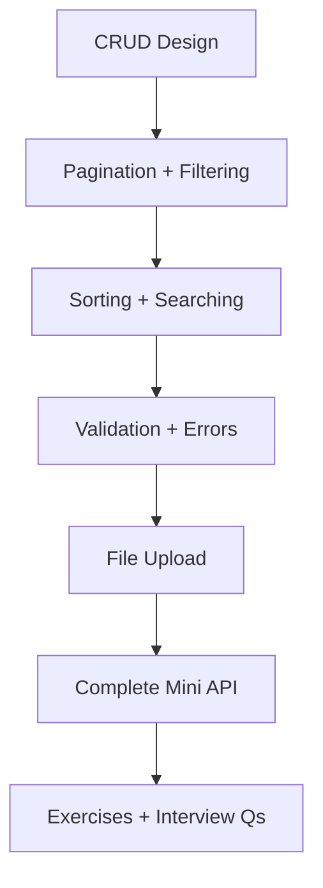
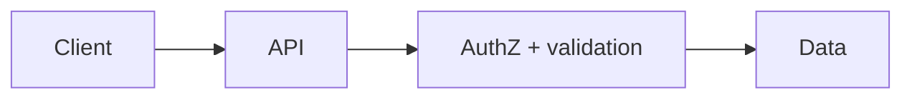

# 11 — REST API Design

> Treat APIs as contracts: validate at the boundary, authorize every mutating path, paginate lists, and return stable error shapes.

---

## Who This Section Is For

- Express + Mongo developers building production HTTP APIs
- Candidates designing CRUD, filters, uploads, and error models in interviews
- Anyone starting [19-Projects](../19-Projects/README.md)

**Prerequisites:** Express middleware, Mongo/Mongoose basics, JWT auth concepts.

---

## Learning Roadmap

| Phase | Topics | Focus | Est. Time |
|-------|--------|-------|-----------|
| **1. Resources** | CRUD APIs | Verbs, status codes, resource naming | 1 day |
| **2. Lists** | Pagination, filtering, sort/search | Cursor vs offset, indexes | 1–2 days |
| **3. Hardening** | Validation, errors | Zod/Joi, Problem Details-style JSON | 1 day |
| **4. Media** | File upload | Multer, size limits, content-type | 0.5–1 day |
| **5. Capstone** | Complete mini API | Vertical slice end-to-end | 1–2 days |
| **6. Drill** | Exercises + Interview Qs | Design an API on a whiteboard | Ongoing |

---

## Topic Index

| # | Topic | Folder | Key Interview Themes |
|---|--------|--------|----------------------|
| 1 | [CRUD API Design](./crud-apis/README.md) | `crud-apis/` | REST maturity, idempotency |
| 2 | [Pagination and Filtering](./pagination-filtering/README.md) | `pagination-filtering/` | Cursor, limit caps |
| 3 | [Sorting and Searching](./sorting-searching/README.md) | `sorting-searching/` | Whitelist sort fields |
| 4 | [File Uploads](./file-upload/README.md) | `file-upload/` | Streaming, virus scan hooks |
| 5 | [Validation and Errors](./validation-errors/README.md) | `validation-errors/` | 400 vs 422, error envelopes |
| 6 | [Complete Mini API](./complete-api-example/README.md) | `complete-api-example/` | Full vertical slice |

**Practice**

- [Exercises](./exercises/README.md)
- [Interview Questions](./interview-questions/README.md)

---

## How to Study

1. Read the topic, run the example, then break it (invalid body, huge page size).
2. For every list endpoint, name the supporting index.
3. Implement one resource with create/list/get/update/delete + ownership checks.
4. Document the public contract (paths, status codes) before coding.
5. Capstone: extend `complete-api-example` or a [19-Projects](../19-Projects/README.md) starter.

---

## Interview Focus

- Idempotency for POST create (payments/orders) via keys.
- Why unbounded `limit` or `OFFSET` deep pages hurt production.
- Consistent error shape with `requestId` for support.
- Versioning strategies (`/v1`, headers) and breaking-change policy.

---

## Common Pitfalls

- Returning 200 for create instead of 201 + Location.
- Filtering with raw user strings into Mongo operators (NoSQL injection).
- Putting business rules only in the frontend.
- Skipping auth on “internal” routes that are still public.

---

## Official Documentation

- [MDN — HTTP](https://developer.mozilla.org/en-US/docs/Web/HTTP)
- [RFC 9457 — Problem Details](https://www.rfc-editor.org/rfc/rfc9457.html)
- [Express Guide](https://expressjs.com/en/guide/routing.html)
