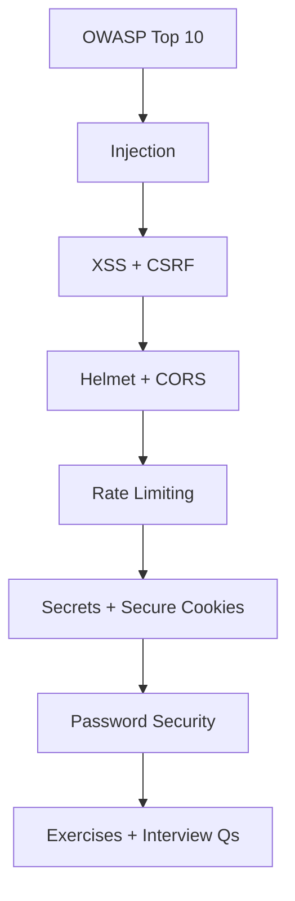
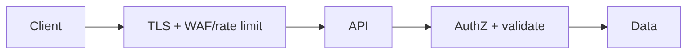

# 12 — Application Security

> Layered risk reduction for Node APIs: OWASP Top 10, injection, XSS/CSRF, Helmet/CORS, rate limits, secrets, and password storage.

---

## Who This Section Is For

- Backend engineers shipping internet-facing Express services
- Candidates who must threat-model auth cookies, uploads, and query params
- Anyone pairing this with [10-Authentication](../10-Authentication/README.md)

**Prerequisites:** HTTP, Express middleware, basic auth concepts.

---

## Learning Roadmap

| Phase | Topics | Focus | Est. Time |
|-------|--------|-------|-----------|
| **1. Landscape** | OWASP Top 10 | Map risks to Node APIs | 1 day |
| **2. Input** | Injection, XSS/CSRF | Parameterization, encoding, tokens | 1–2 days |
| **3. HTTP hardening** | Helmet, CORS, rate limits | Headers, origins, abuse | 1 day |
| **4. Ops secrets** | Env secrets, secure cookies | Rotation, Least privilege | 1 day |
| **5. Credentials** | Password security | Hashing, breach response | 0.5 day |
| **6. Drill** | Exercises + Interview Qs | Find flaws in a sample app | Ongoing |

---

## Topic Index

| # | Topic | Folder | Key Interview Themes |
|---|--------|--------|----------------------|
| 1 | [OWASP Top 10](./owasp-top-10/README.md) | `owasp-top-10/` | Broken access, injection, misconfig |
| 2 | [XSS and CSRF](./xss-csrf/README.md) | `xss-csrf/` | Cookie auth vs token auth |
| 3 | [Injection Attacks](./injection-attacks/README.md) | `injection-attacks/` | SQL + NoSQL |
| 4 | [Helmet and CORS](./helmet-cors/README.md) | `helmet-cors/` | CSP, allowlists |
| 5 | [Rate Limiting](./rate-limiting/README.md) | `rate-limiting/` | IP vs user, Redis stores |
| 6 | [Env and Secrets](./env-secrets/README.md) | `env-secrets/` | .env vs vault, rotation |
| 7 | [Secure Cookies](./secure-cookies/README.md) | `secure-cookies/` | Flags, prefix `__Host-` |
| 8 | [Password Security](./password-security/README.md) | `password-security/` | Hashing, reset flows |

**Practice**

- [Exercises](./exercises/README.md)
- [Interview Questions](./interview-questions/README.md)

---

## How to Study

1. For each OWASP item, name one Express mitigation you would ship.
2. Break a vulnerable example (injection / XSS), then fix it.
3. Configure Helmet + strict CORS for a SPA origin and explain the trade-offs.
4. Practice incident answers: leaked `.env`, stolen session cookie, credential stuffing.
5. Cross-link auth token choices with CSRF/XSS consequences.

---

## Interview Focus

- Broken access control is often #1 — ownership checks on every ID.
- Parameterized queries / typed filters; never concatenate user input into queries.
- Defense in depth: headers, cookies, rate limits, least privilege DB users.
- Secrets: not in git, rotatable, scoped.

---

## Common Pitfalls

- `CORS: *` with credentialed cookies.
- Trusting `X-Forwarded-For` for rate limits without a trusted proxy.
- Disabling Helmet CSP “to make the app work” permanently.
- Logging passwords, tokens, or full card PANs.

---

## Official Documentation

- [OWASP Top 10](https://owasp.org/www-project-top-ten/)
- [Helmet](https://helmetjs.github.io/)
- [OWASP Cheat Sheet Series](https://cheatsheetseries.owasp.org/)
